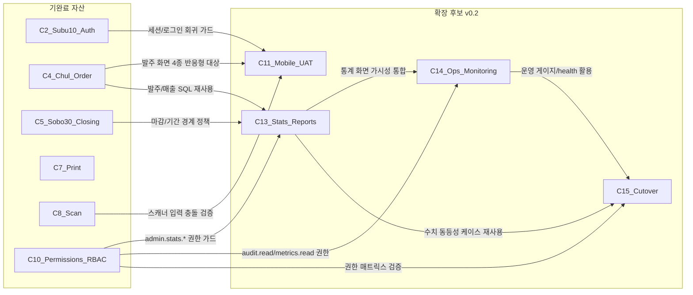

# 확장 후보 의존성 그래프 (C11/C13/C14/C15)

_생성: 2026-04-20 — 확장 라인 v0.2 베이스라인 (계획서 §확장 후보 v0.2)_

> 본 문서는 확장 후보 시나리오(C11/C13/C14/C15)가 기완료 자산(C2/C4/C5/C7/C8/C10)에 어떻게 의존하는지를 단일 정본으로 명시한다. 모든 신규 시나리오 카드/계약/테스트는 본 문서를 1차 참조한다.

## 1. 의존성 다이어그램 (Mermaid)

- 굵은 선(권한·SQL): **구현 의존** — 선행 시나리오 미완료 시 진입 불가.
- 점선 의미: **승인 의존** — 선행 시나리오 결정 항목(DEC) 합의 필요.
- 신규 의존 추가 시 본 다이어그램과 [`docs/core-scenarios-porting-plan.md`](../../docs/core-scenarios-porting-plan.md) §7 해당 절을 함께 갱신한다.

## 2. 선행 자산표 (구현 의존)

| 확장 시나리오 | 선행 자산 | 자산 유형 | 재사용 위치 | 회귀 가드 |
|---|---|---|---|---|
| **C11** | C2 outbound `/outbound/orders` | UI 페이지 | viewport ≤ 768px 반응형 적용 대상 | desktop 셀렉터/레이아웃 스냅샷 비교 |
| **C11** | C8 `lib/scanner.ts` | 입력 훅 | 모바일 가상키보드 충돌 검증 | C8 22 케이스 회귀 |
| **C11** | C10 `<PermissionGuard>` | 권한 가드 | 모바일에서도 동일 가드 적용 | C10 24 케이스 회귀 |
| **C13** | C4 `outbound_service.list_outbound_orders` | SELECT | 매출 기간별 집계 base | 신규 SQL 0건 grep |
| **C13** | C5 `settlement_service.assert_period_open` | 마감 가드 | 통계 기간 경계 차단 | C5 63 케이스 회귀 |
| **C13** | `reports_service.get_book_sales/customer_sales` | SELECT 헬퍼 | 도서/거래처 분석 base | C6 20 케이스 회귀 |
| **C13** | C10 `require_permission` | RBAC | F50/F51/F52/F53 가드 | catalog grep `admin.stats.*` |
| **C14** | C10 `audit_service`/`audit_password_service` | audit 영속화 | `/admin/audit` 통합 뷰 SELECT | catalog grep `admin.audit.read` |
| **C14** | C10 `require_permission` | RBAC | metrics/health admin 가드 | `admin.metrics.read`/`admin.health.read` |
| **C14** | `app.core.db` | 풀 헬스 | health 확장 dependency check | 4 server probe `health.dependencies` |
| **C15** | C10 `id_logn_service` | 사용자 매트릭스 | cutover 사용자 검증 | 10 핵심 테이블 count |
| **C15** | C13 통계 수치 | 수치 정합 | cut-over 후 동등성 검증 | stats 4 endpoint 응답 비교 |
| **C15** | C14 `/health` + `/metrics` | 운영 게이지 | dry-run/롤백 모니터링 | RTO ≤ 15분 측정 |
| **C15** | `t5_ssub_adapt` (DEC-033) | 스키마 어댑터 | mysql3 호환 cut-over | schema diff fail 0 |

## 3. 승인 의존 (DEC 합의 필요)

| 확장 시나리오 | 의존 DEC | 합의 필요 항목 |
|---|---|---|
| C11 | DEC-019 / DEC-004 / DEC-040 | 단일 빌드 / USB-HID / 스캔 분리 정책 (이미 동결) |
| C13 | DEC-019 / DEC-040 / DEC-041 | 단일 원천 / 신규 SQL 0 / 표준 응답 코드 (이미 동결) |
| C13 | **신규** DEC-STAT-EXP | 4 통계 endpoint v1.0 동결 |
| C14 | DEC-033 / DEC-041 / DEC-042 | 멀티 DB 호환 / 응답 코드 / If-Match (이미 동결) |
| C14 | **신규** DEC-OPS-EXP | self-hosted 정책 + 메트릭 카디널리티 + degraded 매핑 |
| C15 | DEC-033 / DEC-041 / DEC-042 | mysql3 호환 / 응답 코드 / If-Match 부하 (이미 동결) |
| C15 | **신규** DEC-CUT-EXP | 단계 전환 + 롤백 RTO + 5종 검증 |

## 4. 진입 게이트 (의존 만족 검사)

각 확장 시나리오 T2 진입 전 본 표의 항목을 모두 만족해야 한다 (PR 체크리스트 등록).

| 확장 시나리오 | 진입 게이트 |
|---|---|
| C11 | (a) C2/C4/C8 페이지 desktop 동작 PASS, (b) `lib/scanner.ts` Phase 1 회귀 22 PASS |
| C13 | (a) `legacy-analysis/stats_inventory.md` 작성 완료, (b) `permission-keys-catalog.md` 에 `admin.stats.*` 4종 등록, (c) C5 마감 가드 정합 검증 케이스 정의 |
| C14 | (a) `permission-keys-catalog.md` 에 `admin.audit.read`/`admin.metrics.read`/`admin.health.read` 등록, (b) 카디널리티 정책 + `/health` degraded 매핑표 contract 명시 |
| C15 | (a) `cutover_validator.py` 5종 검증 항목 구현, (b) dry-run RTO 측정값 < 15분, (c) OQ-IN-1/OQ-DBL-001~003 마감 또는 명시적 위험 노트 |

## 5. 변경 이력

- 2026-04-20 — v0.2 베이스라인 (확장 후보 의존성 그래프 + 선행 자산표 + 진입 게이트 동결).
