# 레이아웃 매핑: C8 바코드 스캔 통합 (Sobo21/22/23 → outbound/inbound/returns)

DEC-028 의무 — 레거시 `Tong07.FTong07` 프레임의 스캔 입력 위젯을 모던 페이지의 스캔 영역에 1:1 매핑한다. C8 은 별도 화면이 아니라 **기존 3 화면에 임베드되는 입력 레이어** 이므로, 본 노트는 영역/위젯 ID 매핑보다 **스캔 입력 → 매칭 응답 → 라인 추가** 의 데이터 흐름 매핑에 무게를 둔다.

## 0. 입력 산출물

- **레거시**:
  - `legacy_delphi_source/legacy_source/Tong07.dfm` (TTong70 프레임 — Edit101/Button100/Button104 등)
  - `legacy_delphi_source/legacy_source/Tong07.pas` (Button100Click L73, Edit101KeyPress L66, Button104Click L333)
  - `legacy_delphi_source/legacy_source/Tong08.pas` (TTong80 — TComPort + ComPortRxChar L40)
  - `legacy_delphi_source/legacy_source/Subu21.pas` L152/171/704-708 (Sobo21 = nForm '21' = 출고)
  - `legacy_delphi_source/legacy_source/Subu22.pas` L150/167/595-599 (Sobo22 = nForm '22' = 입고)
  - `legacy_delphi_source/legacy_source/Subu23.pas` L150/167/585-589 (Sobo23 = nForm '23' = 반품)
- **dfm 산출물 (DEC-028 룰 7)**:
  - `tools/delphi_porting_accelerator/examples/generated/legacy_source_root/Subu21/` (Sobo21.html/form.json/tree.json/pas_analysis.json)
  - `tools/delphi_porting_accelerator/examples/generated/legacy_source_root/Subu22/` (+ `Subu22_1`, `Subu22_2` 변형)
  - `tools/delphi_porting_accelerator/examples/generated/legacy_source_root/Subu23/` (+ `Subu23_1`, `Subu23_1_chul05`, `Subu23_1_chul08` 변형)
  - **Tong08 dfm 산출물 부재** (생성기 미처리 — DataModule 형 폼)
- **모던 라우트**:
  - 출고: [`outbound/orders/[orderKey]/page.tsx`](../../도서물류관리프로그램/frontend/src/app/(app)/outbound/orders/[orderKey]/page.tsx) (Sobo21 등가)
  - 입고: [`inbound/receipts/[receiptKey]/page.tsx`](../../도서물류관리프로그램/frontend/src/app/(app)/inbound/receipts/[receiptKey]/page.tsx) (Sobo22 등가)
  - 반품: [`returns/receipts/[returnKey]/page.tsx`](../../도서물류관리프로그램/frontend/src/app/(app)/returns/receipts/[returnKey]/page.tsx) (Sobo23 등가)
- **계약**: [`migration/contracts/barcode_scan.yaml`](../../migration/contracts/barcode_scan.yaml) v1.0.0 (POST /api/v1/scan/match)
- **Tong08 카드**: [`analysis/screen_cards/Tong08.md`](../screen_cards/Tong08.md)

## 1. 의미적 분기 — 별도 화면 vs 임베드

레거시는 `TTong70` 프레임 인스턴스 (`FTong07`) 를 **부모 폼이 동적으로 생성** 하여 자기 폼의 그리드 위에 얹는 구조 (`Subu21.pas` L704-708):

```pascal
FTong07 := TTong70.Create(Self);
Frame := FTong07;
FTong07.Edit101.SetFocus;
```

모던에서는 **별도 화면 라우트 없이** 3 페이지에 동일한 `useScanner` 훅 + 스캔 입력 영역을 임베드한다. 데이터 흐름:

```mermaid
flowchart LR
  KeyboardWedge[USB-HID Wedge] -->|"keydown buffer + CR"| Scanner["lib/scanner.ts useScanner()"]
  Scanner -->|"barcode + context"| ScanAPI["POST /api/v1/scan/match"]
  ScanAPI -->|"resolved line"| Form[Page Line Form]
  Form -->|"user qty + Enter"| Lines[Lines State Array]
  Lines -->|"PUT /orders|/receipts|/returns/{key}"| Save[Persistence]
```



## 2. 위젯 매핑 — `FTong07` 프레임 ↔ 모던 컴포넌트

| FTong07 위젯 (TabOrder) | 클래스 | 용도 | 모던 위치 | data-legacy-id 부착 위치 | 비고 |
| --- | --- | --- | --- | --- | --- |
| `Edit101` | TFlatEdit | 바코드/ISBN 입력 | `<input role="searchbox">` (스캔 영역) | input(scan) | TTong70 의 핵심 입력 |
| `Button100` | TFlatButton (Visible=false) | 매칭 실행 (수동) | `<Button onClick=resolve>매칭` (선택, 디버그용) | button(match) | 웨지 + CR 자동 호출이 기본 |
| `Button104` | (Public) | 외부 호출용 (Tong08 → here) | (없음 — 모던은 onScan 콜백 직결) | — | 시리얼 진입점, 모던에서는 useScanner |
| `Edit101.OnKeyPress` (`#13`) | event | Enter 시 Button100Click | `useScanner({ onScan })` 내부 디바운스 | event(scan-complete) | 키 인터벌 30ms 임계 |
| `Edit101.OnKeyDown` | event | (빈 스텁, L73-76) | (없음) | — | |

### 2.1 `data-legacy-id` 부착 가이드

모던 페이지에 다음 위젯을 추가할 때 부착:

- 스캔 입력 박스: `data-legacy-id="FTong07.Edit101"` (3 페이지 공통)
- 수동 매칭 버튼 (옵션): `data-legacy-id="FTong07.Button100"`
- 스캔 결과 미리보기 카드: `data-legacy-id="FTong07.NSqry"` (레거시 그리드 등가)

T7 회귀 검사 (`grep -r 'data-legacy-id="FTong07'` count >= 3 페이지) 가 보장.

## 3. 컨텍스트 파라미터 — `nForm` ↔ scan_context

레거시 전역 변수 `nForm` 이 모던 API 의 `scan_context` 로 전이:

| 레거시 nForm | 모던 scan_context | 호출 화면 (모던) | G* 단가 테이블 |
| --- | --- | --- | --- |
| `'21'` | `outbound` | `outbound/orders/[orderKey]/page.tsx` | G1_Ggeo |
| `'22'` | `inbound` | `inbound/receipts/[receiptKey]/page.tsx` | G2_Ggwo |
| `'23'` | `return` | `returns/receipts/[returnKey]/page.tsx` | G1_Ggeo (출고 테이블 재사용) |

## 4. 매칭 응답 → 라인 폼 미리채움

`POST /api/v1/scan/match` 응답 `resolved` 객체의 필드를 모던 라인 폼의 어느 입력에 미리채우는지:

| resolved 필드 | 출처 SQL | 출고/반품 입력 | 입고 입력 |
| --- | --- | --- | --- |
| `gcode` | G4_Book | `gcode` 입력 | `gcode` 입력 |
| `gname` | G4_Book | `gname` 표시 | `gname` 표시 |
| `gjeja` | G4_Book | (메타) | (메타) |
| `ocode` | G4_Book | (메타) | (메타) |
| `gdang` | G4_Book | `unit_price` 폴백 (Grats 미존재 시) | `unit_price` 폴백 |
| `grats[1..6]` | G1_Ggeo / G2_Ggwo | 거래처 단가 입력 (`grade` 셀렉트로 선택) | 거래처 단가 입력 |
| `status: matched/nodata` | (서버 합성) | toast 분기 | toast 분기 |

## 5. 단가 폴백 우선순위 (D-SC-1)

레거시 `Tong07.pas` L126-142 (출고/반품) 와 L159-175 (입고) 는 동일 패턴:

1. **1순위**: `Hcode = ''` (전 거래처 공통 단가) 로 G1/G2_Ggeo 조회
2. **2순위**: `Hcode = <라인 거래처>` 로 동일 테이블 조회
3. **3순위**: `G6_Ggeo` (특별 단가, 일부 흐름) — Phase 1 비범위

모던 `scan_match_service.resolve_grats(context, gcode, hcode)` 가 1→2 순서로 시도하고, 둘 다 NODATA 면 `grats=null` (사용자가 수동 입력).

## 6. 영역 분할 — 임베드 위치

모던 3 페이지의 화면 구성 (위→아래):

```
[Header: 키 정보 + 액션 버튼]
[Scan Area: 본 매핑 추가] ← 신규 임베드 (C8)
  - input(scan, autoFocus)
  - "스캔 대기..." status
  - 최근 매칭 결과 카드 (gcode/gname/grats) — 4초 후 자동 사라짐
[Lines Editor: 기존 라인 그리드 + 추가 폼]
  - 매칭 응답이 폼에 미리채워져 사용자가 수량/단가 확정 → 추가
[Save / Cancel]
```

스캔 영역 위치 후보:
- 출고: 라인 추가 폼 위 (line ~150 근방)
- 입고: 동일
- 반품: 동일

상세 좌표는 모던 페이지 수정 시 결정 (T6).

## 7. Out-of-scope (deltas)

본 1차에 포함되지 않음 — 향후 OQ-002-R 또는 Phase 2:

- **Web Serial / 시리얼 브리지** — DEC-004 보류
- **자동 라인 병합** (동일 ISBN 누적 수량) — Phase 2
- **G6_Ggeo 특별 단가** — Phase 2 (현재는 G1/G2_Ggeo 만)
- **Tong08 의 `nForm` 전역 변수와의 호환** (모던은 컨텍스트가 페이지별로 명시되므로 전역 상태 불필요)
- **스캔 사용 audit 로그** — 향후 KPI/감사 요구 발생 시 별도 시나리오

## 8. 회귀 가드

- T6 완료 후 3 페이지에 `data-legacy-id="FTong07.Edit101"` grep 결과 ≥ 3건.
- T7 의 `debug/probe_backend_all_servers.py` 에 `scan.match` 1 그룹 4 server 매트릭스 등록.
- 매칭 응답이 라인 폼에 채워졌을 때 사용자 입력 (수량) 변경 흐름과의 충돌 없음 (텍스트 입력 중에는 스캐너 캡처가 디바운스).
