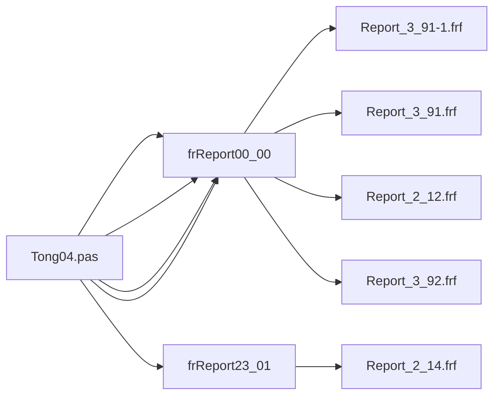

# FRF 레거시 호출 사이트 매핑 (자동 추출)

본 문서는 [`tools/analysis/frf_legacy_usage_extractor.py`](../../tools/analysis/frf_legacy_usage_extractor.py) 가 생성한다. 수동 편집 ❌.

- 정본 디렉터리: `legacy_delphi_source/legacy_source/Report/` (98 건)
- 추출 패턴: `LoadFromFile`, `OnGetValue`, `FieldByName`, `object frReportXX_YY: TfrReport`.

## 채움률 요약

- 정본 총 98 건
- 풀-매핑 (load+procedure+binding) ≥ 90%: **80** 건 (81%)
- 부분 매핑: **11** 건
- 매핑 0: **7** 건

### 매핑 0 사유 (수동 분석)

- ``-1`` / ``-2`` / ``-N`` 접미 변형 (예: ``Report_2_13-1.frf``, ``Report_4_51-1.frf``): 베이스 양식 (``Report_2_13.frf``, ``Report_4_51.frf``) 의 *서브 페이지/카피* 로 동적 선택. 따라서 ``LoadFromFile`` 에 *문자열로 등장하지 않음* 이 정상.
- ``계산서.frf``: ``Tong06.dfm`` 의 ``frReport49_01.ReportForm = {…}`` 안에 BLOB 으로 *임베드* (``StoreInDFM = True``). 적재는 form-create 시점에 자동.
- 일부 ``Report_6_*`` / ``Report_3_43`` 등: 현재 메뉴에서 미연결 (legacy 가지치기 후 죽은 양식 가능성).

## 호출 흐름 (top 5 적재)

## 정본 매핑 표

| FRF | 적재 unit (.pas) | TfrReport 컴포넌트 | 호출 procedure | Memo 바인딩 / 핸들러 | 채움률 |
| --- | --- | --- | --- | --- | ---: |
| `Report_1_11.frf` | Seep11.pas | frReport00_00 | Button1Click, Button2Click | — | 66% |
| `Report_1_21.frf` | Seep13.pas | frReport00_01 | Button2Click, Button3Click | fields: oSqry.* | 100% |
| `Report_1_22.frf` | Seep13.pas | frReport00_01 | Button2Click, Button3Click | fields: oSqry.* | 100% |
| `Report_1_23.frf` | Seep13.pas | frReport00_01 | Button2Click, Button3Click | fields: oSqry.* | 100% |
| `Report_1_24.frf` | Seep13.pas | frReport00_01 | Button2Click, Button3Click | fields: oSqry.* | 100% |
| `Report_1_25.frf` | Seep13.pas | frReport00_01 | Button2Click, Button3Click | fields: oSqry.* | 100% |
| `Report_1_61.frf` | Tong04.pas | frReport00_00 | Print_16_01 | fields: oSqry.* FindObject: Memo02, Memo04, Memo91 | 100% |
| `Report_1_62.frf` | Tong04.pas | frReport00_00 | Print_16_02 | fields: oSqry.* FindObject: Memo02, Memo04, Memo11, Memo12, Memo40 … (+3) | 100% |
| `Report_1_71.frf` | Tong04.pas | frReport00_00 | Print_17_03 | fields: oSqry.* FindObject: Memo100, Memo101, Memo40, Memo42, Memo44 … (+17) | 100% |
| `Report_2_11-.frf` | Tong04.pas | frReport21_01 | PrinTing00 | — | 66% |
| `Report_2_12.frf` | Tong04.pas | frReport00_00 | Print_21_02, Print_22_02, Print_23_02 | fields: oSqry.* FindObject: Memo02, Memo03, Memo04, Memo11, Memo12 … (+2) | 100% |
| `Report_2_13-1.frf` | Tong04.pas | frReport20_01 | PrinTing00 | — | 66% |
| `Report_2_13-2.frf` | Tong04.pas | frReport20_01 | PrinTing00 | — | 66% |
| `Report_2_13-3.frf` | Tong04.pas | frReport20_01 | PrinTing00 | — | 66% |
| `Report_2_13-5.frf` | Tong04.pas | frReport20_01 | PrinTing00 | — | 66% |
| `Report_2_13.frf` | Tong04.pas | frReport20_01 | PrinTing00 | — | 66% |
| `Report_2_14.frf` | Tong04.pas | frReport23_01 | PrinTing00 | — | 66% |
| `Report_2_19.frf` | Tong04.pas | frReport21_01 | PrinTing00 | — | 66% |
| `Report_2_41.frf` | Tong04.pas | frReport00_00 | Print_24_01, Print_34_01, Print_35_01 | fields: oSqry.* FindObject: Memo00, Memo02, Memo03, Memo04, Memo11 … (+5) | 100% |
| `Report_2_46.frf` | Tong04.pas | frReport00_00 | Print_59_11, Print_59_12 | fields: oSqry.* FindObject: Memo02, Memo03, Memo04, Memo16, Memo26 … (+3) | 100% |
| `Report_2_51.frf` | Tong04.pas | frReport00_00 | Print_25_01 | fields: oSqry.* FindObject: Memo00, Memo02, Memo03, Memo04, Memo11 … (+1) | 100% |
| `Report_3_11.frf` | Tong04.pas | frReport00_00 | Print_31_01, SetTring12 | fields: oSqry.* FindObject: Memo00, Memo02, Memo04, Memo06, Memo91 | 100% |
| `Report_3_12.frf` | Tong04.pas | frReport00_00 | Print_31_02 | fields: oSqry.* FindObject: Memo02, Memo04, Memo06, Memo91 | 100% |
| `Report_3_21.frf` | Tong04.pas | frReport00_00 | Print_32_01 | fields: oSqry.* FindObject: Memo02, Memo03, Memo04, Memo06, Memo91 | 100% |
| `Report_3_22.frf` | Tong04.pas | frReport00_00 | Print_32_02 | fields: oSqry.* FindObject: Memo02, Memo03, Memo04, Memo06, Memo91 | 100% |
| `Report_3_31.frf` | Tong04.pas | frReport00_00 | Print_33_02 | fields: oSqry.* FindObject: Memo02, Memo03, Memo04, Memo17, Memo27 … (+3) | 100% |
| `Report_3_32.frf` | Tong04.pas | frReport00_00 | Print_33_01 | fields: oSqry.* FindObject: Memo02, Memo03, Memo04, Memo91 | 100% |
| `Report_3_41.frf` | Tong04.pas | frReport00_00 | Print_34_02 | fields: oSqry.* FindObject: Memo02, Memo03, Memo04, Memo17, Memo27 … (+3) | 100% |
| `Report_3_42.frf` | Tong04.pas | frReport00_00 | Print_34_01 | fields: oSqry.* FindObject: Memo02, Memo03, Memo04, Memo17, Memo27 … (+3) | 100% |
| `Report_3_43.frf` | — | — | — | — | 0% |
| `Report_3_44.frf` | — | — | — | — | 0% |
| `Report_3_45.frf` | Tong04.pas | frReport00_00 | Print_34_05, Print_34_06 | fields: oSqry.* FindObject: Memo00, Memo02, Memo03, Memo04, Memo11 … (+2) | 100% |
| `Report_3_91-1.frf` | Tong04.pas | frReport00_00 | Print_39_01, Print_39_02, Print_39_03, Print_39_04, Print_39_05 | fields: oSqry.* FindObject: Memo02, Memo04, Memo13, Memo44, Memo71 … (+2) | 100% |
| `Report_3_91.frf` | Tong04.pas | frReport00_00 | Print_39_01, Print_39_02, Print_39_03, Print_39_04, Print_39_05 | fields: oSqry.* FindObject: Memo02, Memo04, Memo13, Memo44, Memo71 … (+2) | 100% |
| `Report_3_92.frf` | Tong04.pas | frReport00_00 | Print_39_01, Print_39_02, Print_39_08, Print_39_09, Print_99_01 | fields: oSqry.* FindObject: Memo02, Memo04, Memo44, Memo71, Memo72 … (+1) | 100% |
| `Report_4_11.frf` | Tong04.pas | frReport00_00 | Print_41_01 | fields: oSqry.* FindObject: Memo02, Memo04, Memo91 | 100% |
| `Report_4_21.frf` | Tong04.pas | frReport00_00 | Print_42_01 | fields: oSqry.* FindObject: Memo02, Memo04, Memo91 | 100% |
| `Report_4_31.frf` | Tong04.pas | frReport00_00 | Print_43_01 | fields: oSqry.* FindObject: Memo02, Memo04, Memo06, Memo91 | 100% |
| `Report_4_41.frf` | Tong04.pas | frReport00_00 | Print_44_01 | fields: oSqry.* FindObject: Memo00, Memo01, Memo02, Memo04, Memo201 … (+1) | 100% |
| `Report_4_51-0.frf` | Tong04.pas | frReport00_00 | Print_45_01, Print_46_01, Print_46_02 | fields: oSqry.* FindObject: Memo00, Memo01, Memo02, Memo193, Memo201 … (+27) | 100% |
| `Report_4_51-1.frf` | Tong04.pas | frReport00_00 | Print_45_01, Print_46_01, Print_46_02 | fields: oSqry.* FindObject: Memo00, Memo01, Memo02, Memo193, Memo201 … (+27) | 100% |
| `Report_4_51-2.frf` | Tong04.pas | frReport00_00 | Print_45_01, Print_46_01, Print_46_02 | fields: oSqry.* FindObject: Memo00, Memo01, Memo02, Memo193, Memo201 … (+27) | 100% |
| `Report_4_51-3.frf` | Tong04.pas | frReport00_00 | Print_45_01, Print_46_01, Print_46_02 | fields: oSqry.* FindObject: Memo00, Memo01, Memo02, Memo193, Memo201 … (+27) | 100% |
| `Report_4_51-4.frf` | Tong04.pas | frReport00_00 | Print_45_01, Print_46_01, Print_46_02 | fields: oSqry.* FindObject: Memo00, Memo01, Memo02, Memo193, Memo201 … (+27) | 100% |
| `Report_4_51-5.frf` | Tong04.pas | frReport00_00 | Print_45_01, Print_46_01, Print_46_02 | fields: oSqry.* FindObject: Memo00, Memo01, Memo02, Memo193, Memo201 … (+27) | 100% |
| `Report_4_51-6.frf` | Tong04.pas | frReport00_00 | Print_45_01, Print_46_01, Print_46_02 | fields: oSqry.* FindObject: Memo00, Memo01, Memo02, Memo193, Memo201 … (+27) | 100% |
| `Report_4_51-7.frf` | Tong04.pas | frReport00_00 | Print_45_01, Print_46_01, Print_46_02 | fields: oSqry.* FindObject: Memo00, Memo01, Memo02, Memo193, Memo201 … (+27) | 100% |
| `Report_4_51-8.frf` | Tong04.pas | frReport00_00 | Print_45_01, Print_46_01, Print_46_02 | fields: oSqry.* FindObject: Memo00, Memo01, Memo02, Memo193, Memo201 … (+27) | 100% |
| `Report_4_51-9.frf` | Tong04.pas | frReport00_00 | Print_45_01, Print_46_01, Print_46_02 | fields: oSqry.* FindObject: Memo00, Memo01, Memo02, Memo193, Memo201 … (+27) | 100% |
| `Report_4_51.frf` | Tong04.pas | frReport00_00 | Print_45_01, Print_46_01, Print_46_02 | fields: oSqry.* FindObject: Memo00, Memo01, Memo02, Memo193, Memo201 … (+27) | 100% |
| `Report_4_52.frf` | Tong04.pas | frReport00_00 | Print_45_02 | fields: oSqry.* FindObject: Memo00, Memo01, Memo02, Memo193, Memo201 … (+18) | 100% |
| `Report_4_71.frf` | Tong04.pas | frReport00_00 | Print_47_01 | fields: oSqry.* FindObject: Memo02, Memo03, Memo04, Memo91 | 100% |
| `Report_4_94.frf` | Tong04.pas | frReport40_02 | PrinTing00 | — | 66% |
| `Report_4_96.frf` | Tong04.pas | frReport40_02 | PrinTing00 | — | 66% |
| `Report_5_21.frf` | Tong04.pas | frReport00_00 | Print_51_01, Print_52_01 | fields: oSqry.* FindObject: Memo02, Memo03, Memo04, Memo91 | 100% |
| `Report_5_31.frf` | Tong04.pas | frReport00_00 | Print_53_01 | fields: oSqry.* FindObject: Memo02, Memo91 | 100% |
| `Report_5_32.frf` | Tong04.pas | frReport00_00 | Print_53_02 | fields: oSqry.* FindObject: Memo02, Memo91 | 100% |
| `Report_5_41.frf` | Tong04.pas | frReport00_00 | Print_54_01 | fields: oSqry.* FindObject: Memo02, Memo91 | 100% |
| `Report_5_42.frf` | Tong04.pas | frReport00_00 | Print_54_02 | fields: oSqry.* FindObject: Memo02, Memo91 | 100% |
| `Report_5_51.frf` | Tong04.pas | frReport00_00 | Print_55_01 | fields: oSqry.* FindObject: Memo02, Memo91 | 100% |
| `Report_5_52.frf` | Tong04.pas | frReport00_00 | Print_55_02 | fields: oSqry.* FindObject: Memo02, Memo91 | 100% |
| `Report_5_53.frf` | Tong04.pas | frReport00_00 | Print_55_03 | fields: oSqry.* FindObject: Memo02, Memo91 | 100% |
| `Report_5_54.frf` | Tong04.pas | frReport00_00 | Print_55_04 | fields: oSqry.* FindObject: Memo02, Memo91 | 100% |
| `Report_5_61.frf` | Tong04.pas | frReport00_00 | Print_56_01 | fields: oSqry.* FindObject: Memo02, Memo91 | 100% |
| `Report_5_62.frf` | Tong04.pas | frReport00_00 | Print_56_02 | fields: oSqry.* FindObject: Memo02, Memo91 | 100% |
| `Report_5_63.frf` | Tong04.pas | frReport00_00 | Print_56_02, Print_59_01 | fields: oSqry.* FindObject: Memo02, Memo91 | 100% |
| `Report_5_64.frf` | Tong04.pas | frReport00_00 | Print_59_02 | fields: oSqry.* FindObject: Memo02, Memo91 | 100% |
| `Report_5_71.frf` | Tong04.pas | frReport00_00 | Print_57_01 | fields: oSqry.* FindObject: Memo02, Memo91 | 100% |
| `Report_5_72.frf` | Tong04.pas | frReport00_00 | Print_57_02 | fields: oSqry.* FindObject: Memo02, Memo91 | 100% |
| `Report_5_81.frf` | Tong04.pas | frReport00_00 | Print_58_01 | fields: oSqry.* FindObject: Memo02, Memo03, Memo04, Memo91 | 100% |
| `Report_5_82.frf` | Tong04.pas | frReport00_00 | Print_58_02 | fields: oSqry.* FindObject: Memo02, Memo03, Memo04, Memo16, Memo26 … (+3) | 100% |
| `Report_5_91.frf` | Tong04.pas | frReport00_00 | Print_39_11 | fields: oSqry.* FindObject: Memo02, Memo91 | 100% |
| `Report_5_92.frf` | Tong04.pas | frReport00_00 | Print_39_21 | fields: oSqry.* FindObject: Memo02, Memo04, Memo91 | 100% |
| `Report_6_11.frf` | Tong04.pas | frReport00_00 | Print_61_01 | fields: oSqry.* FindObject: Memo02, Memo03, Memo04, Memo16, Memo26 … (+3) | 100% |
| `Report_6_12.frf` | Tong04.pas | frReport00_00 | Print_61_02 | fields: oSqry.* FindObject: Memo02, Memo03, Memo04, Memo14, Memo24 … (+3) | 100% |
| `Report_6_21.frf` | Tong04.pas | frReport00_00 | Print_62_01 | fields: oSqry.* FindObject: Memo02, Memo03, Memo04, Memo14, Memo24 … (+3) | 100% |
| `Report_6_22.frf` | Tong04.pas | frReport00_00 | Print_62_02 | fields: oSqry.* FindObject: Memo02, Memo03, Memo04, Memo91 | 100% |
| `Report_6_31.frf` | — | — | — | — | 0% |
| `Report_6_32.frf` | — | — | — | — | 0% |
| `Report_6_41.frf` | — | — | — | — | 0% |
| `Report_6_42.frf` | Tong04.pas | frReport00_00 | Print_64_02 | fields: oSqry.* FindObject: Memo02, Memo03, Memo04, Memo91 | 100% |
| `Report_6_51-.frf` | Tong04.pas | frReport00_00 | Print_65_01 | fields: oSqry.* FindObject: Memo02, Memo03, Memo04, Memo91 | 100% |
| `Report_6_51.frf` | Tong04.pas | frReport00_00 | Print_65_01 | fields: oSqry.* FindObject: Memo02, Memo03, Memo04, Memo91 | 100% |
| `Report_6_52-.frf` | Tong04.pas | frReport00_00 | Print_65_02 | fields: oSqry.* FindObject: Memo02, Memo03, Memo04, Memo91 | 100% |
| `Report_6_52.frf` | Tong04.pas | frReport00_00 | Print_65_02 | fields: oSqry.* FindObject: Memo02, Memo03, Memo04, Memo91 | 100% |
| `Report_6_61-.frf` | Tong04.pas | frReport00_00 | Print_66_01 | fields: oSqry.* FindObject: Memo02, Memo03, Memo04, Memo91 | 100% |
| `Report_6_61.frf` | Tong04.pas | frReport00_00 | Print_66_01 | fields: oSqry.* FindObject: Memo02, Memo03, Memo04, Memo91 | 100% |
| `Report_6_62-.frf` | Tong04.pas | frReport00_00 | Print_66_02 | fields: oSqry.* FindObject: Memo02, Memo03, Memo04, Memo17, Memo27 … (+3) | 100% |
| `Report_6_62.frf` | Tong04.pas | frReport00_00 | Print_66_02 | fields: oSqry.* FindObject: Memo02, Memo03, Memo04, Memo17, Memo27 … (+3) | 100% |
| `Report_6_71.frf` | Tong04.pas | frReport00_00 | Print_67_01 | fields: oSqry.* FindObject: Memo02, Memo03, Memo04, Memo17, Memo27 … (+3) | 100% |
| `Report_6_72.frf` | Tong04.pas | frReport00_00 | Print_67_02 | fields: oSqry.* FindObject: Memo02, Memo03, Memo04, Memo17, Memo27 … (+3) | 100% |
| `Report_6_81.frf` | Tong04.pas | frReport00_00 | Print_68_01 | fields: oSqry.* FindObject: Memo02, Memo03, Memo04, Memo15, Memo25 … (+3) | 100% |
| `Report_6_82.frf` | Tong04.pas | frReport00_00 | Print_68_02 | fields: oSqry.* FindObject: Memo02, Memo03, Memo04, Memo15, Memo25 … (+3) | 100% |
| `Report_6_91.frf` | Tong04.pas | frReport00_00 | Print_63_01 | fields: oSqry.* FindObject: Memo02, Memo03, Memo04, Memo91 | 100% |
| `Report_6_92.frf` | Tong04.pas | frReport00_00 | Print_64_01 | fields: oSqry.* FindObject: Memo02, Memo03, Memo04, Memo91 | 100% |
| `Report_6_93.frf` | Tong04.pas | frReport00_00 | Print_63_02 | fields: oSqry.* FindObject: Memo02, Memo03, Memo04, Memo91 | 100% |
| `Report_6_99.frf` | — | — | — | — | 0% |
| `계산서.frf` | — | — | — | — | 0% |
