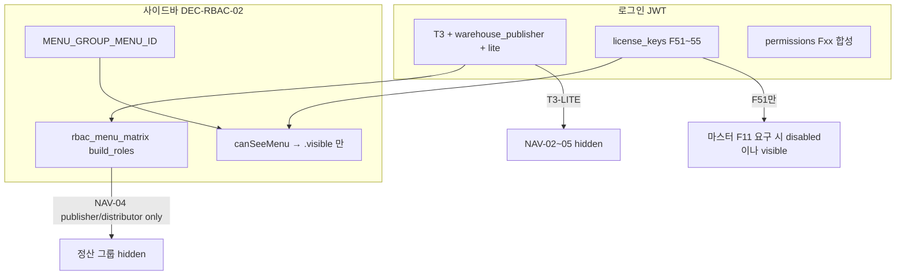

# 서브·부서 계정(경리부 등) 메뉴 미노출 — 처리 계획

| 항목 | 내용 |
|------|------|
| 작성일 | 2026-05-25 |
| 상태 | **IMPLEMENTED (2026-05-25)** — live 계정 자격증명 재확인 후 Phase 0 probe 재실행만 남음 |
| 대표 사례 | 교문사(`chul_09_db`) 테넌트 로그인 + Id_Logn `경리부` → 사이드바 **전 그룹 0건** |
| Harness | **N/A** (RBAC·로그인·프론트 사이드바 정합 — 일반 백엔드/프론트 작업) |

---

## 1. 문제 정의

### 1.1 관찰된 패턴

| 구분 | 교문사(본사·대표 Id_Logn) | 경리부(부서·서브 Id_Logn) |
|------|-------------------------|---------------------------|
| 테넌트 선택 | `tenantId` = 교문사 | 동일 `tenantId`로 로그인 (DSN-DEC-09) |
| `account_type` / `build_role` | `T3` + `warehouse_publisher` (시드) | **동일** (테넌트에서 상속) |
| Id_Logn Fxx (실측) | `F11`~ 거래·마스터 계열 `O`/`R` | `F51`~`F55` 회계·정산 계열 `O`/`R`, `F11` 없음 |
| `license_keys` (JWT) | F11, F12, … | F51, F52, … (union) |
| 레거시 UX | 거래·마스터·(빌드별) 물류 메뉴 | **회계·정산 메뉴만** (Seek_Uses F51~) |
| 웹 UX (현재) | T3-LITE 자체 물류 NAV 일부 노출 | **사이드바 빈 화면** (visible 폼 0) |

회귀 단위 테스트로 프로파일 분리는 이미 고정됨: `test/test_auth_fxx_license_keys_merge.py::test_gyomunsa_vs_accounting_department_profile`.

### 1.2 근본 원인 (3중 불일치)

웹 메뉴는 **테넌트 메타만** 보고, **사용자 Id_Logn Fxx 프로파일**은 라이선스(disabled)에만 쓰이거나 무시된다.

**결정적 차단 (경리부 → 메뉴 0건)**

1. **`build_role` 게이트**  
   `정산관리` 그룹 기본 `menuId` = `ACC-MENU-NAV-04`(회계관리). 매트릭스 `build_roles` = `["distributor","publisher"]` 만 허용 → `warehouse_publisher` 는 **visible=false** → 그룹 전체 숨김 (`sidebar.tsx`: `forms.length === 0`).

2. **T3-LITE 티어**  
   교문사 계열은 `warehouse_menu_tier=lite`. 매트릭스상 publisher 셸 NAV-02~05(거래·원장·회계·자료)는 LITE 열 **비허용**. 경리부가 필요로 하는 회계 NAV-04는 이중으로 막힘.

3. **그룹↔셸 매핑 편향**  
   `MENU_GROUP_MENU_ID` 는 publisher 셸 NAV를 기본으로 두고, 자체 물류(NAV-09~)는 폼 단위 `menuId` 로만 보강. **F51 전용 부서 계정**용 NAV/그룹 세트가 없음.

4. **(부가) `account_type=""` 폴백**  
   ACTR-DEC-05 미매핑 시 매트릭스 `account_types` 검사 전부 실패 → 동일하게 빈 사이드바. 서브계정이 `login_id_index`·`tenants_directory` 에 없을 때 발생 가능.

5. **(부가) 사이드바는 `disabled` 미반영**  
   MENUVIS-DEC-06: 라이선스 미보유 시 `visible=true, disabled=true`. 사이드바는 `.visible` 만 보므로, RBAC만 통과한 항목은 보이나 **경리부는 RBAC 단계에서 이미 전부 탈락**.

---

## 2. 계정 패턴 분류 (처리 대상)

`analysis/welove_shared_db_hcode_candidates.json` · `login_id_index` 기준 **chul_09_db 공유 DB** 후보:

| 패턴 ID | 예시 로그인 | Fxx 지문 | 테넌트 로그인 | 기대 메뉴 셸 |
|---------|-------------|----------|---------------|--------------|
| `PUB-MAIN` | 교문사, 동문사 | F11~, F51 X | 본사 `tenantId` | T3 publisher 또는 WH-LITE (운영 정책) |
| `DEPT-ACCT` | 경리부, 경리부(케이디북스) | F51~55, F11 없음 | 부모 `tenantId` | **회계·정산 NAV만** (레거시 동등) |
| `DEPT-OPS` | 영업부, 총무부, 물류, 관리부 | F11~ 또는 물류 Fxx 혼합 | 부모 `tenantId` | 부서별 부분 집합 |
| `PUB-SUB-HCODE` | `_경리부(김은선)_` | 별도 `hcode`(5015 등) | 동일/별도 | DEPT-ACCT + **hcode 데이터 격리** 유지 |
| `UNMAPPED` | 신규 서브 Id_Logn | 불명 | 미등록 | ACTR 빈값 → 관리자 매핑 대기 |

**원칙**: `hcode`·API 데이터 격리는 유지. 메뉴 셸만 Id_Logn Fxx **프로파일**로 분기(테넌트 `build_role` 덮어쓰기 금지).

---

## 3. 목표·비목표

### 목표

- `DEPT-ACCT` 로그인 시 레거시와 같이 **회계·정산 관련 메뉴만** 노출(최소 1개 NAV 그룹 + 하위 폼).
- 동일 테넌트 내 `PUB-MAIN` / `DEPT-*` **동시 운영** 시 메뉴·JWT·API 스코프 회귀 없음.
- 진단·운영: 로그인 직후 **왜 메뉴가 비었는지** 한눈에 보는 배지/프로브.

### 비목표 (본 사이클)

- Id_Logn Fxx 편집 UI 전면 개편(후속).
- 모든 62 F-key ↔ `ACC-MENU-*` 1:1 자동 매핑(`OQ-LICENSE-KEY-MAP` 전체).
- 레거시 Delphi 메뉴 항목 수준 100% 동등(웹은 phase1 승격 폼만).

---

## 4. 처리 전략 (권장: 프로파일 + 유효 메뉴 셸)

### 4.1 `login_profile` (JWT·로그인 응답)

| 값 | 판정 (우선순위) | 효과 |
|----|-----------------|------|
| `publisher_main` | 기본·F11 지배 | 현행 T3/`warehouse_publisher` + publisher NAV |
| `warehouse_ops` | F11 없고 NAV-09 계열 Fxx 지배 | T3-LITE 물류 NAV |
| `department_accounting` | F51~55만(또는 지배), F11 없음 | **회계 NAV 전용** 셸 |
| `department_custom` | 관리자 `web_users.menu_profile` | 수동 오버라이드 |
| `unconfigured` | Fxx 없음 + ACTR 실패 | 빈 메뉴 + **안내 UX** (§6) |

**판정 위치**: `auth_service` 로그인 종단 — `merge_license_keys` 직후, Fxx 지문 함수 `infer_login_profile(fxx) -> str` (신규, 단일 모듈).

**DEC 후보**: `DEC-RBAC-04` — «메뉴 셸은 `login_profile` + `license_keys`; `build_role` 은 API·데이터 스코프용».

### 4.2 매트릭스 확장

1. `analysis/rbac_menu_matrix.json` / `docs/onboarding-rbac-menu-matrix.md`  
   - NAV-04(회계)에 `build_roles` += `warehouse_publisher` **만으로는 부족** — LITE 티어·부서 프로파일 열 추가.  
   - 신설 `login_profiles: ["department_accounting"]` 차원(빈 배열 = 무제한 규칙 유지).

2. `migration/contracts/default_id_logn_permissions.yaml`  
   - `customer_variants` 예: `match.login_profile: department_accounting` → `menu_ids_granted_hint` / F51 NAV 매핑.

3. `form-registry.ts`  
   - 정산·회계 폼에 `menuId: ACC-MENU-*` + F51 `license_keys` 정합 (C5 Sobo45 계열).

### 4.3 프론트

- `account-menu-matrix.ts` / `use-permissions.ts`: `loginProfile` 인자 추가, `navUiState` 평가에 반영.
- `sidebar.tsx`: visible 0건일 때 **「부서 계정 — 허용 메뉴 없음」** + `login_profile`·누락 `license_keys` 요약(운영자용, 비밀 없음).
- (선택) MENUVIS-DEC-06 정합: 사이드바에 `disabled` 스타일 + tooltip «권한 없음».

### 4.4 백엔드·관리

- `GET /api/v1/auth/me` 또는 로그인 응답에 `login_profile`, `menu_shell_hint` 추가.
- `(app)/admin/id-logn`: 프로파일 미리보기 + `login_profile` 수동 고정.
- `debug/probe_login_menu_visibility.py`: `userId` + `tenantId` → JWT 클레임 + visible/disabled 메뉴 ID 목록 (DB live 옵션).

### 4.5 데이터·테넌트

- 서브 Id_Logn은 **부모 `tenantId` 로그인 유지** (DSN-DEC-09).  
- `hcode` 는 Id_Logn row SSOT — 경리부 `5039` vs 교문사 `5056` 격리 **변경 없음**.  
- `tenants_directory` 에 `parent_tenant_id`·`sub_account_policy` 문서화만(코드 분기 최소).

---

## 5. 구현 단계

| Phase | 내용 | 산출물 | 완료 기준 |
|-------|------|--------|-----------|
| **0 진단** | 교문사·경리부 로그인 JWT 스냅샷, visible 메뉴 ID diff | `debug/probe_login_menu_visibility.py` 비교 모드 + `analysis/audit/login-menu-visibility-probe-20260525.json` | **부분 완료** (산출물 생성, 현재 자격증명 401) |
| **1 계약** | `login_profile` enum, DEC-RBAC-04 초안, 매트릭스 `login_profiles` 열 | `decision-rbac`, `rbac_menu_matrix.json`, onboarding 문서 | **완료** (`DEC-RBAC-04`, onboarding 열, extract 재생성 반영) |
| **2 백엔드** | `infer_login_profile`, JWT/로그인 응답, `menu_policy` 동기화 | `auth_service`, `menu_policy.py` | `test_auth_fxx_*` + 신규 profile 테스트 |
| **3 프론트** | matrix·sidebar·빈 메뉴 UX | `account-menu-matrix.ts`, `sidebar.tsx` | **완료** (빈 메뉴 진단 + login_profile/license_keys 요약 + disabled 표시) |
| **4 운영** | Id_Logn 관리 화면 미리보기, ACTR 빈값 알림 | admin 라우터 | **완료** (`account-directory` login_profile 오버레이 + `id-logn` profile preview) |
| **5 회귀** | 4대 서버 스모크는 기존; 메뉴 전용 dry-run | `test_account_menu_matrix_visibility.py` 확장 | **완료** (pairwise 시나리오/DEC-RBAC-04 회귀 추가) |

**의존 순서**: 0 → 1 → 2 ∥ 3 → 4 → 5.

---

## 6. 진단 체크리스트 (운영·개발 공통)

로그인 직후 다음을 순서대로 확인:

1. **JWT / 사용자 객체**  
   - `account_type` (빈 문자열 여부)  
   - `build_role`, `warehouse_menu_tier`, `active_build_id`  
   - `license_keys` (F11 vs F51 집합)  
   - `permissions` (Fxx 합성 0건 여부)  
   - (신규) `login_profile`

2. **Id_Logn** (`chul_09_db`, Gcode=경리부)  
   - `fetch_fxx_matrix` → F51~55만 `O`/`R` 인지  
   - `Hcode` ≠ 본사인지(데이터 스코프)

3. **매트릭스 게이트** (프론트 dry-run 또는 probe)  
   - `ACC-MENU-NAV-04` + `build_role=warehouse_publisher` → 현재 **false** 기대  
   - `ACC-MENU-NAV-06` 통계 → T3 + empty build_roles → **true** 가능(하위 폼은 Fxx·menuId 추가 게이트)

4. **ACTR**  
   - `login_id_index` / `tenants_directory` 에 경리부 행 존재 여부  
   - `account_type=""` 이면 노란 배지 + admin/id-logn 매핑

5. **사이드바**  
   - `visibleFormsByGroup` 전 그룹 0 → 본 계획의 대표 증상

### 6.1 실측 로그 (2026-05-25)

- 실행 도구: `debug/probe_login_menu_visibility.py` (비교 모드)
- 산출물: `analysis/audit/login-menu-visibility-probe-20260525.json`
- 실행 파라미터: `base=http://localhost:8000`, `tenantId=fa6758ea-a7e5-5d27-bf87-ccee0a90e72c`, 비교 계정=`교문사` vs `경리부`
- 결과: 두 계정 모두 `401` (`아이디 또는 비밀번호가 올바르지 않습니다.`)로 반환되어 live visible/diff는 빈 집합
- 해석: 프로브·diff 저장 경로는 검증 완료. DoD 판정을 위한 실측은 운영 테스트 계정 자격증명 재확인 후 동일 명령 재실행 필요

---

## 7. 테스트·DoD

| 항목 | 내용 |
|------|------|
| 단위 | `infer_login_profile` — gyomunsa / accounting / mixed Fxx |
| 단위 | `navUiState` — `department_accounting` + F51 only → NAV-04 visible, NAV-09 optional deny |
| 통합 | Mock 로그인 `경리부` + 교문사 `tenantId` → JWT `login_profile=department_accounting` |
| 통합 | 교문사 본계정 회귀 — 기존 visible 집합 **감소 없음** |
| E2E | (선택) Playwright: 사이드바 ≥1 그룹, 정산 라우트 1건 클릭 |
| DoD | `DEPT-ACCT` 빈 사이드바 0건; `UNMAPPED` 는 안내 UX만 허용 |

기존 잠금 유지: `test/test_auth_fxx_license_keys_merge.py`, `test/test_account_menu_matrix_visibility.py`, `test/test_auth_login_dynamic_routing.py` (tenantId 전달).

---

## 8. 리스크·완화

| 리스크 | 완화 |
|--------|------|
| `warehouse_publisher` 에 publisher NAV 전부 열림 | `login_profile` 로 NAV 집합 제한; 매트릭스 `login_profiles` 열 |
| Fxx 지문 오판(영업부) | `department_custom` 관리자 오버라이드 + probe 로그 |
| JWT 60키 한도 | F51~55만이면 여유; tenant union 시 truncate 정책 유지 |
| hcode 격리 회귀 | 메뉴 변경만; `enforce_hcode_isolation` 미변경 |

---

## 9. 모델 선택 (planning-model-tiers)

| 서브태스크 | 권장 티어 | 사용자 모델 선택 메모 |
|------------|-----------|----------------------|
| Phase 0 probe·JWT diff | 표준 | 기본 |
| Phase 1 DEC·매트릭스·YAML 계약 | 표준 | 기본 |
| Phase 2~3 auth/menu_policy/프론트 | 표준 | 기본 |
| Fxx↔ACC-MENU 전량 매핑 검토 | 고급 권장 | 레거시 핸들러 62키 해석 시 Thinking 모델 선택 권장 |

**모델 선택:** 표준 행은 Cursor 기본·빠른 모델. 고급 권장 행만 수동 지정 후 해당 단계 재실행.

---

## 10. 참조

- `test/test_auth_fxx_license_keys_merge.py` — 교문사 vs 경리부 Fxx  
- `docs/decision-rbac-and-id-logn-truth.md` — DEC-RBAC-02/03  
- `docs/onboarding-account-type-resolution.md` — ACTR-DEC-01~05  
- `docs/menu-visibility-runtime-design.md` — MENUVIS-DEC-06  
- `docs/onboarding-rbac-menu-matrix.md` — T3-LITE vs publisher NAV  
- `도서물류관리프로그램/frontend/src/components/app-shell/sidebar.tsx` — 그룹 숨김 규칙  
- `analysis/welove_shared_db_hcode_candidates.json` — 경리부·부서 로그인 샘플  

---

## 11. 즉시 완화 (구현 전 임시)

운영 긴급 시 (코드 배포 전):

1. 관리자 `(app)/admin/id-logn` 에서 경리부 `web_users` / ACTR `account_type` 확인.  
2. 슈퍼/테스트가 아니면 **경리부 전용 테스트 계정**으로 `login_profile` 수동 지정은 Phase 4 전까지 불가 → Phase 0 probe로 원인 확인 후 Phase 1~2 우선 착수 권장.

장기적으로는 **테넌트 `build_role` 복사가 아니라 `login_profile` + Fxx 지문** 이 서브·부서 계정의 정식 경로다.
