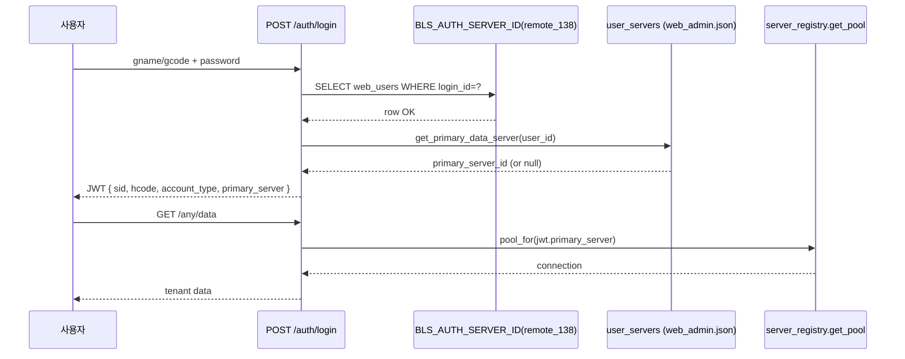

# 로그인 기반 DB 라우팅 설계 (DEC 후보 — `DSN-*`)

| 항목 | 내용 |
|------|------|
| 작성일 | 2026-04-23 (2026-04-24 보강: `DSN-DEC-06/07` — `(tenant_id, account_family)` 합성 키 + JWT `license_keys[]`) (2026-04-24 후보 추가: `DSN-DEC-08` — 분산 `Id_Logn` 정합 + 메타 기반 cross-DB 인증 경로 동결) (2026-04-24 후보 추가: `DSN-DEC-09` — login_id 인덱스 + 온디맨드 lazy refresh, `DSN-DEC-10` — 가중치 기반 신규 테넌트 DB 자동 프로비저닝) |
| 상태 | **DRAFT (사용자 승인 전)** — DEC-008(단일 테넌트), DEC-051(인증 서버 단일화), DEC-052(사용자별 1:1 데이터 서버) 와 정합 검토 후 DEC-XXX 로 동결 후보. `DSN-DEC-08` 은 분산 `Id_Logn` 운영 현실에 따라 DEC-051/052 의 의미를 재정의한다. |
| 추적 ID | `DSN-*` (라우팅 규칙 단위) |
| 단일 원천 | 본 문서 + 메타 [`analysis/welove_db_route_matrix.json`](../analysis/welove_db_route_matrix.json) + 빌드 카탈로그 [`analysis/welove_chul_builds.json`](../analysis/welove_chul_builds.json) |
| 비밀 정책 | 자격증명 0건 — 본 문서·메타 모두 [`docs/secrets-policy.md`](secrets-policy.md) 의 G3 강화 정책을 따른다. |
| 연관 | OQ-LOGIN-1 (멀티테넌시), OQ-LOGIN-2 (`SCH-RECON-01` — `Id_Logn.gcode/gname` 의미), `migration/contracts/login.yaml` D-LOGIN-4, [`docs/welove-chul-build-menu-matrix.md`](welove-chul-build-menu-matrix.md), [`docs/menu-visibility-runtime-design.md`](menu-visibility-runtime-design.md) |

---

## 1. 문제 정의

레거시 델파이는 **고객사별 EXE + Config.Ini** 모델로 사실상 단일 테넌트로 운영(DEC-008). 웹은 한 인스턴스에서 다수 고객사를 수용해야 하므로 **로그인 주체 → 데이터 소스(서버·DB)** 의 자동 결정이 필요하다.

수집된 자산:

- 4 운영 서버 × 약 40 개 테넌트(출판사·총판) — [`analysis/welove_db_route_matrix.json`](../analysis/welove_db_route_matrix.json)
- 사용자/암호는 출판사별로 분리되어 있어 **단일 인증 서버**(DEC-051) 와 **사용자별 primary 서버**(DEC-052) 로 결합 운영.
- 회의 결과(2026-04-23) 3 가지 계정 유형(T1 수퍼, T2 총판/소속, T3 독립) — 유형별 데이터 가시성 정책이 다름.

---

## 2. 핵심 결정 (제안)

### `DSN-DEC-01` — 단일 인증 서버 + 사용자별 primary 데이터 서버 (확정 — DEC-051/052 인용)

- 모든 비밀번호 검증은 `BLS_AUTH_SERVER_ID` 한 곳의 `web_users` 에서 수행(DEC-051).
- 로그인 성공 시 `data_server_id = get_primary_data_server(user_id) or BLS_AUTH_SERVER_ID` 를 JWT `sid` 에 적재(DEC-052).
- 본 결정은 **이미 코드에 적용** — 본 문서는 정합 명시.

### `DSN-DEC-02` — JWT 클레임 표준 (신설 후보)

JWT payload 에 다음 필드를 표준화하여 모든 라우터/서비스가 일관 사용한다.

```json
{
  "sub": "<gcode>",
  "user_id": "<gcode>",
  "user_name": "<hname>",
  "hcode": "<출판사코드>",
  "account_type": "T1|T2_DIST|T2_PUB|T3",
  "primary_server": "<server_id>",
  "tenant_db": "<db_name_logical>",
  "permissions": ["..."]
}
```

- `account_type` 은 회의 결과(`docs/meeting-account-types-rbac-context.md`) 의 T1/T2(상·하)/T3 매핑.
- `tenant_db` 는 메타에서만 채워지고, 비밀(user/password)은 JWT 비포함 — Vault/환경변수에서 서버측에서만 결합.

### `DSN-DEC-03` — 요청당 커넥션 풀 선택 헬퍼 (신설 후보)

기존 `app.db.server_registry.get_pool(server_id)` 를 그대로 활용하되, **요청 컨텍스트 헬퍼** 1 개를 신설한다.

```python
def pool_for(request_or_user) -> Pool:
    """JWT 의 primary_server -> server_registry.get_pool() 을 일관 조회."""
```

- 모든 도메인 서비스(`outbound_service`, `settlement_service` 등)는 본 헬퍼 1 개를 통해서만 풀을 잡는다 — 신규 서비스 추가 시 분기 누락 차단.
- 라우터 파라미터 `server_id` 가 명시되면 admin 권한 가드 + 본 헬퍼의 override 분기로 처리.

### `DSN-DEC-04` — 1차 롤아웃 (단일 DB 옵션 명시) — *권장*

| 단계 | 범위 | 안전망 |
|------|------|--------|
| **R0** (현 상태 유지) | `BLS_AUTH_SERVER_ID=remote_138` 1개 서버만 데이터 소스로 사용. JWT `sid` = auth 서버. | 4 서버 라이브 라우팅 OFF. 사용자 입장에서 행동 변화 0. |
| **R1** | admin 화면에서 사용자별 primary 1개 부여(DEC-052). 일부 사용자만 다른 서버로 라우팅 시작. | 라우터 가드 — primary 미할당 사용자는 R0 동작. |
| **R2** | 4 서버 동시 라우팅 + cross-DB invariant 가드(DEC-033 계열) PASS. | `test_regression_phase2.py --multi-db` 통과 후 phase1 승격. |
| **R3** | 옵션 — 멀티테넌시(DEC-008/OQ-LOGIN-1) 결정 후 `tenant_id` 추가. | 별 사이클 별 DEC. |

→ **본 사이클의 추천:** 현재는 R0/R1 사이. R2 진입 게이트는 DEC-047 (phase1 승격 0건) 의 4대 DB 환경 등록 완료에 종속.

### `DSN-DEC-05` — 메타 단일 원천: `welove_db_route_matrix.json` (신설)

- 신규 테넌트 추가 시 본 JSON 의 `routes[]` 에 1행 추가하면 admin 화면 드롭다운(DEC-052)이 자동 갱신되도록 **백엔드 sync 스크립트** 후속 단계에서 도입.
- 본 사이클은 메타 도입만, 자동 sync 는 다음 사이클.

### `DSN-DEC-06` — 라우팅 키 = `(tenant_id, account_family)` 합성 (신설 보강)

**문제 (2026-04-24 발견)**: 7 빌드 카탈로그 분석 결과, **`Config.Ini::Uses` 라벨 단독으로는 빌드/계정 SKU 를 결정할 수 없는 사례**가 발견되었다 ([`docs/welove-chul-build-menu-matrix.md::§7`](welove-chul-build-menu-matrix.md)):

| Uses 라벨 | 매핑되는 빌드 | account_family |
|---|---|---|
| `한국도서유통` | `BLD-DIST-KBT` | `book_kb` |
| `한국도서유통` | `BLD-PUB-WAREHOUSE-BOOKNBOOK-NEW` | `book_07` |
| `홍길동` (sample) | `BLD-PUB-STD` | (sample placeholder) |
| `홍길동` (sample) | `BLD-PUB-KBT` (≡PUB-STD 바이트 동일) | (sample placeholder) |

또한 동일 SKU 가 N 테넌트에 공유 배포되는 사례 ([`analysis/welove_db_route_matrix.json`](../analysis/welove_db_route_matrix.json)):
- `chul_09` SKU → 위러브1·2·3 + 교문사 (4 테넌트 공유 `chul_09_db`)
- `book_07` SKU → 북앤북 + 유앤북 (2 테넌트 공유 `book_07_db`)

→ **DSN/RBAC 라우팅 키 = `(tenant_id, account_family)` 합성**. 단일 라벨로 결정 금지.

**라우팅 키 결정 트리**:

```
로그인 (gname/gcode + password)
  ├─ 1) BLS_AUTH_SERVER_ID 의 web_users 에서 인증 (DSN-DEC-01)
  ├─ 2) user_id → tenant_id 조회 (web_users.tenant_id)
  ├─ 3) tenant_id → (account_family, build_id) 조회 (tenants_directory)
  │       account_family = 'chul_09' | 'book_07' | 'book_21' | 'book_kb' | ...
  │       build_id       = 'BLD-*'
  ├─ 4) (account_family) → primary_data_server, db_name_logical 조회
  │       (welove_db_route_matrix.json::routes 또는 user_servers override)
  └─ 5) JWT 발급 (DSN-DEC-02 + DSN-DEC-07)
```

**백엔드 헬퍼 보강**:

```python
def resolve_routing(user: User) -> RoutingKey:
    tenant = tenants_directory.get(user.tenant_id)
    return RoutingKey(
        tenant_id=tenant.id,
        account_family=tenant.account_family,   # 빌드 SKU
        build_id=tenant.active_build_id,        # forced_hidden, forms 결정
        build_role=tenant.build_role,           # distributor|publisher|warehouse_publisher
        primary_server=tenant.primary_server,
        db_name_logical=tenant.db_name_logical,
    )
```

**메타 신규 컬럼** (`tenants_directory.yaml` — 후속 사이클 신설):

| 컬럼 | 의미 | 예시 |
|---|---|---|
| `tenant_id` | UUID | `tnt_8a7f...` |
| `tenant_label_kor` | 표시 라벨 (Uses 와 동일) | `위러브1`, `북앤북`, `한국도서유통` |
| `account_family` | DB 사용자 prefix = 빌드 SKU | `chul_09`, `book_07`, `book_kb` |
| `active_build_id` | 활성 빌드 (BLD-*) | `BLD-PUB-WAREHOUSE-WELOVE` |
| `build_role` | distributor/publisher/warehouse_publisher | `warehouse_publisher` |
| `parent_tenant_id` | 상위 총판 (T2-PUB 의 경우) | nullable |
| `primary_server` | 데이터 서버 ID | `서버1`, `서버3`, `서버4` |
| `db_name_logical` | DB 이름 (자격증명 제외) | `chul_09_db` |

> 본 메타는 [`docs/secrets-policy.md`](secrets-policy.md) 준수 — UserName/Password 컬럼 신설 금지.

### `DSN-DEC-08` — 분산 `Id_Logn` 정합 + 메타 기반 cross-DB 인증 경로 동결 (신설 — 통합 로그인/자동 서버 지정)

**배경**: [`tools/_oneoff_dump_idlogn_for_distributors.py`](../tools/_oneoff_dump_idlogn_for_distributors.py) 로 추출한 `Id_Logn` 라이브 덤프 결과, 사용자/암호 데이터는 단일 인증 서버가 아니라 **테넌트별 `\<db\>.Id_Logn`** 으로 4 개 운영 서버(`remote_138`/`remote_153`/`remote_154`/`remote_155`) 에 분산되어 있음을 확인했다. `BLS_AUTH_SERVER_ID=remote_138` 의 default DB 한 곳에서만 검증하면 다른 서버·다른 DB 의 사용자는 영원히 401 을 받는다. DEC-051 (인증 서버 단일화) 의 운영 의미를 본 결정으로 재정의한다.

**결정**:

- **인증 경로 정본 = 메타 기반 cross-DB Id_Logn 직접 조회.**
  - 통합 로그인 UI(ID/PW + 옵션 보조 식별자) → 백엔드 라우팅 해석기가 `(remote_id, db_name_logical)` 1쌍을 결정 → 그 위치의 `\`<db>\`.Id_Logn` 1회 SELECT 로 비밀번호 검증.
  - 다중 서버 순차 probe 는 금지. 메타로 결정 불가능한 모호 매치는 **단일 401 메시지** (`AUTH_AMBIGUOUS_ROUTE`).
- **인증 서버 단일화(DEC-051) 의 의미** = "허용된 인증 엔드포인트(=`POST /auth/login`) 는 한 곳, 검증 위치는 메타가 결정" 으로 재정의. `BLS_AUTH_SERVER_ID` 는 라우팅 해석 실패 시 폴백 데이터 서버로 의미 축소.
- **JWT `sid`(DEC-052) = 검증에 성공한 물리 데이터 서버.** `admin_service.get_primary_data_server(login_id)` 로 명시적 primary 가 설정된 사용자는 그 값을 우선, 미설정 사용자는 메타 해석 결과를 그대로 채워 수동 운영 누락(DSN-RISK-03) 을 자동 해소한다.
- **장기 수렴 옵션**: 별도 `web_users` 중앙 인증 테이블(또는 인증 전용 DB) 도입은 본 사이클 범위 외 — `DSN-DEC-09` 로 별도 동결 후보. 본 결정은 그 시점까지 분산 `Id_Logn` 을 정본으로 유지한다.

**라우팅 해석 우선순위** (`tenants_directory_service.resolve_login_route`) — `DSN-DEC-09` 보강 후:

1. `LoginRequest.tenant_id` (UI 명시 보조 필드) → 직접 매핑.
2. `LoginRequest.account_family` (호출자 명시) → 직접 매핑.
3. `LoginRequest.hcode` (회사 코드 힌트) → `lookup_by_hcode_hint`.
4. `member_signup_service` 의 `approved` row(`login_id == user_id`) 의 `tenant_id`/`account_family` → 메타 매핑.
5. **`login_id_index_service.lookup`** (DSN-DEC-09) — 4 서버 라이브 `Id_Logn` 스캔으로 사전 빌드된 인덱스 조회. 동명 ID 는 `hcode` 보조 입력으로만 단일 row 로 좁힘.
6. (모두 실패) → 라우터에서 `admin_service.get_primary_data_server(user_id)` (DEC-052) → 그래도 없으면 `BLS_AUTH_SERVER_ID` 폴백 (R0 호환).

**감사 로그 보강**: 성공·실패 모두 `server_id` (검증 시도 데이터 서버) + `resolved_db` (논리 DB 명) + `resolved_via` (라우팅 해석 단계) + `index_hit`/`lazy_refreshed` (DSN-DEC-09) 를 추가 기록한다 (DSN-RISK-03 운영 가시성).

**비밀 정책 (변경 없음)**: 본 결정은 메타(`tenants_directory_seed.json`) 만 사용. DB 자격증명은 `servers.yaml`/vault 외부에 유지 ([`docs/secrets-policy.md`](secrets-policy.md) G3 준수).

### `DSN-DEC-09` — `login_id` 인덱스 + 온디맨드 lazy refresh (신설 — 다중 서버 자동 라우팅)

**배경**: `DSN-DEC-08` 의 메타 라우팅(`tenant_id`/`account_family`/`hcode`/approved signup row)은 신규 가입·관리자 사전 입력 단계가 끝난 사용자만 정확히 매핑한다. 운영 중 분산 `Id_Logn` 에 직접 들어가 있는 기존 사용자(legacy delphi 가입자) 는 보조 식별자 없이 `ID/PW` 만 입력했을 때 메타 라우팅이 항상 None 을 반환해 `BLS_AUTH_SERVER_ID` 폴백으로만 검증된다 — 다른 서버에 있는 사용자는 영원히 401. 이를 해소하기 위해 **4 운영 서버의 `\<db\>.Id_Logn` 라이브 덤프** 를 정본으로 하는 `login_id` 인덱스를 백엔드 캐시(`backend/data/login_id_index.json`) 로 둔다.

**결정**:

- **인덱스 정본화** — `tools/build_login_id_index.py` (배치) + `login_id_index_service.rebuild()` (관리자/lazy hook) 가 4 서버를 in-process `execute_query` 로 스캔해 `(login_id, hcode) → (remote_id, db_name, tenant_id, account_family)` 매핑을 산출.
- **저장 위치** — [`도서물류관리프로그램/backend/data/login_id_index.json`](../도서물류관리프로그램/backend/data/login_id_index.json). [`.gitignore`](../.gitignore) `도서물류관리프로그램/` 51행으로 폴더 전체 git 제외 확인됨 (`web_admin.json`/`tenants_directory_seed.json` 과 동일 정책).
- **비밀 정책** — 인덱스에는 `Gcode`/`Hcode`/`remote_id`/`db_name`/`tenant_id`/`account_family` 만 저장. **비밀번호·평문 자격증명 0건**. 분류 = INTERNAL (RED 아님). [`docs/secrets-policy.md`](secrets-policy.md) G3 준수.
- **온디맨드 lazy refresh** — 로그인 401 + 라우팅 출처가 `fallback_auth_server` 또는 인덱스 lookup 결과가 None 이었을 때만, 인덱스를 1회 재빌드(서버 4회 SELECT)하고 단 1회만 재해석·재인증을 시도. 동시 trigger 는 `threading.Lock` + `min_interval_secs=300` 가드(러시 방어).
- **동명 ID 처리** — 인덱스에 `Gcode` 가 2건 이상이면 `hcode` 보조 입력이 있을 때만 단일 row 로 좁힘. 보조 입력 없으면 라우팅 모호로 간주해 단일 401 (`AUTH_AMBIGUOUS_ROUTE`) — `DSN-DEC-08` 정책 유지.
- **incremental 갱신** — `member_signup_service.approve_request` 가 `login_id_index_service.add_entry()` 로 신규 가입 row 를 즉시 인덱스에 반영(전체 재빌드 회피).
- **DEC-051/052 의미 유지** — 인증 엔드포인트는 1개, 검증 위치는 인덱스가 결정. 관리자 명시 primary(`get_primary_data_server`) 는 인덱스보다 우선(기존 동일).

**모니터링**: `audit.auth.lazy_refreshed=true` 카운트 추적 — 0 에 가까워지면 인덱스 신선도 양호.

### `DSN-DEC-10` — 가중치 기반 신규 테넌트 DB 자동 프로비저닝 (신설 — 신규 가입 자동 서버 할당)

**배경**: 레거시 환경에서 신규 총판/독립 출판사 가입 시 운영자가 수동으로 (a) 어느 서버에 배치할지 결정 (b) DB 생성 (c) 스키마 import (d) 초기 사용자 시드 (e) tenants_directory 등록 — 5단계를 모두 직접 수행해야 했다. 본 결정은 (a)~(e) 를 가입 승인 1회 호출로 자동화한다.

**결정**:

- **대상 build_role** — `distributor` (T2_DIST) 와 `T3` 독립 출판사 (`build_role='publisher'` 이면서 `default_account_type='T3'`). `T3_WAREHOUSE_*` (물류내장형) 는 부모 총판 DB 안에 들어가므로 자동 할당 대상에서 **제외** (부모 `tenant_id` 의 DB 를 그대로 상속).
- **점수식** (가중치 합산, 낮을수록 우선):

  ```
  score(server) = 0.4 * norm(tenant_count)
                + 0.3 * norm(disk_used_gb)
                + 0.2 * norm(avg_db_size_gb)
                + 0.1 * (1 - norm(capacity_weight))
  ```

  - `norm(x) = (x - min) / (max - min + ε)` — 4 서버 사이 0~1 정규화.
  - `capacity_weight` 는 `servers.yaml` 의 운영자 가중치 (클수록 더 받기). `(1 - norm)` 으로 가중이 높은 서버가 점수에서 유리.
  - 동률(±0.02) 은 `capacity_weight` 우선, 그 다음 `tenant_count` 적은 쪽.
- **하드 가드** — `capacity.max_tenants` 도달 또는 `disk_free_gb < capacity.min_free_gb` 인 서버는 후보에서 자동 제외. 모든 서버가 가드 위반이면 자동 할당 거부 + 운영자 수동 모드로 전환 (`PROVISION_NO_CAPACITY` 단일 422 메시지).
- **운영자 override** — 추천 결과는 항상 표시되지만 관리자가 다른 서버를 명시 선택 가능 (이유 텍스트 필수, 감사 로그 보존).
- **DB 명 규칙** — `account_family + "_db"` (예: `chul_42`→`chul_42_db`, `book_91`→`book_91_db`). 충돌 시 `_2` 접미. 정규식 `^[a-z][a-z0-9_]{1,30}_db$` 검증.
- **스키마 정본** — [`docs/schema/welove_tenant_template.sql`](schema/welove_tenant_template.sql) 1회 추출 후 git 커밋(자격증명/실데이터 0건 — `mysqldump --no-data --skip-comments`). 본 파일이 모든 신규 DB 의 부트스트랩 정본.
- **부트스트랩 row** — 신규 DB 생성 직후 `Id_Logn` 에 (a) 운영자 슈퍼 row(`Hcode='0000'`) (b) 가입 신청자의 첫 row(`Gcode = login_id`, `Gpass = 임시 평문`)를 시드. 임시 비번은 활성화 토큰과 별개로 1회용, 사용자 첫 로그인 후 강제 변경.
- **DEC-052 정합** — 자동 할당 결과를 `admin_service.set_primary_data_server(login_id, remote_id)` 로 즉시 기록하여, 이후 로그인은 라우팅 해석을 거치지 않고 primary 로 직행.
- **롤백 정책** — DDL/DML 단계별 실패 시 같은 트랜잭션에서 생성한 DB 만 `DROP DATABASE IF EXISTS` 로 보상 트랜잭션 실행. 신청 상태는 `contract_review` 로 보존되어 운영자가 수동 재시도 가능 (멱등 보장).

### `DSN-DEC-09 / DSN-DEC-10` — 운영 절차 (Runbook)

**A. 인덱스 초기 빌드 (DSN-DEC-09)**

```bash
# 1) dry run — 어떤 (remote_id, db_name) 라우트가 스캔될지만 확인
python3 tools/build_login_id_index.py

# 2) 실제 빌드 — 4 서버에 (Gcode, Hcode) 만 SELECT 후 backend/data/login_id_index.json 작성
python3 tools/build_login_id_index.py --apply

# 3) 환경별 출력 경로 변경 (선택)
BLS_LOGIN_ID_INDEX_PATH=/var/lib/web/login_id_index.json \
  python3 tools/build_login_id_index.py --apply
```

권장 주기: **신규 가입 승인 hook** 이 incremental 갱신을 보장하므로 정상 운영 중에는 재빌드 불필요. 다음 경우에만 수동 재빌드:

- `tenants_directory_seed.json` 의 신규 라우트 추가 (`primary_server` / `db_name_logical`).
- 라이브 `Id_Logn` 에 외부 도구로 직접 INSERT 한 경우 (DBA 작업).
- audit 의 `lazy_refreshed=true` 비율이 1% 초과로 지속 (인덱스 신선도 저하 신호).

**B. lazy refresh 모니터링 (DSN-DEC-09)**

```jsonl
audit.auth ... {"resolved_via": "fallback_auth_server", "lazy_refreshed": true,  "result": "success"}   ← 정상 (새 사용자 자동 발견)
audit.auth ... {"resolved_via": "fallback_auth_server", "lazy_refreshed": false, "result": "failure", "reason": "invalid_credentials"}  ← cooldown 또는 정상 401
audit.auth ... {"resolved_via": "index_ambiguous",      "lazy_refreshed": false, "result": "failure", "reason": "ambiguous_route"}     ← 동명 ID — UI 에서 hcode 보조 입력 안내 필요
```

알람 규칙 (예시 — `BLS_LOGIN_INDEX_REFRESH_MIN_INTERVAL_SECS=300` 기준):

| 지표 | 임계 | 의미 |
|------|------|------|
| `lazy_refreshed=true` 비율 | > 1% (24h) | 인덱스가 신규 가입 hook 으로 충분히 incremental 되지 못함 — 야간 재빌드 추가 검토 |
| `reason=ambiguous_route` 카운트 | > 5건 (24h) | 동명 ID 충돌 다수 — UI 에 회사 선택 보조 입력 활성화 필요 |
| `lazy_refresh.errors[].count` | > 0 | 4 서버 중 일부 SELECT 실패 — `servers.yaml` 자격증명 / SSH 터널 점검 |

**C. 신규 가입 자동 프로비저닝 (DSN-DEC-10)**

```bash
# 1) 1회 셋업 — 표준 운영 DB 에서 스키마 정본 추출 + 커밋
mysqldump -h <서버4> -u root -p \
  --no-data --skip-comments --skip-add-drop-table \
  chul_05_db > docs/schema/welove_tenant_template.sql
git add docs/schema/welove_tenant_template.sql
git commit -m "DSN-DEC-10: capture welove tenant template (no-data)"

# 2) servers.yaml 에 capacity 블록 채우기
#    각 서버 항목 하단에:
#      capacity:
#        weight: 1.0          # 0.0~2.0
#        max_tenants: 30
#        min_free_gb: 50
```

운영자 승인 동작 (정상 흐름):

1. 관리자 화면이 `GET /admin/signup/{id}` 요청 시 4 서버 점수 카드 + 추천 배지를 함께 응답.
2. 관리자가 추천 그대로 `POST /admin/signup/{id}/approve` (override 없음).
3. 백엔드가 `tenant_db_provisioner.provision()` → `tenants_directory.upsert_tenant()` → `login_id_index.add_entry()` → `admin.set_primary_data_server()` 5단계 자동 실행.
4. 실패 시 보상 트랜잭션 (`DROP DATABASE IF EXISTS`) → 신청은 `contract_review` 로 유지 → 운영자가 사유 확인 후 재승인.

수동 override 동작:

- `selected_remote_id` ≠ `recommended_remote_id` 이면 `override_reason` 필수 (감사 로그 보존).
- 모든 서버가 capacity 가드(`max_tenants`/`min_free_gb`) 위반이면 자동 할당 거부, `PROVISION_NO_CAPACITY` 422 반환 — 관리자가 servers.yaml 갱신 또는 신규 서버 추가 후 재승인.

**D. 비밀 정책 회귀 (DSN-DEC-09 + DSN-DEC-10)**

- `tools/build_login_id_index.py` 가 발행하는 SQL 에는 `Gpass` / `Password` 컬럼이 절대 포함되지 않는다 (단위 테스트 `test_rebuild_writes_index_and_no_password_in_sql` 가 회귀 가드).
- `docs/schema/welove_tenant_template.sql` 은 `--no-data` 옵션으로 추출되어 행 데이터 0건 보장 (PR 리뷰 시 `mysqldump` 명령 그대로 재현 가능).
- 모든 신규 산출물은 [`docs/secrets-policy.md`](secrets-policy.md) G3 (자격증명 저장 금지) 와 정합.

### `DSN-DEC-07` — JWT `license_keys[]` 클레임 추가 (신설 보강)

[`docs/menu-visibility-runtime-design.md::MENUVIS-DEC-05`](menu-visibility-runtime-design.md) 의 라이선스 키 메커니즘 (`Seek_Uses('F##')`) 을 웹에 이전한다.

**JWT 클레임 확장** (`DSN-DEC-02` 표준에 다음 필드 추가):

```json
{
  "sub": "<user_id>",
  "user_id": "<user_id>",
  "user_name": "<hname>",
  "tenant_id": "tnt_8a7f...",
  "hcode": "<출판사코드>",
  "account_type": "T1|T2_DIST|T2_PUB|T3|T3_WAREHOUSE_LITE|T3_WAREHOUSE_FULL",
  "account_family": "chul_09",
  "build_id": "BLD-PUB-WAREHOUSE-WELOVE",
  "build_role": "warehouse_publisher",
  "primary_server": "서버1",
  "tenant_db": "chul_09_db",
  "license_keys": ["F11","F12","F13","F15","F17","F18","F22","F24","F31","..."],
  "permissions": ["..."]
}
```

- `license_keys[]` 는 `tenant_features` 테이블에서 `granted=true` 인 F-key 만 포함.
- 프론트 `PermissionGuard` 와 백엔드 가드는 메뉴 클릭 시 `menu_features.feature_key in jwt.license_keys` 검사.
- 키가 없으면 메뉴는 **disabled (회색) + tooltip "권한 없음"** ([MENUVIS-DEC-06](menu-visibility-runtime-design.md)).
- JWT 크기 영향: 평균 30~60 키 × 4 bytes ≈ 200~300 bytes 추가 — 허용 범위.

**메타 신규 테이블**:

```sql
CREATE TABLE tenant_features (
  tenant_id   VARCHAR(64) NOT NULL,
  feature_key VARCHAR(8)  NOT NULL,           -- F11..F78
  granted     BOOLEAN     NOT NULL,
  granted_at  TIMESTAMP,
  granted_by  VARCHAR(64),
  PRIMARY KEY (tenant_id, feature_key)
);

CREATE TABLE menu_features (             -- 메뉴 → 필요 키 (정적)
  menu_id     VARCHAR(64) NOT NULL,
  feature_key VARCHAR(8)  NOT NULL,
  PRIMARY KEY (menu_id)
);
```

→ `menu_features` 의 정본 매핑은 별 사이클 `OQ-LICENSE-KEY-MAP` 에서 [`analysis/welove_chul_menu_handlers.json`](../analysis/welove_chul_menu_handlers.json) 의 `handlers[*].license_keys_checked` 로부터 파생.

### DSN-DEC-11 — 레거시 Delphi 라우팅 정본화 정책 (2026-04-24)

**배경**: 레거시 Delphi(`도서유통-New/**/Chul.pas`, `도서유통-출판/**/Chul.pas`) 빌드 127건은 `Base10.Database.{Host, Login, Password, Database}` 4 필드를 컴파일 시점에 하드코딩(MimeDecode base64) 하고 있다. 이 정보가 신규 통합 시스템의 (1) `tenants_directory_seed.json` 정본, (2) 가입 신청 `primary_server_hint`, (3) 자동 프로비저닝 skip 판단 의 기본값으로 활용 가능하므로 1회성 정본화 + 다층 통합을 결정한다.

**산출물 / 파이프라인**:

1. [`tools/extract_legacy_delphi_db_routing.py`](../tools/extract_legacy_delphi_db_routing.py) — 빌드 폴더별 (host_ip, database, account_family, mismatch_note) 엑셀.
2. [`tools/build_legacy_routing_defaults.py`](../tools/build_legacy_routing_defaults.py) — 위 엑셀과 동일 스캔(`_scan_chul_pas` 재사용)을 거쳐 `host_ip → remote_id` (servers.yaml `host` 필드 기반) 매핑까지 적용한 JSON 으로 정본화. 각 row 에 `confidence` 부여:
   - `high` — 모든 필수 필드 존재 + 알려진 IP + folder↔DB 일치
   - `low`  — folder↔DB 불일치 / unknown_host_ip / Database 빈칸 중 하나 이상
3. [`tools/merge_legacy_routing_into_seed.py`](../tools/merge_legacy_routing_into_seed.py) — `tenants_directory_seed.json` 으로 병합. 정책:
   - **운영 우선** — 동일 `account_family` 가 시드에 있으면 운영 row 보존. routing 불일치 시 `notes` 에 한 줄 경고 + `_legacy_chul_pas_meta` 부착.
   - **신규 충원** — 시드에 없는 family 는 신규 row(`tenant_id` = UUIDv5(고정 NS, family) 로 멱등). `confidence=low` 는 `is_active=false` 로 자동 라우팅 제외.
   - `--dry-run` (기본) → `--apply`.
4. [`tenants_directory_service.find_by_account_family`](../도서물류관리프로그램/backend/app/services/tenants_directory_service.py) / [`host_ip_to_remote_id`](../도서물류관리프로그램/backend/app/services/tenants_directory_service.py) — 신청 hook 과 빌드 도구가 동일 매핑 진실(servers.yaml) 을 공유.
5. [`member_signup_service._resolve_signup_hint`](../도서물류관리프로그램/backend/app/services/member_signup_service.py) — 신청 시점에 `primary_server_hint` (사용자 입력 우선) → `account_family/dist_hcode/requested_publisher_hcode` 를 후보로 시드 조회 → 자동 채움. row 에 `primary_server_hint_source` (`user`|`legacy`|`matrix`|None) + `primary_server_hint_meta` (confidence·mismatch) 보관.
6. admin 승인 UI ([`signup-requests/page.tsx`](../도서물류관리프로그램/frontend/src/app/(app)/admin/signup-requests/page.tsx)) — 추천 카드 위에 "레거시 기본값" 뱃지(legacy/high·low 색 구분) + `skip_auto_provision` 체크박스. legacy·high 는 디폴트 ON (기존 DB 추정 → 자동 프로비저닝 건너뜀). low 는 디폴트 OFF (운영자가 수동 판단).

**시드 row 스키마 확장 (하위호환)**:
- `confidence: "high" | "low" | null` (null = high 동등 — 기존 운영 row 영향 없음)
- `_legacy_chul_pas_meta: { build_folder, host_ip, remote_id, unknown_host_ip, mismatch_note, confidence, low_confidence_reasons }`

**비밀 정책 (G3)**: 본 파이프라인은 `*_user`, `*_pw` 같은 명명 규칙(SKU)만 보관하고 실 운영 root 비밀번호는 절대 산출물에 포함하지 않는다. 산출 JSON 은 `WeLove_FTP/` 디렉터리(gitignored) 에만 저장.

**운영 절차** (1회성 + 필요 시 재실행):
```bash
python3 tools/extract_legacy_delphi_db_routing.py
python3 tools/build_legacy_routing_defaults.py --apply
python3 tools/merge_legacy_routing_into_seed.py            # dry-run 리포트 검토
python3 tools/merge_legacy_routing_into_seed.py --apply    # 시드 갱신 (.bak 자동 백업)
python3 tools/build_login_id_index.py --apply              # 인덱스 재빌드 (확장 효과 자동 반영)
```

---

## 3. 흐름 다이어그램



---

## 4. 계정 유형별 정책 (회의 정합)

| 유형 | 인증 서버 | 데이터 서버 | 읽기 가시성 | 쓰기 권한 |
|------|---------|------------|------------|---------|
| **T1 수퍼관리자** | `BLS_AUTH_SERVER_ID` | 모든 서버 (admin override) | 전체 | 전체 |
| **T2 총판(물류)** | 동일 | 총판이 등록된 1 서버 (예: `chul_05`) | 본인 총판 + 소속 출판사(`hcode` 매칭) | 총판 운영 SQL 전체 |
| **T2 소속 출판사** | 동일 | 총판과 동일 서버, **다른 DB or 같은 DB·hcode 분리** | 본인 출판사 데이터 only (`hcode = self.hcode`) | 본인 데이터 INSERT/UPDATE, 마스터 RU |
| **T3 독립 출판사** | 동일 | 별도 단독 DB (예: `book_kb`) | 본인 단독 | 본인 단독 |

- `hcode` 격리는 `user-permission-management-plan.md` M4 (보류) 와 묶인다 — 본 DSN 결정은 **서버·DB 격리** 까지만, **행 레벨**(hcode) 강제는 별 결정.

---

## 5. 위험 / 미해결

| ID | 항목 | 정합 |
|----|------|------|
| `DSN-RISK-01` | 일부 출판사가 동일 서버·동일 DB 에서 `hcode` 만 다른 경우 — 행 레벨 격리 누수 위험 | M4 (보류) DEC 후 닫음 |
| `DSN-RISK-02` | 단일 인증 서버 장애 시 전 사용자 로그인 불가 | DEC-051 운영 가이드 — auth 서버 HA 또는 BLS_AUTH_SERVER_ID 장애 절체 절차 별도 |
| `DSN-RISK-03` | `primary_server` 가 비어 있는 사용자(R1 단계) — 운영자 누락 위험 | 헤더 미설정 경고 배지(DEC-052) + 야간 audit 리포트 |
| `DSN-RISK-04` | 메타(`welove_db_route_matrix.json`)와 운영 vault 의 자격증명 불일치 | secrets-policy 절차 — 신규 테넌트 추가 시 메타·vault 동시 갱신 PR |
| `DSN-RISK-05` | DEC-008(단일 테넌트) 와의 충돌 — 본 결정은 **데이터 서버는 다중·인증 서버는 단일** 으로 좁혀 충돌 회피 | 명시 — `tenant_id` 컬럼 도입은 별 사이클(OQ-LOGIN-1) |
| `DSN-RISK-06` (신규) | `Uses` 라벨만으로 라우팅 → `한국도서유통` 3 빌드 충돌 (`BLD-DIST-KBT` / `BLD-PUB-WAREHOUSE-BOOKNBOOK-NEW` / `BLD-PUB-KBT`) | DSN-DEC-06 합성 키로 해소 — `Uses` 단독 라우팅 코드는 `OQ-DSN-1` 에서 grep 후 제거 |
| `DSN-RISK-07` (신규) | 동일 SKU 다중 테넌트 (`chul_09_db` 4 테넌트, `book_07_db` 2 테넌트) 에서 `hcode` 격리 누수 | DSN-DEC-06 + M4 (보류) 행 레벨 가드 동시 진행 — 별도 OQ-DSN-2 등록 |
| `DSN-RISK-08` (신규) | F-key 라이선스 폐지/추가 시 활성 세션의 JWT 가 stale → 폐지된 메뉴 접근 가능 | JWT TTL ≤ 1h + 백엔드 가드 이중 검증 (`tenant_features` 재조회) — `OQ-DSN-3` 에서 정책 확정 |
| `DSN-RISK-09` (신규) | 동일 `Gcode` 가 다중 테넌트 DB 에 중복 존재 — 보조 식별자 미입력 시 라우팅 해석 모호 | DSN-DEC-08 — `AUTH_AMBIGUOUS_ROUTE` 단일 401 메시지로 통합. UI 는 충돌이 발견된 경우에만 보조 입력 노출 (회사 코드 / 회사 선택). |
| `DSN-RISK-10` (신규) | 라우팅 해석 결과(`remote_id`) 가 SSH 터널 미가동 / mysql3 프로토콜 미지원 환경에서 401 로 묻힘 | 감사 로그 `resolved_db` / `resolved_via` 로 운영 추적 + 회귀 테스트(`멀티 서버 로그인`) 에서 4 `remote_*` 각 1건 PASS 강제. |

---

## 6. 수용 기준 (본 문서 + 후속 코드)

- ✅ 본 문서가 `legacy-analysis/decisions.md` 의 후속 사이클 DEC-XXX 로 등록될 때 §2 의 `DSN-DEC-01..07` 가 1:1 매핑.
- ✅ `analysis/welove_db_route_matrix.json` 이 자격증명 0 + `secrets_policy` 메타를 보유.
- ✅ `analysis/welove_chul_builds.json` 의 `account_family` / `build_role` 컬럼이 `tenants_directory` 메타와 1:1 매핑.
- ✅ `migration/contracts/login.yaml` D-LOGIN-4 의 `proposed_web_behavior` 가 본 문서를 인용.
- ✅ admin UI ([`(app)/admin/user-servers/page.tsx`](../도서물류관리프로그램/frontend/src/app/(app)/admin/user-servers/page.tsx)) 의 라디오 1선택 정책(DEC-052)이 본 결정과 정합.
- ✅ JWT 페이로드 스키마 (`DSN-DEC-07`) 에 `account_family`, `build_id`, `build_role`, `license_keys[]` 4 컬럼 신설.

---

## 7. 권장 다음 액션

1. SME 와 함께 §4 표 1행씩 검증 — 특히 T2(소속 출판사) 의 "동일 서버·동일 DB·hcode 분리" vs "별 DB" 정합.
2. `pool_for(...)` 헬퍼 신설 PR (1 커밋) — 도메인 서비스는 PR 별로 점진 합류.
3. 메타 ↔ vault sync 스크립트(`tools/sync_db_routes.py`) 후속 단계 백로그.
4. **(신규)** `tenants_directory.yaml` 메타 신설 PR — `tenant_id` / `account_family` / `active_build_id` / `build_role` 컬럼 정의 + `analysis/welove_chul_builds.json` 과 `analysis/welove_db_route_matrix.json` 을 결합한 1차 시드 데이터.
5. **(신규)** `tenant_features` / `menu_features` 테이블 마이그레이션 신설 — 1차 시드는 `analysis/welove_chul_menu_handlers.json::handlers[*].license_keys_checked` 의 합집합 (총 62 F-key) 을 모든 테넌트에 `granted=true` 로 부여한 후, SME 검증을 거쳐 점진 폐지 (보수 안전).
6. **(신규)** 백엔드 `resolve_routing(user)` 헬퍼 (`DSN-DEC-06`) 와 JWT 빌더 (`DSN-DEC-07`) 1 커밋 PR — 기존 `pool_for()` 와 결합.
