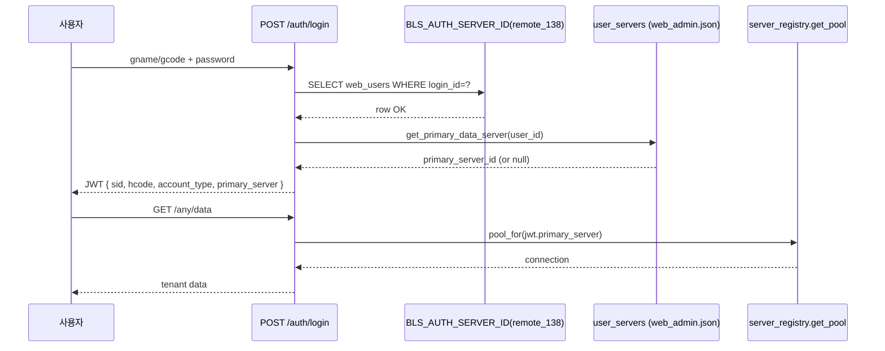

# 로그인 기반 DB 라우팅 설계 (DEC 후보 — `DSN-*`)

| 항목 | 내용 |
|------|------|
| 작성일 | 2026-04-23 (2026-04-24 보강: `DSN-DEC-06/07` — `(tenant_id, account_family)` 합성 키 + JWT `license_keys[]`) |
| 상태 | **DRAFT (사용자 승인 전)** — DEC-008(단일 테넌트), DEC-051(인증 서버 단일화), DEC-052(사용자별 1:1 데이터 서버) 와 정합 검토 후 DEC-XXX 로 동결 후보. |
| 추적 ID | `DSN-*` (라우팅 규칙 단위) |
| 단일 원천 | 본 문서 + 메타 [`analysis/welove_db_route_matrix.json`](../analysis/welove_db_route_matrix.json) + 빌드 카탈로그 [`analysis/welove_chul_builds.json`](../analysis/welove_chul_builds.json) |
| 비밀 정책 | 자격증명 0건 — 본 문서·메타 모두 [`docs/secrets-policy.md`](secrets-policy.md) 의 G3 강화 정책을 따른다. |
| 연관 | OQ-LOGIN-1 (멀티테넌시), OQ-LOGIN-2 (`SCH-RECON-01` — `Id_Logn.gcode/gname` 의미), `migration/contracts/login.yaml` D-LOGIN-4, [`docs/welove-chul-build-menu-matrix.md`](welove-chul-build-menu-matrix.md), [`docs/menu-visibility-runtime-design.md`](menu-visibility-runtime-design.md) |

---

## 1. 문제 정의

레거시 델파이는 **고객사별 EXE + Config.Ini** 모델로 사실상 단일 테넌트로 운영(DEC-008). 웹은 한 인스턴스에서 다수 고객사를 수용해야 하므로 **로그인 주체 → 데이터 소스(서버·DB)** 의 자동 결정이 필요하다.

수집된 자산:

- 4 운영 서버 × 약 40 개 테넌트(출판사·총판) — [`analysis/welove_db_route_matrix.json`](../analysis/welove_db_route_matrix.json)
- 사용자/암호는 출판사별로 분리되어 있어 **단일 인증 서버**(DEC-051) 와 **사용자별 primary 서버**(DEC-052) 로 결합 운영.
- 회의 결과(2026-04-23) 3 가지 계정 유형(T1 수퍼, T2 총판/소속, T3 독립) — 유형별 데이터 가시성 정책이 다름.

---

## 2. 핵심 결정 (제안)

### `DSN-DEC-01` — 단일 인증 서버 + 사용자별 primary 데이터 서버 (확정 — DEC-051/052 인용)

- 모든 비밀번호 검증은 `BLS_AUTH_SERVER_ID` 한 곳의 `web_users` 에서 수행(DEC-051).
- 로그인 성공 시 `data_server_id = get_primary_data_server(user_id) or BLS_AUTH_SERVER_ID` 를 JWT `sid` 에 적재(DEC-052).
- 본 결정은 **이미 코드에 적용** — 본 문서는 정합 명시.

### `DSN-DEC-02` — JWT 클레임 표준 (신설 후보)

JWT payload 에 다음 필드를 표준화하여 모든 라우터/서비스가 일관 사용한다.

```json
{
  "sub": "<gcode>",
  "user_id": "<gcode>",
  "user_name": "<hname>",
  "hcode": "<출판사코드>",
  "account_type": "T1|T2_DIST|T2_PUB|T3",
  "primary_server": "<server_id>",
  "tenant_db": "<db_name_logical>",
  "permissions": ["..."]
}
```

- `account_type` 은 회의 결과(`docs/meeting-account-types-rbac-context.md`) 의 T1/T2(상·하)/T3 매핑.
- `tenant_db` 는 메타에서만 채워지고, 비밀(user/password)은 JWT 비포함 — Vault/환경변수에서 서버측에서만 결합.

### `DSN-DEC-03` — 요청당 커넥션 풀 선택 헬퍼 (신설 후보)

기존 `app.db.server_registry.get_pool(server_id)` 를 그대로 활용하되, **요청 컨텍스트 헬퍼** 1 개를 신설한다.

```python
def pool_for(request_or_user) -> Pool:
    """JWT 의 primary_server -> server_registry.get_pool() 을 일관 조회."""
```

- 모든 도메인 서비스(`outbound_service`, `settlement_service` 등)는 본 헬퍼 1 개를 통해서만 풀을 잡는다 — 신규 서비스 추가 시 분기 누락 차단.
- 라우터 파라미터 `server_id` 가 명시되면 admin 권한 가드 + 본 헬퍼의 override 분기로 처리.

### `DSN-DEC-04` — 1차 롤아웃 (단일 DB 옵션 명시) — *권장*

| 단계 | 범위 | 안전망 |
|------|------|--------|
| **R0** (현 상태 유지) | `BLS_AUTH_SERVER_ID=remote_138` 1개 서버만 데이터 소스로 사용. JWT `sid` = auth 서버. | 4 서버 라이브 라우팅 OFF. 사용자 입장에서 행동 변화 0. |
| **R1** | admin 화면에서 사용자별 primary 1개 부여(DEC-052). 일부 사용자만 다른 서버로 라우팅 시작. | 라우터 가드 — primary 미할당 사용자는 R0 동작. |
| **R2** | 4 서버 동시 라우팅 + cross-DB invariant 가드(DEC-033 계열) PASS. | `test_regression_phase2.py --multi-db` 통과 후 phase1 승격. |
| **R3** | 옵션 — 멀티테넌시(DEC-008/OQ-LOGIN-1) 결정 후 `tenant_id` 추가. | 별 사이클 별 DEC. |

→ **본 사이클의 추천:** 현재는 R0/R1 사이. R2 진입 게이트는 DEC-047 (phase1 승격 0건) 의 4대 DB 환경 등록 완료에 종속.

### `DSN-DEC-05` — 메타 단일 원천: `welove_db_route_matrix.json` (신설)

- 신규 테넌트 추가 시 본 JSON 의 `routes[]` 에 1행 추가하면 admin 화면 드롭다운(DEC-052)이 자동 갱신되도록 **백엔드 sync 스크립트** 후속 단계에서 도입.
- 본 사이클은 메타 도입만, 자동 sync 는 다음 사이클.

### `DSN-DEC-06` — 라우팅 키 = `(tenant_id, account_family)` 합성 (신설 보강)

**문제 (2026-04-24 발견)**: 7 빌드 카탈로그 분석 결과, **`Config.Ini::Uses` 라벨 단독으로는 빌드/계정 SKU 를 결정할 수 없는 사례**가 발견되었다 ([`docs/welove-chul-build-menu-matrix.md::§7`](welove-chul-build-menu-matrix.md)):

| Uses 라벨 | 매핑되는 빌드 | account_family |
|---|---|---|
| `한국도서유통` | `BLD-DIST-KBT` | `book_kb` |
| `한국도서유통` | `BLD-PUB-WAREHOUSE-BOOKNBOOK-NEW` | `book_07` |
| `홍길동` (sample) | `BLD-PUB-STD` | (sample placeholder) |
| `홍길동` (sample) | `BLD-PUB-KBT` (≡PUB-STD 바이트 동일) | (sample placeholder) |

또한 동일 SKU 가 N 테넌트에 공유 배포되는 사례 ([`analysis/welove_db_route_matrix.json`](../analysis/welove_db_route_matrix.json)):
- `chul_09` SKU → 위러브1·2·3 + 교문사 (4 테넌트 공유 `chul_09_db`)
- `book_07` SKU → 북앤북 + 유앤북 (2 테넌트 공유 `book_07_db`)

→ **DSN/RBAC 라우팅 키 = `(tenant_id, account_family)` 합성**. 단일 라벨로 결정 금지.

**라우팅 키 결정 트리**:

```
로그인 (gname/gcode + password)
  ├─ 1) BLS_AUTH_SERVER_ID 의 web_users 에서 인증 (DSN-DEC-01)
  ├─ 2) user_id → tenant_id 조회 (web_users.tenant_id)
  ├─ 3) tenant_id → (account_family, build_id) 조회 (tenants_directory)
  │       account_family = 'chul_09' | 'book_07' | 'book_21' | 'book_kb' | ...
  │       build_id       = 'BLD-*'
  ├─ 4) (account_family) → primary_data_server, db_name_logical 조회
  │       (welove_db_route_matrix.json::routes 또는 user_servers override)
  └─ 5) JWT 발급 (DSN-DEC-02 + DSN-DEC-07)
```

**백엔드 헬퍼 보강**:

```python
def resolve_routing(user: User) -> RoutingKey:
    tenant = tenants_directory.get(user.tenant_id)
    return RoutingKey(
        tenant_id=tenant.id,
        account_family=tenant.account_family,   # 빌드 SKU
        build_id=tenant.active_build_id,        # forced_hidden, forms 결정
        build_role=tenant.build_role,           # distributor|publisher|warehouse_publisher
        primary_server=tenant.primary_server,
        db_name_logical=tenant.db_name_logical,
    )
```

**메타 신규 컬럼** (`tenants_directory.yaml` — 후속 사이클 신설):

| 컬럼 | 의미 | 예시 |
|---|---|---|
| `tenant_id` | UUID | `tnt_8a7f...` |
| `tenant_label_kor` | 표시 라벨 (Uses 와 동일) | `위러브1`, `북앤북`, `한국도서유통` |
| `account_family` | DB 사용자 prefix = 빌드 SKU | `chul_09`, `book_07`, `book_kb` |
| `active_build_id` | 활성 빌드 (BLD-*) | `BLD-PUB-WAREHOUSE-WELOVE` |
| `build_role` | distributor/publisher/warehouse_publisher | `warehouse_publisher` |
| `parent_tenant_id` | 상위 총판 (T2-PUB 의 경우) | nullable |
| `primary_server` | 데이터 서버 ID | `서버1`, `서버3`, `서버4` |
| `db_name_logical` | DB 이름 (자격증명 제외) | `chul_09_db` |

> 본 메타는 [`docs/secrets-policy.md`](secrets-policy.md) 준수 — UserName/Password 컬럼 신설 금지.

### `DSN-DEC-07` — JWT `license_keys[]` 클레임 추가 (신설 보강)

[`docs/menu-visibility-runtime-design.md::MENUVIS-DEC-05`](menu-visibility-runtime-design.md) 의 라이선스 키 메커니즘 (`Seek_Uses('F##')`) 을 웹에 이전한다.

**JWT 클레임 확장** (`DSN-DEC-02` 표준에 다음 필드 추가):

```json
{
  "sub": "<user_id>",
  "user_id": "<user_id>",
  "user_name": "<hname>",
  "tenant_id": "tnt_8a7f...",
  "hcode": "<출판사코드>",
  "account_type": "T1|T2_DIST|T2_PUB|T3|T3_WAREHOUSE_LITE|T3_WAREHOUSE_FULL",
  "account_family": "chul_09",
  "build_id": "BLD-PUB-WAREHOUSE-WELOVE",
  "build_role": "warehouse_publisher",
  "primary_server": "서버1",
  "tenant_db": "chul_09_db",
  "license_keys": ["F11","F12","F13","F15","F17","F18","F22","F24","F31","..."],
  "permissions": ["..."]
}
```

- `license_keys[]` 는 `tenant_features` 테이블에서 `granted=true` 인 F-key 만 포함.
- 프론트 `PermissionGuard` 와 백엔드 가드는 메뉴 클릭 시 `menu_features.feature_key in jwt.license_keys` 검사.
- 키가 없으면 메뉴는 **disabled (회색) + tooltip "권한 없음"** ([MENUVIS-DEC-06](menu-visibility-runtime-design.md)).
- JWT 크기 영향: 평균 30~60 키 × 4 bytes ≈ 200~300 bytes 추가 — 허용 범위.

**메타 신규 테이블**:

```sql
CREATE TABLE tenant_features (
  tenant_id   VARCHAR(64) NOT NULL,
  feature_key VARCHAR(8)  NOT NULL,           -- F11..F78
  granted     BOOLEAN     NOT NULL,
  granted_at  TIMESTAMP,
  granted_by  VARCHAR(64),
  PRIMARY KEY (tenant_id, feature_key)
);

CREATE TABLE menu_features (             -- 메뉴 → 필요 키 (정적)
  menu_id     VARCHAR(64) NOT NULL,
  feature_key VARCHAR(8)  NOT NULL,
  PRIMARY KEY (menu_id)
);
```

→ `menu_features` 의 정본 매핑은 별 사이클 `OQ-LICENSE-KEY-MAP` 에서 [`analysis/welove_chul_menu_handlers.json`](../analysis/welove_chul_menu_handlers.json) 의 `handlers[*].license_keys_checked` 로부터 파생.

---

## 3. 흐름 다이어그램



---

## 4. 계정 유형별 정책 (회의 정합)

| 유형 | 인증 서버 | 데이터 서버 | 읽기 가시성 | 쓰기 권한 |
|------|---------|------------|------------|---------|
| **T1 수퍼관리자** | `BLS_AUTH_SERVER_ID` | 모든 서버 (admin override) | 전체 | 전체 |
| **T2 총판(물류)** | 동일 | 총판이 등록된 1 서버 (예: `chul_05`) | 본인 총판 + 소속 출판사(`hcode` 매칭) | 총판 운영 SQL 전체 |
| **T2 소속 출판사** | 동일 | 총판과 동일 서버, **다른 DB or 같은 DB·hcode 분리** | 본인 출판사 데이터 only (`hcode = self.hcode`) | 본인 데이터 INSERT/UPDATE, 마스터 RU |
| **T3 독립 출판사** | 동일 | 별도 단독 DB (예: `book_kb`) | 본인 단독 | 본인 단독 |

- `hcode` 격리는 `user-permission-management-plan.md` M4 (보류) 와 묶인다 — 본 DSN 결정은 **서버·DB 격리** 까지만, **행 레벨**(hcode) 강제는 별 결정.

---

## 5. 위험 / 미해결

| ID | 항목 | 정합 |
|----|------|------|
| `DSN-RISK-01` | 일부 출판사가 동일 서버·동일 DB 에서 `hcode` 만 다른 경우 — 행 레벨 격리 누수 위험 | M4 (보류) DEC 후 닫음 |
| `DSN-RISK-02` | 단일 인증 서버 장애 시 전 사용자 로그인 불가 | DEC-051 운영 가이드 — auth 서버 HA 또는 BLS_AUTH_SERVER_ID 장애 절체 절차 별도 |
| `DSN-RISK-03` | `primary_server` 가 비어 있는 사용자(R1 단계) — 운영자 누락 위험 | 헤더 미설정 경고 배지(DEC-052) + 야간 audit 리포트 |
| `DSN-RISK-04` | 메타(`welove_db_route_matrix.json`)와 운영 vault 의 자격증명 불일치 | secrets-policy 절차 — 신규 테넌트 추가 시 메타·vault 동시 갱신 PR |
| `DSN-RISK-05` | DEC-008(단일 테넌트) 와의 충돌 — 본 결정은 **데이터 서버는 다중·인증 서버는 단일** 으로 좁혀 충돌 회피 | 명시 — `tenant_id` 컬럼 도입은 별 사이클(OQ-LOGIN-1) |
| `DSN-RISK-06` (신규) | `Uses` 라벨만으로 라우팅 → `한국도서유통` 3 빌드 충돌 (`BLD-DIST-KBT` / `BLD-PUB-WAREHOUSE-BOOKNBOOK-NEW` / `BLD-PUB-KBT`) | DSN-DEC-06 합성 키로 해소 — `Uses` 단독 라우팅 코드는 `OQ-DSN-1` 에서 grep 후 제거 |
| `DSN-RISK-07` (신규) | 동일 SKU 다중 테넌트 (`chul_09_db` 4 테넌트, `book_07_db` 2 테넌트) 에서 `hcode` 격리 누수 | DSN-DEC-06 + M4 (보류) 행 레벨 가드 동시 진행 — 별도 OQ-DSN-2 등록 |
| `DSN-RISK-08` (신규) | F-key 라이선스 폐지/추가 시 활성 세션의 JWT 가 stale → 폐지된 메뉴 접근 가능 | JWT TTL ≤ 1h + 백엔드 가드 이중 검증 (`tenant_features` 재조회) — `OQ-DSN-3` 에서 정책 확정 |

---

## 6. 수용 기준 (본 문서 + 후속 코드)

- ✅ 본 문서가 `legacy-analysis/decisions.md` 의 후속 사이클 DEC-XXX 로 등록될 때 §2 의 `DSN-DEC-01..07` 가 1:1 매핑.
- ✅ `analysis/welove_db_route_matrix.json` 이 자격증명 0 + `secrets_policy` 메타를 보유.
- ✅ `analysis/welove_chul_builds.json` 의 `account_family` / `build_role` 컬럼이 `tenants_directory` 메타와 1:1 매핑.
- ✅ `migration/contracts/login.yaml` D-LOGIN-4 의 `proposed_web_behavior` 가 본 문서를 인용.
- ✅ admin UI ([`(app)/admin/user-servers/page.tsx`](../도서물류관리프로그램/frontend/src/app/(app)/admin/user-servers/page.tsx)) 의 라디오 1선택 정책(DEC-052)이 본 결정과 정합.
- ✅ JWT 페이로드 스키마 (`DSN-DEC-07`) 에 `account_family`, `build_id`, `build_role`, `license_keys[]` 4 컬럼 신설.

---

## 7. 권장 다음 액션

1. SME 와 함께 §4 표 1행씩 검증 — 특히 T2(소속 출판사) 의 "동일 서버·동일 DB·hcode 분리" vs "별 DB" 정합.
2. `pool_for(...)` 헬퍼 신설 PR (1 커밋) — 도메인 서비스는 PR 별로 점진 합류.
3. 메타 ↔ vault sync 스크립트(`tools/sync_db_routes.py`) 후속 단계 백로그.
4. **(신규)** `tenants_directory.yaml` 메타 신설 PR — `tenant_id` / `account_family` / `active_build_id` / `build_role` 컬럼 정의 + `analysis/welove_chul_builds.json` 과 `analysis/welove_db_route_matrix.json` 을 결합한 1차 시드 데이터.
5. **(신규)** `tenant_features` / `menu_features` 테이블 마이그레이션 신설 — 1차 시드는 `analysis/welove_chul_menu_handlers.json::handlers[*].license_keys_checked` 의 합집합 (총 62 F-key) 을 모든 테넌트에 `granted=true` 로 부여한 후, SME 검증을 거쳐 점진 폐지 (보수 안전).
6. **(신규)** 백엔드 `resolve_routing(user)` 헬퍼 (`DSN-DEC-06`) 와 JWT 빌더 (`DSN-DEC-07`) 1 커밋 PR — 기존 `pool_for()` 와 결합.
