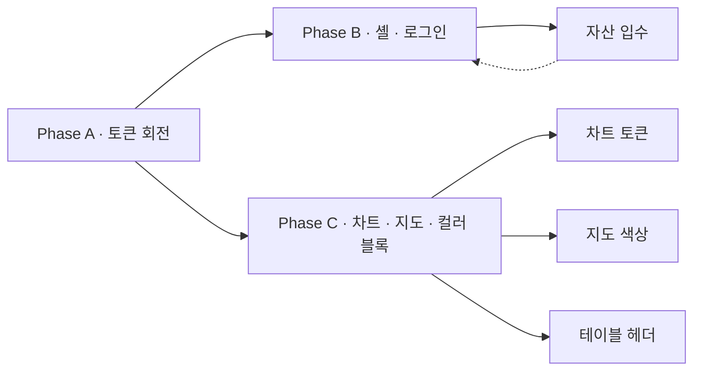

# Design Rollout Plan — 북이오웍스 가이드 적용 (Phase A → B → C)

> 본 문서는 [`docs/Design.md`](Design.md) 의 가이드를 도서물류관리프로그램에 적용하기 위한 **자산 경로 + 단계별 PR 분리 + 회귀 가드** 운영 노트다.
> 변경은 **토큰 → 셸·로고 → 페이지 디테일** 순으로 진행해 회귀 범위를 통제한다 ([`docs/design-gap-analysis.md` §5](design-gap-analysis.md#5-phase-분리-가이드-요약)).

---

## 1. 자산 경로 합의 (자산 입수 후 배치)

### 1.1 디렉터리 구조

```text
도서물류관리프로그램/frontend/
├─ public/
│  └─ brand/                          # 신설 — 정적 브랜드 자산 단일 위치
│     ├─ bukioworks-symbol.svg        # PDF §Symbol 단순 도형
│     ├─ bukioworks-symbol.png        # 32 / 96 / 192 (다중 해상도)
│     ├─ bukioworks-wordmark.svg      # PDF §Wordmark "북이오"
│     ├─ bukioworks-wordmark-dark.svg # 인버스 (Dark Filled 영역용)
│     ├─ favicon.svg                  # 모던 브라우저
│     ├─ favicon-32.png               # 32x32
│     ├─ favicon-16.png               # 16x16
│     ├─ apple-touch-icon-180.png     # iOS
│     └─ og-default.png               # 1200x630 (검토 후 작업)
└─ src/
   └─ components/brand/
      └─ Logo.tsx                     # 신설 — 진입점 단일화 (variant: symbol|wordmark)
```

> 현 시점 `frontend/public/` 에는 Next.js scaffold 파일 (`next.svg`, `vercel.svg`, ...) 만 존재. `brand/` 하위는 **자산 입수 시점에 생성**.
> 디자이너 전달 자산이 들어오기 전까지는 임시 placeholder 로 현재 [`header.tsx`](../도서물류관리프로그램/frontend/src/components/app-shell/header.tsx)·[`sidebar.tsx`](../도서물류관리프로그램/frontend/src/components/app-shell/sidebar.tsx) 의 인라인 아이콘을 유지한다.

### 1.2 메타 경로 변경 (Phase B)

대상: [`도서물류관리프로그램/frontend/src/app/layout.tsx`](../도서물류관리프로그램/frontend/src/app/layout.tsx)

| 메타 항목 | 현재 | Phase B 후 |
|-----------|------|-------------|
| `metadata.title` | `"도서물류 · buk.io"` | `"도서물류관리 · 북이오웍스"` |
| `metadata.description` | `"도서 유통·재고·발송·통계 통합 관리 (buk.io 서브도메인)"` | `"북이오웍스 도서물류 CMS — 유통·재고·발송·통계·정산 통합 운영"` |
| `metadata.icons` | (미정의 → `app/favicon.ico` 자동) | `{ icon: ["/brand/favicon.svg", "/brand/favicon-32.png"], apple: "/brand/apple-touch-icon-180.png" }` |
| `metadata.openGraph` (선택) | (없음) | `{ title, description, images: ["/brand/og-default.png"], locale: "ko_KR" }` |
| favicon 파일 | [`src/app/favicon.ico`](../도서물류관리프로그램/frontend/src/app/favicon.ico) (Next.js 기본) | 자산 입수 후 교체 + 경로 메타로 이전 |

> Next.js App Router 는 `app/favicon.ico` 와 `app/icon.svg` 를 자동 메타화한다. **자산 입수 후 단일 위치 (`public/brand/`)** 로 옮기고 `app/icon.svg` (또는 `app/favicon.ico`) 는 동일 자산을 가리키도록 정리.

---

## 2. Phase A — 토큰 회전 (Risk 낮음, 동시 PR 1개)

### 2.1 변경 파일

| 파일 | 변경 |
|------|------|
| [`도서물류관리프로그램/frontend/src/app/globals.css`](../도서물류관리프로그램/frontend/src/app/globals.css) | `:root` 의 §1.1 22 토큰 회전 + §1.2 신규 5 토큰 추가 ([`design-gap-analysis.md` §1.1·§1.2](design-gap-analysis.md#11-변경-필요-phase-a-의-핵심)) |

### 2.2 신규 토큰 (스니펫 — 그대로 추가 가능)

```css
:root {
  /* ... 기존 토큰 ... */
  --vivid-lime: oklch(0.95 0.20 122);       /* #E0FF00 — Primary Filled / NOTICE */
  --vivid-lime-hover: oklch(0.88 0.18 122); /* #C9E500 — Primary Filled hover */
  --vivid-sky: oklch(0.93 0.10 195);        /* #5EFFFF — IMPORTANT 알림 */
  --accent-red: oklch(0.93 0.025 25);       /* #FFE3DF — 중요도 낮은 강조 */
  --radius-pill: 9999px;                    /* Full Pill 버튼 */
}
```

### 2.3 폐기 검토

- `--brand-warm` / `--brand-warm-foreground` 는 컴포넌트에서 0회 사용 (rg 검증 완료, 2026-05-11).
- 안전한 폐기를 위해 **Phase A 머지 후 1 사이클** 동안 deprecated 표시만 두고, Phase A.1 후속 PR 에서 삭제.

### 2.4 회귀 가드

```bash
# 1. 토큰 외 하드코딩 HEX 점검 (화이트리스트 외 0건이어야 함)
rg -n '#[0-9a-fA-F]{6}\b' 도서물류관리프로그램/frontend/src --type tsx

# 2. brand-warm 미사용 확인
rg 'brand-warm' 도서물류관리프로그램/frontend/src

# 3. 시각 회귀 (수기 또는 browser-use MCP)
# - 로그인 / 대시보드 / 테이블 / 사이드바 active 스크린샷
```

### 2.5 PR 템플릿

```text
제목: style(design): phase A — bukioworks token rotation (lime primary + neutral text)

요약:
- globals.css 의 22개 토큰을 docs/Design.md §7.1 표에 1:1 매핑.
- vivid-lime/vivid-lime-hover/vivid-sky/accent-red/radius-pill 5종 신규.
- 컴포넌트 코드 무변경 (OCP, DEC-028).

검증:
- npm run lint && npm run build PASS
- rg 화이트리스트 외 신규 HEX 0건
- 스크린샷: login / dashboard / sidebar-active
```

---

## 3. Phase B — 앱 셸 · 로그인 · 로고 (Risk 중)

### 3.1 사전 조건

- `frontend/public/brand/` 에 SVG/PNG 자산 입수 완료.
- 자산 검수: 다크 배경 위 워드마크 가독성, 32px favicon 윤곽.

### 3.2 변경 파일

| 파일 | 변경 |
|------|------|
| [`도서물류관리프로그램/frontend/src/components/brand/Logo.tsx`](../도서물류관리프로그램/frontend/src/components/brand/Logo.tsx) | **신설** — `<Logo variant="symbol" \| "wordmark" size="sm" \| "md" \| "lg" />` |
| [`도서물류관리프로그램/frontend/src/components/app-shell/header.tsx`](../도서물류관리프로그램/frontend/src/components/app-shell/header.tsx) L67–86 | 인라인 책 SVG → `<Logo variant="wordmark" size="sm" />` |
| [`도서물류관리프로그램/frontend/src/components/app-shell/sidebar.tsx`](../도서물류관리프로그램/frontend/src/components/app-shell/sidebar.tsx) L172–193 | `BookOpen` placeholder → `<Logo variant="symbol" size="sm" />` (`user.logo_url` 우선 정책 유지) |
| [`도서물류관리프로그램/frontend/src/app/(public)/login/page.tsx`](../도서물류관리프로그램/frontend/src/app/(public)/login/page.tsx) L82–92 | `<MascotMotif size="sm" />` → `<Logo variant="wordmark" size="md" />` |
| [`도서물류관리프로그램/frontend/src/components/brand/BrandHero.tsx`](../도서물류관리프로그램/frontend/src/components/brand/BrandHero.tsx) | `<MascotMotif>` → `<Logo variant="symbol" />` 옵션 추가 (호환 유지를 위해 prop 으로 토글) |
| [`도서물류관리프로그램/frontend/src/components/ui/button.tsx`](../도서물류관리프로그램/frontend/src/components/ui/button.tsx) | `cva variants` 에 `"brand-primary"` (Full Pill, h-50, text-18, font-semibold, vivid-lime) 추가 |
| [`도서물류관리프로그램/frontend/src/app/layout.tsx`](../도서물류관리프로그램/frontend/src/app/layout.tsx) | `metadata.title/description/icons/openGraph` 갱신 (§1.2 표) |
| [`도서물류관리프로그램/frontend/src/app/favicon.ico`](../도서물류관리프로그램/frontend/src/app/favicon.ico) | 신규 자산으로 교체 또는 `app/icon.svg` 로 이전 |

### 3.3 brand-primary 버튼 변형 (스니펫 — `button.tsx` cva 추가 가이드)

```ts
// components/ui/button.tsx — variants 객체에 추가
"brand-primary":
  "h-[50px] rounded-full px-6 text-[18px] font-semibold " +
  "bg-[var(--vivid-lime)] text-foreground hover:bg-[var(--vivid-lime-hover)] " +
  "disabled:bg-[oklch(0.83_0_0)] disabled:text-muted-foreground",
```

### 3.4 로그인 페이지 적용 우선순위

1. 카드 헤더의 `<MascotMotif>` → `<Logo variant="wordmark" size="md" />`.
2. "로그인" 버튼을 `<Button variant="brand-primary" />` 로 교체.
3. 회원가입/계정찾기 링크는 underline 유지 (Phase A 토큰 회전으로 자동 반영).

### 3.5 회귀 가드

- `npm run lint && npm run build` PASS.
- 시각: 로그인 / 헤더 / 사이드바 / dashboard 카드 헤더 스크린샷.
- 한 화면에 Primary Filled 1개 검수 (특히 등록 패널의 "신규/저장/삭제" 3버튼 — 저장만 brand-primary, 신규/삭제는 outline/dark filled 로 분기).

### 3.6 PR 분리 권장

- B-1: `Logo.tsx` 신설 + 헤더/사이드바 교체.
- B-2: 로그인 + brand-primary 버튼 + 메타 갱신.
- B-3: BrandHero / Mascot 정리 (단계적 폐기는 후속).

---

## 4. Phase C — 페이지 디테일 (Risk 중·페이지 단위 분할)

### 4.1 차트 컬러 토큰화

대상: [`도서물류관리프로그램/frontend/src/components/stats/charts.tsx`](../도서물류관리프로그램/frontend/src/components/stats/charts.tsx)

- 현재 `#2563eb` `#16a34a` `#f59e0b` `#dc2626` `#9333ea` 5색 → `--chart-1~5` 토큰 (`globals.css` 기존 정의 회전 또는 새 정의).
- 가이드 §9 (미제공 보완) 으로 Light 톤에서는 `Info Blue / Positive Green / Warning Orange / Error Red / Pale Lime` 5색 베이스.

### 4.2 지도 신호 컬러

대상: [`도서물류관리프로그램/frontend/src/components/dashboard/traffic-map-leaflet.tsx`](../도서물류관리프로그램/frontend/src/components/dashboard/traffic-map-leaflet.tsx) L53–90

- `#dc2626` → `var(--destructive)` / `#ca8a04` → `var(--status-warn)` / `#16a34a` → `var(--status-ok)` / `#3b82f6` → `var(--status-info)`.

### 4.3 테이블 헤더·합계 행

- DataGrid 컴포넌트 한 곳만 수정. 헤더 배경 `--muted` (Neutral Gray), 합계 행 배경 `--secondary` (Pale Lime).

### 4.4 NOTICE / IMPORTANT 컬러 블록

- 신규 컴포넌트 `components/ui/color-block.tsx` (`variant="light" | "vivid"`, `tone="notice" | "important" | "info"`).
- 알림 영역에서만 호출. 일반 카드/패널 사용 금지 (가이드 §8).

### 4.5 LegacyFormRenderer 예외 명시

- `components/legacy-form/LegacyFormRenderer.tsx` 의 `#ececec`/`#d4d0c8`/`#e8e4dc`/`#c0bcb4` 는 **Delphi 미리보기 회색 톤 재현 의도** — 본 가이드 적용 대상 아님.
- 파일 상단 주석에 사유 1줄 추가 권장: _"Delphi 폼 미리보기 회색 톤 재현 — 가이드 §8 예외 (의도)"_

---

## 5. 일정 / 의존성 요약



| 우선순위 | 단계 | 차단 조건 |
|----------|------|-----------|
| 1 | Phase A | 없음 — 즉시 가능 |
| 2 | Phase B | 자산 (SVG/PNG) 입수 필수 |
| 3 | Phase C | A 머지 후 페이지별 PR 로 진행 |

---

## 6. 운영 의무 — `bookioworks-design` 스킬과 함께 본 문서를 갱신

- 자산 입수 / 메타 결정 / Vivid 사용 정책 변경이 발생하면 **본 문서와 `docs/Design.md` 를 동시에 갱신**한다.
- Cursor 새 세션에서 디자인 작업을 시작할 때는 [`bookioworks-design` 스킬](../.cursor/skills/bookioworks-design/SKILL.md) 을 먼저 읽도록 요청.
