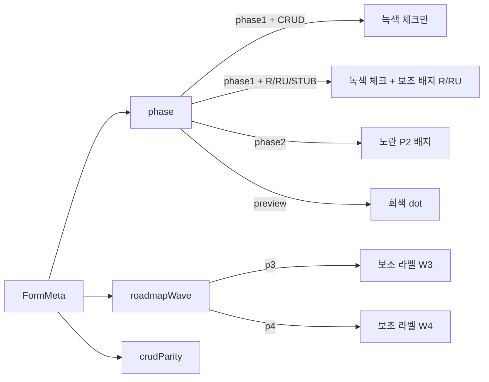

# 메뉴 로드맵 웨이브 + CRUD 동등성 표기 정책

**ID**: MENU-ROADMAP-WAVES
**일자**: 2026-04-23
**상태**: 1차 동결 (form-registry 확장과 사이드바 배지 동시 적용)
**연관 결정**: DEC-053(phase1 승격 게이트), DEC-NN(`roadmapWave`/`crudParity` 메타 도입 — 본 문서 §6 참고)
**관련 문서**: [`docs/phase1-promotion-gate.md`](phase1-promotion-gate.md), [`docs/crud-backlog.md`](crud-backlog.md), [`legacy-analysis/decisions.md`](../legacy-analysis/decisions.md)

---

## 1. 배경

사이드바에는 화면별 진척도가 표시된다. 그동안 단일 필드 `FormMeta.phase`(`"phase1" | "phase2" | "preview"`) 가 두 가지를 동시에 나타내려고 했다.

1. **품질 게이트** — 5축(functional/data/ui/audit/performance) PASS 여부 (DEC-053).
2. **로드맵 우선순위** — “P3/P4 까지 가야 한다”는 제품/사업 계획.

여기에 더해 **레거시 대비 CRUD 동등성** 이라는 제3의 축이 가시화되지 않았다. 예를 들어 출판사 마스터(`/master/publisher`) 는 `phase1` 로 표시되지만 페이지 상단 주석에 *“1차 READ only · 수정은 후속”* 으로 적혀 있어, 사용자는 “녹색 체크 = 레거시와 완전 동일” 로 오해할 수 있다.

본 문서는 위 3축을 `FormMeta` 의 직교 필드 3개로 분리하고, 사이드바 배지 규칙을 통일한다.

---

## 2. 3축 정의 (단일 진실 원천)

| 축 | 필드 | 허용값 | 의미 | 사이드바 표기 |
|---|---|---|---|---|
| **품질 게이트** | `phase` | `"phase1" \| "phase2" \| "preview"` | DEC-053 의 5축 PASS·회귀 통과·계약 equivalence 충족 여부. | `phase1` → 녹색 체크, `phase2` → 노란 `P2`, `preview` → 회색. |
| **로드맵 웨이브** | `roadmapWave` | `"p2" \| "p3" \| "p4"` (선택) | 백로그 우선순위·분기 계획. *현재 사이클(P2)에 끝낼 것 / 차기(P3) / 장기(P4).* | `p3`/`p4` 일 때만 회색 라벨 (`W3`/`W4`) 노출. `p2` 는 기본값이라 비표시 (소음 방지). |
| **CRUD 동등성** | `crudParity` | `"R" \| "RU" \| "CRUD" \| "STUB"` (선택) | 레거시 델파이 화면 대비 지원 연산 집합. R=조회만, RU=조회+부분쓰기, CRUD=전체, STUB=라우트만. | `phase==="phase1"` + `crudParity ∈ {R, RU, STUB}` 인 “부분 동등” 화면에 한해 보조 배지(`R`/`RU`) + tooltip 강조. `CRUD` 는 표시 생략 (기본 가정). |

### 2.1 핵심 원칙

1. **세 축은 직교**: 품질이 `phase1` 이어도 CRUD 가 `R` 이면 “쓰기는 레거시 미달”. 품질이 `phase2` 여도 로드맵은 `p2` 일 수 있다 (이번 사이클에 끝내야 함).
2. **`phase` 는 절대 `roadmapWave` 와 같은 의미로 쓰지 않는다**. 사이드바 라벨도 분리(`P2` 노랑 = 품질 phase2, `W3`/`W4` 회색 = 로드맵 wave) 한다.
3. **`crudParity` 는 “미검토”로 두지 않는다**. 인벤토리 1회 후에는 모든 행이 `R | RU | CRUD | STUB` 중 하나로 채워져야 한다 (정적 가드 — §5).

---

## 3. 사이드바 표기 규칙



### 3.1 컴포넌트 책임 (`sidebar.tsx`)

- 메인 배지 1: `phase` 만 본다 — 기존 로직 유지.
- 보조 배지 2: `crudParity` 가 `"R"`/`"RU"`/`"STUB"` 일 때만 (회색 outline `R`/`RU`/`STUB`).
  - `phase1` + `R` 조합은 “녹색 체크 + 회색 R” → tooltip 첫 줄에 `CRUD: 조회만 (레거시: 신규·수정 가능)` 노출 (사용자 오인 방지).
- 보조 배지 3: `roadmapWave` 가 `"p3"` / `"p4"` 일 때 (회색 outline `W3`/`W4`).
  - `p2` 는 기본값으로 가정해 표시 안 함.
- 모든 보조 배지는 `<Tooltip>` 으로 풀어쓴 설명을 제공한다 (한 줄 자막 정책).

### 3.2 Tooltip 템플릿

```
[caption]
품질: phase1 (5축 PASS · DEC-053)
CRUD: R — 조회만 (레거시는 C/R/U/D)
웨이브: W3 — 차기 사이클 보강 예정 (docs/crud-backlog.md)
```

생략된 축은 줄을 출력하지 않는다 (기본값과 일치하면 침묵).

---

## 4. CRUD 동등성 — 티어별 정의

| 티어 | 정의 | 사이드바 보조 배지 | 인벤토리 단서 |
|---|---|---|---|
| **CRUD** | 레거시 화면의 모든 버튼·이벤트(생성·조회·수정·삭제·취소) 가 동등하게 동작. | (생략) | 페이지에 POST/PATCH/DELETE 라우트 + audit_log 보강. |
| **RU** | Read + 부분 Write (예: 신규만, 또는 수정만, 또는 마감 가드만 구현). | `RU` (회색 outline) | 페이지에 mutation 일부만 존재 — `crudNotes` 에 차이 명시. |
| **R** | Read-only — 조회만, 쓰기 UI 없음/비활성. | `R` (회색 outline) | 페이지 상단 주석 *“1차 READ only · 수정은 후속”* 류, 또는 mutation 라우트 0건. |
| **STUB** | 라우트·메뉴는 있으나 외부 채널·후속 API placeholder. | `STUB` (회색 outline) | `ScreenPlaceholder` 컴포넌트 사용 또는 *“DEC-035 stub”* 등 명시 배너. |

### 4.1 인벤토리 절차 (1회/사이클)

1. **자동 후보**: `frontend/src/app/(app)/**/page.tsx` 에서 `READ only` · `placeholder` · `stub` · `ScreenPlaceholder` grep.
2. **API 교차 확인**: 페이지가 import 하는 API 함수에서 `apiClient.post/put/patch/delete` 호출 유무.
3. **계약 대조**: `migration/contracts/*.yaml` 의 write 경로 + blocker 목록.
4. **레거시 SME**: `legacy_delphi_source/legacy_source/Subu*.pas` 의 버튼 이벤트 vs 웹 라우트 표.

산출물: [`docs/crud-backlog.md`](crud-backlog.md) 의 *CRUD gap matrix* (화면 ID × 레거시 연산 × 웹 상태 × 목표 티어 × 목표 `roadmapWave`).

---

## 5. 정적 가드 (불변식)

`test/test_form_registry_metadata.py` 가 다음을 강제한다 (실패 시 PR 차단).

1. `roadmapWave` 가 정의되어 있다면 값은 `"p2" | "p3" | "p4"` 중 하나.
2. `crudParity` 가 정의되어 있다면 값은 `"R" | "RU" | "CRUD" | "STUB"` 중 하나.
3. **일관성**: `phase === "phase1"` + `crudParity` 가 `"R"`/`"RU"`/`"STUB"` 인 행은 반드시 `crudNotes` (또는 `scenario.blockers`) 에 차이 사유가 1줄 이상 적혀 있어야 한다.
4. **인벤토리 완성도**: `phase1` 화면은 `crudParity` 가 비어 있으면 안 된다 (인벤토리 1차 완료 후 도입).

> §5.4 는 점진 도입 — 1차에는 *경고*, 다음 사이클에 *에러* 로 승격.

---

## 6. 구현 단계 (본 사이클)

| 단계 | 산출 | 파일 |
|---|---|---|
| 6.1 | 본 정책 문서 신설 | `docs/menu-roadmap-waves.md` |
| 6.2 | `FormMeta` 에 `roadmapWave` + `crudParity` + `crudNotes` 추가 + 전 행 초기값 | `frontend/src/lib/form-registry.ts` |
| 6.3 | 사이드바에 보조 배지(`R`/`RU`/`STUB`/`W3`/`W4`) + tooltip | `frontend/src/components/app-shell/sidebar.tsx` |
| 6.4 | CRUD 인벤토리 + 보강 마일스톤 | `docs/crud-backlog.md` |
| 6.5 | dashboard JSON 동기화 정책 | `dashboard/data/phase2-screen-cards.json` $comment |
| 6.6 | 정적 회귀 가드 | `test/test_form_registry_metadata.py` |
| 6.7 | DEC 단락 추가 (3축 메타 단일 원천 명시) | `legacy-analysis/decisions.md` |

---

## 7. FAQ

**Q1.** `phase2` 인 화면은 `crudParity` 가 의미가 있나?
A. 있다. `phase2` 라도 “쓰기까지 다 구현되었지만 회귀 미통과” 와 “조회만 동작” 은 다르다. 후자는 `RU`/`R` 로 명시.

**Q2.** `roadmapWave` 미지정은 어떤 의미?
A. *현 사이클(P2) 범위* 로 간주한다. 사이드바에 보조 라벨이 붙지 않는다. P3/P4 로 미루는 의도가 있을 때만 명시.

**Q3.** `STUB` 와 `preview` 는 무슨 차이인가?
A. `preview` 는 `phase` 축의 값으로 “메뉴만 노출, 백엔드 SQL 미구현”. `STUB` 는 `crudParity` 축의 값으로 “라우트는 동작하지만 외부 채널/특정 mutation 만 placeholder”. 둘은 직교한다.

**Q4.** dashboard 의 `phase2-screen-cards.json` 에도 두 필드를 넣어야 하나?
A. 1차에는 필수 아님. `FormMeta` 가 단일 원천이고 dashboard 는 거울. 단 §6.5 에서 `$comment` 로 동기화 의무를 명시한다 (drift 가 발생하면 dashboard 빌드 시 경고).
