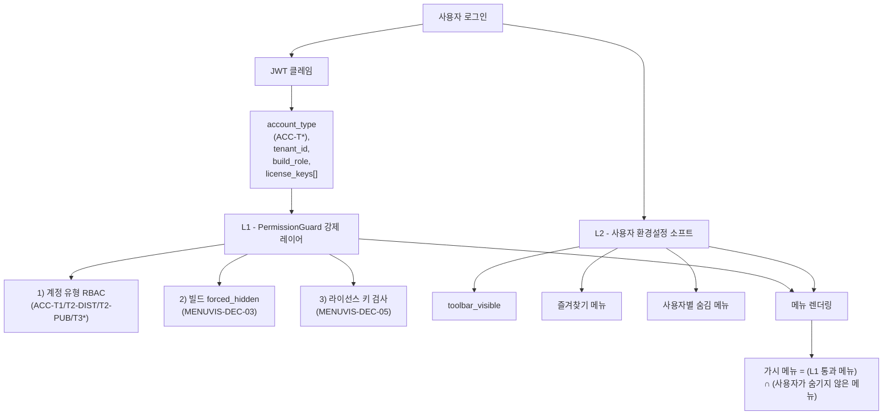

# 메뉴 가시성·접근 권한 런타임 설계 (레거시 → 웹)

| 항목 | 내용 |
|------|------|
| 목적 | 레거시 Chul 클라이언트의 메뉴 노출/숨김 메커니즘을 정확히 정의하고, 웹 (`PermissionGuard` + 사용자 환경설정) 에 대응되는 매핑·정책을 확정한다. |
| 분석 일자 | 2026-04-24 |
| 근거 | [`analysis/welove_chul_menu_handlers.json`](../analysis/welove_chul_menu_handlers.json) (62 라이선스 키 UNION), [`analysis/welove_chul_menu_matrix.json`](../analysis/welove_chul_menu_matrix.json) (180 메뉴 경로 UNION), `Chul.pas` 핸들러 본문 (CP949) |
| 비밀 정책 | [`docs/secrets-policy.md`](secrets-policy.md). 핸들러 본문 일부에 평문 DB 자격증명 발견 — `OQ-BLD-4` 로 추적, 본 문서 미인용. |

---

## 1. 결정 요약 (`MENUVIS-DEC-*`)

| ID | 결정 | 근거 |
|---|---|---|
| `MENUVIS-DEC-01` | 레거시의 **실제 권한 체계**는 핸들러 진입 시점의 `Seek_Uses('F##')` 라이선스 키 검사. 메뉴 자체는 모두 항상 보임 (단 §3 의 startup hide 예외). | `Chul.pas` 모든 빌드에서 일관 패턴 (53~61 keys per build, 62 unique UNION) |
| `MENUVIS-DEC-02` | publisher 빌드의 `메뉴보이기/메뉴감추기` 메뉴는 **메뉴 권한 토글이 아니라 단순 ToolBar.Visible 토글**. 웹에서는 사용자 환경설정 `toolbar_visible` (불리언) 으로 단순 매핑. | `Menu107Click/Menu108Click` 본문이 `ToolBar.Visible := True/False` 1줄. 원본 권한 검사 코드는 주석처리. |
| `MENUVIS-DEC-03` | `D-KBT` 의 `FormShow Menu410/411/195 := False` + `WH-MS` 의 `FormShow Menu300/400/500/600/700/800/208/308 := False` 는 **빌드 단위 강제 숨김** — 빌드 ID 기반 `forced_hidden` 메뉴 목록으로 백엔드에 정적 등록. 사용자 토글로 무시 불가. | DFM 에 정의되어 있어도 FormShow 시점에 항상 가려짐. |
| `MENUVIS-DEC-04` | 웹 권한 체계 = **2 레이어**. <br>L1) 백엔드 `PermissionGuard` (강제, 변경 불가) — 계정 유형 (`ACC-T*`) + 빌드 forced_hidden + 라이선스 key 매핑. <br>L2) 사용자 환경설정 (소프트, 사용자 변경 가능) — `toolbar_visible`, 사용자별 즐겨찾기/숨김 메뉴. | DEC-02/03 분리 원칙 |
| `MENUVIS-DEC-05` | 라이선스 키 (`F##`) 는 **테넌트 단위 feature flag**. DB 의 `Id_Logn.Authority` 또는 별도 테이블에서 조회되며, `Seek_Uses` 가 'X' 반환 시 차단. 웹에서는 `tenant_features` 테이블로 이전, JWT 클레임 또는 세션 캐시에 미러. | 핸들러 본문: `nUse2:=Base10.Seek_Uses('F17'); if nUse2<>'X' then ... else ShowMessage(E_Connect);` |
| `MENUVIS-DEC-06` | `Seek_Uses` 결과로 차단된 사용자가 메뉴를 클릭하면 레거시는 `ShowMessage(E_Connect)` 표시 후 폼을 열지 않음. 웹은 동일 UX 를 위해 메뉴를 **disabled (회색) + tooltip "권한 없음"** 으로 표시 (숨기지 않음 — 라이선스 추가 안내 위해). | UX 일관성 |

---

## 2. 레거시 권한 메커니즘 (관찰)

### 2.1 라이선스 키 검사 (모든 메뉴 핸들러)

레거시 모든 `Menu*Click` 의 표준 진입 패턴:

```pascal
procedure TSubu00.Menu103Click(Sender: TObject);
var I:Integer;
begin
  nUse2 := nUse1 + 'Sub17';
  nUse2 := Base10.Seek_Uses('F17');     // 라이선스 키 검사
  if nUse2 <> 'X' then begin            // X 가 아니면 허용
    for I:=0 to MDIChildCount - 1 do
    if MDIChildren[I] is TSubu17 then begin
       MDIChildren[I].Show; Exit;       // 이미 열린 자식 폼 재포커스
    end;
    Subu17 := TSubu17.Create( self );   // 신규 폼 생성
  end else
    ShowMessage(E_Connect);             // X 면 차단 메시지
end;
```

**관찰 (자료 [`welove_chul_menu_handlers.json`](../analysis/welove_chul_menu_handlers.json)):**

| 빌드 | 사용된 F-keys | Menu hides at startup |
|---|:-:|:-:|
| `BLD-DIST-STD` | 54 | 0 |
| `BLD-PUB-STD` | 61 | 0 |
| `BLD-DIST-KBT` | 58 | 3 (Menu410, Menu411, Menu195) |
| `BLD-PUB-KBT` | 61 | 0 |
| `BLD-PUB-WAREHOUSE-WELOVE` | 54 | 0 |
| `BLD-PUB-WAREHOUSE-MS` | 53 | **8** (Menu300, 400, 500, 600, 700, 800, 208, 308) |
| `BLD-PUB-WAREHOUSE-BOOKNBOOK-NEW` | 54 | 0 |
| **UNION** | **62** (`F11`~`F78`) | — |

### 2.2 메뉴보이기/메뉴감추기 (publisher 빌드 전용)

`P-STD` / `P-KBT` 의 `Menu107Click` (메뉴보이기), `Menu108Click` (메뉴감추기) 의 실제 본문:

```pascal
procedure TSubu00.Menu107Click(Sender: TObject);    // "메뉴보이기"
var I:Integer;
begin
  { ...주석처리된 원본 권한 검사... }
  ToolBar.Visible := True;                           // 실제 동작은 이 1줄
end;

procedure TSubu00.Menu108Click(Sender: TObject);    // "메뉴감추기"
var I:Integer;
begin
  { ...주석처리된 원본 권한 검사... }
  ToolBar.Visible := False;
end;
```

→ 명칭과 달리 **메뉴를 가리거나 보이는 기능이 아니라 ToolBar 위젯 한 개를 토글**. 웹 매핑 시 사용자 환경설정 `ui_preferences.toolbar_visible` (불리언) 1개로 충분.

### 2.3 빌드 startup-conditional menu hides (`FormShow`)

`D-KBT` (3 항목):
- `Menu410.Visible := False`
- `Menu411.Visible := False`
- `Menu195.Visible := False`

`WH-MS` (8 항목):
- `Menu300.Visible := False` (재고원장)
- `Menu400.Visible := False` (발송비/입금관리)
- `Menu500.Visible := False` (내역서관리)
- `Menu600.Visible := False` (통계관리)
- `Menu700.Visible := False` (재고관리)
- `Menu800.Visible := False` (반품관리)
- `Menu208.Visible := False`
- `Menu308.Visible := False`

→ DFM 에 정의되어 있어도 빌드 시작 시 **무조건** 가려짐. 빌드 단위 강제 숨김 → 웹의 `forced_hidden_menus` 정적 목록.

> **OQ-BLD-MS-1**: WH-MS 가 상단 메뉴 8 개를 모두 가리는데도 정상 운영된다는 점은 모순적임 — 실제로는 다른 진입점(툴바 버튼·단축키)으로 호출되거나, 본 빌드가 부분 운영 모드로 사용 가능. SME 검증 필요.

### 2.4 라이선스 키 ↔ 메뉴 1:1 매핑 (예시: `BLD-DIST-KBT`)

```
Menu101Click → F13      Menu107Click → F11      Menu201Click → F24
Menu102Click → F12      Menu108Click → F15      Menu202Click → F25
Menu103Click → F17      Menu109Click → F19      Menu203Click → F26
Menu104Click → F14      Menu110Click → F18      Menu204Click → F36
Menu105Click → F13      Menu301Click → F31      ... (총 90 매핑)
```

→ **1 메뉴 핸들러 = 1 F-key**. `Menu105Click ↔ Menu101Click` 둘 다 `F13` 처럼 **같은 키가 여러 메뉴에 공유**되기도 함 (관련 메뉴군 묶음 권한). 키 → 메뉴 매핑 정본은 별도 사이클 `OQ-LICENSE-KEY-MAP` 에서 작성.

---

## 3. 웹 매핑 모델

### 3.1 2 레이어 권한 체계



### 3.2 권한 산출 규칙

```python
def is_menu_visible(menu_id: str, user: User, tenant: Tenant) -> tuple[bool, str]:
    # L1.1) 계정 유형 RBAC
    if menu_id not in ACCOUNT_TYPE_MENU_ALLOWLIST[user.account_type]:
        return False, "account_type_block"

    # L1.2) 빌드 forced_hidden
    if menu_id in BUILD_FORCED_HIDDEN[tenant.build_id]:
        return False, "build_forced_hidden"

    # L1.3) 라이선스 키
    required_key = MENU_LICENSE_KEY.get(menu_id)
    if required_key and required_key not in tenant.license_keys:
        return True, "license_disabled"  # 표시는 하되 클릭 시 차단 (UX MENUVIS-DEC-06)

    # L2) 사용자 환경설정
    if menu_id in user.preferences.hidden_menus:
        return False, "user_hidden"

    return True, "ok"
```

→ `License disabled` 인 메뉴는 **렌더링하되 disabled** (회색 + tooltip "권한 없음 — 관리자 문의"). 그 외는 숨김.

### 3.3 ToolBar 토글 (publisher only)

`MENUVIS-DEC-02` 의 `메뉴보이기/감추기` 토글은 단순:
- `(app)/profile/preferences` 화면에 "툴바 표시" 체크박스
- DB: `user_preferences.toolbar_visible BOOLEAN NOT NULL DEFAULT TRUE`
- 메뉴에는 노출하지 않거나, "보기 → 툴바" 표준 메뉴로 이동.

publisher 빌드의 기존 메뉴 항목 `메뉴보이기/메뉴감추기` 자체는 웹에서 **노출하지 않음** (혼동 방지).

### 3.4 빌드 forced_hidden 정적 등록

```yaml
# migration/contracts/build_forced_hidden_menus.yaml (제안)
BLD-DIST-KBT:
  forced_hidden:
    - object_id: Menu410
    - object_id: Menu411
    - object_id: Menu195
BLD-PUB-WAREHOUSE-MS:
  forced_hidden:
    - object_id: Menu300       # 재고원장
    - object_id: Menu400       # 발송비/입금관리
    - object_id: Menu500       # 내역서관리
    - object_id: Menu600       # 통계관리
    - object_id: Menu700       # 재고관리
    - object_id: Menu800       # 반품관리
    - object_id: Menu208
    - object_id: Menu308
```

→ 후속 사이클의 `crud-backlog` 에 `BUILD-FORCED-HIDDEN-CONTRACT` 로 등록.

### 3.5 라이선스 키 → 웹 모델

```sql
-- tenant_features (정본)
CREATE TABLE tenant_features (
  tenant_id   VARCHAR(64) NOT NULL,
  feature_key VARCHAR(8)  NOT NULL,    -- 'F11'..'F78'
  granted     BOOLEAN     NOT NULL,
  granted_at  TIMESTAMP,
  granted_by  VARCHAR(64),
  PRIMARY KEY (tenant_id, feature_key)
);

-- menu_features (정적 매핑 — 메뉴 → 필요 키)
CREATE TABLE menu_features (
  menu_id     VARCHAR(64) NOT NULL,
  feature_key VARCHAR(8)  NOT NULL,
  PRIMARY KEY (menu_id)
);
```

JWT 클레임에는 `tenant_features.granted=true` 인 키만 배열로 미러:

```json
{
  "sub": "...",
  "account_type": "ACC-T2-DIST",
  "tenant_id": "...",
  "build_role": "distributor",
  "license_keys": ["F11","F12","F13",...]
}
```

→ [`docs/decision-login-db-routing.md`](decision-login-db-routing.md) 의 JWT 클레임 정의에 `license_keys[]` 추가 (`DSN-DEC-07` 신설).

---

## 4. 영향받는 산출물

| 파일 | 변경 |
|---|---|
| [`docs/onboarding-rbac-menu-matrix.md`](onboarding-rbac-menu-matrix.md) | 각 `ACC-MENU-*` 행에 `forced_hidden_in_builds[]` + `license_key` 컬럼 추가 |
| [`docs/decision-login-db-routing.md`](decision-login-db-routing.md) | JWT 클레임에 `license_keys[]` 추가 (`DSN-DEC-07`) |
| `migration/contracts/build_forced_hidden_menus.yaml` (신규) | §3.4 정적 매핑 (후속 사이클) |
| `migration/contracts/menu_license_keys.yaml` (신규) | 메뉴 ↔ F-key 매핑 (`OQ-LICENSE-KEY-MAP` 사이클) |
| `(app)/profile/preferences` (신규) | 툴바 토글, 사용자별 숨김 메뉴 (별 사이클) |

---

## 5. `OQ-MENUVIS-*` 미해결 질문

- `OQ-MENUVIS-1` — `Seek_Uses` 가 'X' 외에 다른 코드 (' ', 'Y', '0', '1' 등) 를 반환하는 케이스가 있는지. 현재 모든 핸들러가 `<>'X'` 만 검사 → 'X'=차단, 그 외=허용 으로 단순화 가정. 서버 구현 본문 확인 필요.
- `OQ-MENUVIS-2` — 라이선스 키가 어디에서 발급/관리되는지 (수기 DB 업데이트 vs 별도 콘솔). 웹 이전 시 관리자 화면이 필요한지.
- `OQ-MENUVIS-3` — 60+ 개 F-key 의 의미적 그룹화 (예: `F11~F19` = 기초관리 묶음, `F21~F29` = 거래관리 묶음 등). 별 사이클 `OQ-LICENSE-KEY-MAP` 에서 해소.
- `OQ-MENUVIS-4` — `WH-MS` FormShow Menu300~800 hide 의 실효 노출 메뉴 (=`OQ-BLD-MS-1`). 운영 화면 캡처 또는 SME 인터뷰 필요.
- `OQ-MENUVIS-5` — 사용자별 숨김 메뉴 기능이 레거시에 존재하는지 (사용자 환경설정 보존), 또는 신규 도입 사항인지.

추적 ID 합류: [`docs/welove-tracking-ids-backlog.md`](welove-tracking-ids-backlog.md).
