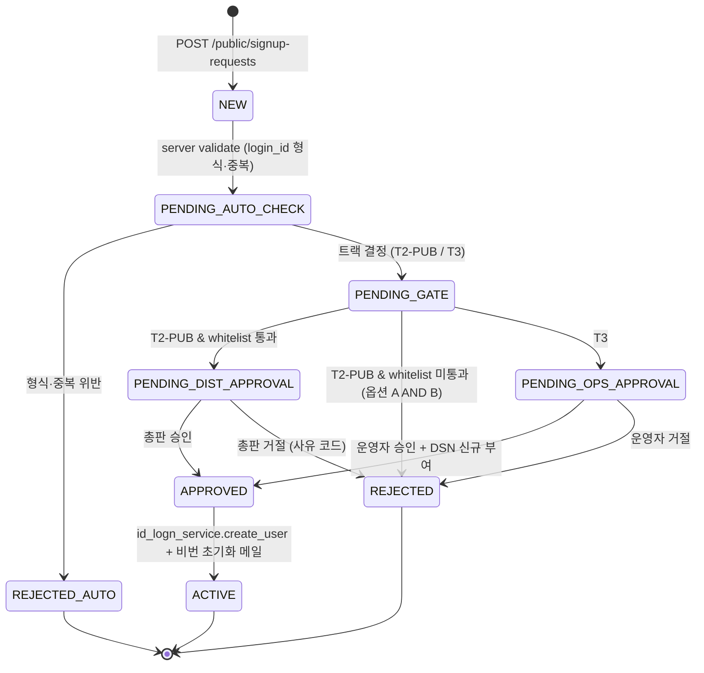

# 온보딩 거버넌스 스펙 (`ONB-*` — DEC ONB-001 후보)

| 항목 | 내용 |
|------|------|
| 작성일 | 2026-04-23 |
| 상태 | **DRAFT** — 본 문서가 SME 승인 후 `legacy-analysis/decisions.md` 의 **DEC ONB-001** 본문으로 인용된다. |
| 추적 ID | `ONB-*` (가입 트랙 단위), `ACC-*` (계정 유형) |
| 정합 | [`docs/meeting-account-types-rbac-context.md`](meeting-account-types-rbac-context.md) (T1/T2/T3), [`docs/decision-login-db-routing.md`](decision-login-db-routing.md) (`DSN-*`), `migration/contracts/login.yaml`, OQ-LOGIN-1 (멀티테넌시) |
| 단일 원천 | 본 문서 — 코드/계약/하네스 시나리오는 `ONB-*` 추적 ID 로 본 문서를 인용. |
| 코드 정합 | [`backend/app/services/member_signup_service.py`](../도서물류관리프로그램/backend/app/services/member_signup_service.py), [`backend/app/routers/public_signup.py`](../도서물류관리프로그램/backend/app/routers/public_signup.py), [`backend/app/routers/admin.py`](../도서물류관리프로그램/backend/app/routers/admin.py) |

---

## 1. 계정 유형 (`ACC-*`)

| 코드 | 명칭 | 정의 | 인증 서버 (DSN-DEC-01) | 데이터 서버 가시성 |
|------|------|------|----|---------|
| `ACC-T1` | 수퍼관리자 | 운영팀(웹마스터) — 전체 운영 콘솔. | 단일 (`BLS_AUTH_SERVER_ID`) | 모든 서버(admin override) |
| `ACC-T2-DIST` | 총판(물류센터) | 본인 총판 운영. | 동일 | 본인 총판 1 서버 |
| `ACC-T2-PUB` | 총판 소속 출판사 | 총판 소속, 본인 출판사 단위. | 동일 | 총판 서버 + `hcode` 격리 |
| `ACC-T3` | 독립 출판사 | 총판 무소속, 단독 DB. | 동일 | 본인 단독 DB |

> 4 가지 유형은 **회의 결과 = 정본 정의**. 본 문서가 가입 분기·승인 게이트의 골격이며, 메뉴/권한 매트릭스는 [`docs/onboarding-rbac-menu-matrix.md`](onboarding-rbac-menu-matrix.md) 가 후속 단계에서 다룬다.

---

## 2. 가입 트랙 (`ONB-TRACK-*`)

| 트랙 | 입구 | 결과 | 1 차 결정 정책 (DEC ONB-001 후보) |
|------|------|------|----|
| `ONB-TRACK-T1` | 운영팀 내부(공개 가입 화면 제공 안 함) | `ACC-T1` 계정 | 외부 신청 경로 0 — 운영팀 admin 콘솔에서 신규 발급. |
| `ONB-TRACK-T2-DIST` | 운영팀 협의 후 admin 발급 | `ACC-T2-DIST` 계정 + 총판 코드 매핑 | 공개 가입 비허용. 총판 신규 등록은 회사 차원 계약 후 admin 발급. |
| `ONB-TRACK-T2-PUB` | 공개 회원가입 (`POST /api/v1/public/signup-requests`) | `ACC-T2-PUB` 계정 + 총판 hcode 매핑 | **AND/OR 게이트**(§3 결정 후보). 사전등록 마스터 vs 총판 승인. |
| `ONB-TRACK-T3` | 공개 회원가입 + 자가 인증(사업자/도서관 등) | `ACC-T3` 계정 | DSN 신규 부여 — DEC-052 후보 (1차 R0 단계는 admin 단독). |

---

## 3. **DEC ONB-001 본문 후보** — 소속 출판사 가입 게이트

> **결정 1 줄(권장 조합):** `(A) 총판 사전등록 마스터에 존재` **AND** `(B) 총판 관리자 승인` 두 가지를 **모두 만족**해야 가입 완료(=계정 활성). 단, 운영 단순화를 위해 **A 단독 통과** 옵션은 운영자 토글로 제공한다.

### 3.1 조합별 비교 (SME 검토 후 1 행 동결)

| 옵션 | 정의 | 운영 부담 | 보안 | 회의 발언 정합 |
|------|------|------|------|----|
| **A AND B (권장)** | 사전등록된 출판사이자 총판이 명시 승인한 경우만 활성 | 중 (사전등록 + 승인 2 단계) | 강 | 회의 메모 “미리 등록 또는 승인” 의 가장 강한 해석. |
| A OR B | 둘 중 하나만 충족하면 활성 | 저 | 중 | 회의 메모 “또는” 그대로. 사전등록 누락 + 신규 출판사도 승인만으로 가입 가능. |
| A only | 사전등록 마스터에 있어야만 가입 가능, 승인 자동 | 저 | 중 | “관리자가 미리 등록한다” 옛 정책 그대로. 신규 출판사 가입 적시성 떨어짐. |
| B only | 총판 승인만 있으면 활성, 사전등록 비검사 | 중 | 약 | 사전등록 마스터 무력화 — 비추. |

→ **권장 = A AND B** + **운영자 토글로 A only 대안 허용**. 토글 정책은 admin 화면에 "가입 게이트 모드" 1 라디오로 노출. 변경 이력은 admin audit 에 적재.

### 3.2 사전등록 마스터의 단일 원천

- 1차: 기존 `master_data` 의 `G7_Ggeo`(출판사) — 총판 hcode 와 1:N 매핑 검증 ([`SCH-WELOVE-출판-G7_Ggeo`](welove-publish-schema-dictionary.md)).
- 2차: 신규 화이트리스트 테이블 `web_publisher_whitelist (hcode, dist_hcode, status)` — 마이그레이션 단계에서 `G7_Ggeo` 에서 시드.
- 정합 SQL 은 후속 사이클의 `tools/db/onboarding_whitelist_sync.py` 에서 자동화. 본 사이클은 마스터 1차만 사용.

### 3.3 거절 사유 코드 (`ONB-REJ-*`)

| 코드 | 의미 |
|------|------|
| `ONB-REJ-NOT_IN_WHITELIST` | 사전등록 마스터에 hcode 가 없음 |
| `ONB-REJ-DIST_DENIED` | 총판이 거절 |
| `ONB-REJ-DUPLICATE_LOGIN_ID` | 동일 login_id 가 이미 활성 (현 코드의 `SIGNUP_DUPLICATE_PENDING` 확장) |
| `ONB-REJ-TYPE_MISMATCH` | 신청 유형(T2-PUB)과 hcode 의 마스터 유형이 불일치 |
| `ONB-REJ-OTHER` | 자유 입력 사유 (감사 로그에 한해 보존) |

거절 사유는 현 코드 [`reject_request`](../도서물류관리프로그램/backend/app/services/member_signup_service.py) 에 `reason_code` 필드 추가로 합류한다(다음 PR).

---

## 4. 상태 기계 (요청 → 활성)

상태값과 현 코드 매핑:

| 본 스펙 상태 | 현 코드 `status` | 비고 |
|---|---|---|
| `NEW` / `PENDING_AUTO_CHECK` | (요청 처리 중) | 응답 전 in-memory. |
| `PENDING_GATE` / `PENDING_DIST_APPROVAL` / `PENDING_OPS_APPROVAL` | `"pending"` | 추후 `pending_substate` 필드 추가 후보. |
| `APPROVED` / `ACTIVE` | `"approved"` (+ `approved_hcode`) | 비번 초기화 메일 발송은 `password-reset` 플로우와 결합. |
| `REJECTED` / `REJECTED_AUTO` | `"rejected"` (+ `reject_reason` / `reason_code`) | `reason_code` 필드 신설 PR. |

---

## 5. 인터페이스 변경 (다음 PR 단위)

| ID | 변경 | 정합 |
|----|------|------|
| `ONB-API-01` | `PublicSignupCreate` 에 `account_track: Literal["T2_PUB","T3"]` 필수 필드 추가 | `T1`·`T2_DIST` 는 공개 트랙에서 차단. |
| `ONB-API-02` | `PublicSignupCreate.dist_hcode: Optional[str]` (T2-PUB 일 때 필수) | §3.2 마스터 매칭 입력. |
| `ONB-API-03` | `member_signup_service.submit_request` 가 `account_track` / `dist_hcode` 검증 후 `pending_substate` 결정 | `PENDING_DIST_APPROVAL` vs `PENDING_OPS_APPROVAL`. |
| `ONB-API-04` | admin 승인 화면을 트랙별로 분기 — 총판은 본인 총판 신청만 표시 | RBAC 후속 PR. |
| `ONB-API-05` | `reject_request(reason_code, reason)` 시그니처 확장 | §3.3. |
| `ONB-API-06` | 승인 시 `gcode/gname` 기본값을 신청 폼에서 자동 매핑 (현 동작 유지) | 변화 없음. |

각 PR 은 본 문서 §1~§5 의 **추적 ID**(`ACC-*`, `ONB-*`, `ONB-API-*`)를 커밋 메시지에 포함한다.

---

## 6. 5 축 평가 정합 (eval-axes-and-dod-draft)

| 축 | 본 스펙이 강제하는 게이트 |
|----|----|
| **기능** | T2-PUB 가입 → 총판 승인 → 활성 까지 happy-path 성공률 100 %. |
| **데이터** | 활성 사용자의 `hcode` 가 마스터 마스터(`G7_Ggeo`) 에 존재함을 가입 시점 + 야간 audit 양쪽에서 검증. |
| **UX** | 거절 화면이 §3.3 의 사유 코드를 사람 친화적 메시지로 노출. |
| **성능** | 가입 → 승인 알림 메일 발송 P95 < 30s (별 SLO). |
| **감사** | submit / approve / reject / delete_request 4 액션이 모두 `admin_audit` 로그 (이미 코드 적용). |

---

## 6.5 총판(T2_DIST) 온라인 가입 + 계약 승인 워크플로우 (`ONB-DIST-*`)

회의 결과(2026-04-24) 총판도 공개 가입 신청을 허용하되, 출판사 목록 엑셀 첨부 + 계약 PDF 활성화의 **2 단계 게이트** 를 강제한다(상세는 [`docs/onboarding-account-type-resolution.md`](onboarding-account-type-resolution.md) §5.T2_DIST).

| 추적 ID | 액션 | 감사 로그 액션명 |
|----|------|-------|
| `ONB-DIST-SUBMIT` | `POST /api/v1/public/signup-requests/distributor` (multipart, 엑셀 첨부 필수) | `signup.submit_distributor` |
| `ONB-DIST-CONTRACT` | `POST /api/v1/admin/signup-requests/{id}/contract` (PDF 첨부) | `signup.contract_attach` |
| `ONB-DIST-APPROVE` | `POST /api/v1/admin/signup-requests/{id}/approve` (T2_DIST 분기) | `signup.approve` + `tenant.upsert` + `whitelist.bulk_upsert` |
| `ATT-VAL-*` | `attachment_service` 확장자/MIME/크기 화이트리스트 + sha256 무결성 | `attachment.save` (id/filename/sha256만, 본문 미저장) |
| `WHL-BULK-*` | `publisher_whitelist_service.bulk_upsert` 부분 실패 허용 | `whitelist.bulk_upsert` (created/updated/errors_count) |
| `TENDIR-UPSERT-*` | `tenants_directory_service.upsert_tenant` overlay 파일에만 기록 | `tenant.upsert` |

상태 기계 확장: `pending → contract_review → approved` 경로를 T2_DIST 신청에만 적용. 계약 PDF 미첨부 시 승인은 422 `SIGNUP_APPROVE_CONTRACT_REQUIRED` 로 거부.

G3 정책: 첨부 본문(엑셀/PDF) 은 `backend/var/attachments/` 에만 저장하고, 인덱스(`backend/data/attachments_index.json`) 와 `member_signup_requests.json` 에는 식별자/파일명/sha256/사이즈만 적재한다. 두 파일 모두 `.gitignore` 등록 + `test_secrets_policy_gate.py` 회귀로 검증.

---

## 7. 위험·미해결

| ID | 항목 | 닫는 조건 |
|----|------|---|
| `ONB-RISK-01` | 사전등록 마스터(`G7_Ggeo`) 에 신규 출판사가 누락된 채 운영 — A AND B 정책 시 정상 출판사도 거절될 위험 | "운영자 토글로 A only 임시 허용" 절차 + 야간 누락 audit 리포트 |
| `ONB-RISK-02` | 멀티 총판 소속 출판사(예: 한 출판사가 2 총판 거래) | 본 사이클 비커버 — `ACC-T2-PUB-MULTI` 로 별 사이클 OQ 등록 |
| `ONB-RISK-03` | T3 가입 시 신규 DSN 부여 로직 부재 | DEC-052 admin 화면 R1 단계에서 부여, 본 사이클은 R0 (운영자 수동) |
| `ONB-RISK-04` | 가입 신청자에게 알림 메일 인프라 부재 | 별 백로그 — `tools/notify/email_dispatch.py` 후속 |
| `ONB-RISK-05` | 본인 가입 정보·비밀번호 수정 흐름 분리 | [`docs/profile-password-ux-spec.md`](profile-password-ux-spec.md) 후속 단계 |

---

## 8. 수용 기준

- ✅ 본 문서가 SME 검토 후 §3 의 한 옵션을 **굵게 동결** + DEC ID 발급.
- ✅ `ONB-API-01..06` 이 6 개 PR(또는 1 PR multi-commit)로 분리 등록.
- ✅ `migration/contracts/login.yaml` D-LOGIN-* 에 `account_track` 입력 추가.
- ✅ 하네스 시나리오 `ONB-E2E-T2-PUB-HAPPY` / `ONB-E2E-T2-PUB-WHITELIST-MISS` / `ONB-E2E-T3-HAPPY` 3 가지가 phase1 회귀 통과.
