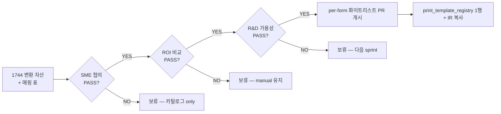

# Phase 3 — `.frf → IR/HTML` 운영 결합 게이트

**ID**: PHASE3-PRINT-GATE
**일자**: 2026-04-21
**상태**: 게이트 정의 (운영 결합 PR 0건 — DEC-039 영속)
**연관 결정**: DEC-037 / DEC-038 / DEC-039 / DEC-046 / DEC-048 / DEC-050(예정)
**연관 트랙**: [`dashboard/data/tracks.json`](../dashboard/data/tracks.json) `T-B4`(M2/M3/M4)
**연관 문서**: [`docs/print-html-status.md`](./print-html-status.md), [`migration/coverage/frf-html-form-catalog.md`](../migration/coverage/frf-html-form-catalog.md), [`migration/coverage/frf-to-screen-usage-map.md`](../migration/coverage/frf-to-screen-usage-map.md), [`docs/print-form-add-sop.md`](./print-form-add-sop.md)

---

## 0. 게이트 목적

Phase 2 (B4 PoC) 의 1744 변환 자산을 운영에 결합하기 위한 **3 조건 모두 PASS** 게이트. 본 게이트 통과 전에는 **per-form 화이트리스트 PR 도 개시되지 않는다** (DEC-048 정합).

---

## 1. 게이트 3 조건

| # | 조건 | DoD | 산출물 |
|---|---|---|---|
| **G1 SME 협의** | 운영 SME 가 1744 자산 중 **정본 form_id 후보** 를 합의 | 인터뷰 1회 ≥ 60 분 + form_id 후보 표 합의 (P0/P1/P2 분류) | [`analysis/research/c7_phase3_sme_review.md`](../analysis/research/c7_phase3_sme_review.md) |
| **G2 ROI 비교** | B1(자체 파서 신규 작성) vs B4(빌드타임 변환 + IR) 의 운영 결합 ROI 회의 통과 | 회의록 + 결정 (B4 채택 = `ir_in_use` 1행 추가 / B1 채택 = T-B5 신설) | [`analysis/research/c7_b1_vs_b4_roi.md`](../analysis/research/c7_b1_vs_b4_roi.md) |
| **G3 R&D 가용성** | 다음 sprint 에 게이트 통과 form 1~5건을 결합할 인력·시간이 있음 | 마일스톤 점검표 + 일정 합의 (sprint 1건 + DoD/Owner) | [`analysis/research/c7_phase3_capacity.md`](../analysis/research/c7_phase3_capacity.md) |

---

## 2. 게이트 통과 후 절차 (요약)

3 조건 모두 PASS → [`docs/print-form-add-sop.md`](./print-form-add-sop.md) **§A 변환 자산 활용 경로** 개시.

1. SME 가 합의한 form_id 1건 선택 (예: Sobo46 청구서 = `Report_4_51`).
2. 품질 점수 게이트 (binding_fill ≥ 0.7 + coord_recovery ≥ 0.95) — [`migration/coverage/frf-html-form-catalog.md`](../migration/coverage/frf-html-form-catalog.md) §3 의 HIGH 버킷 자격 확인.
3. 화이트리스트 PR — [`backend/app/services/print_template_registry.py`](../도서물류관리프로그램/backend/app/services/print_template_registry.py) 에 1행 추가 + IR 파일을 [`backend/app/services/print_templates/auto/`](../도서물류관리프로그램/backend/app/services/print_templates/auto/) 로 **수동 복사**.
4. 시각 회귀 (수동 PDF vs IR PDF) 스크린샷 첨부.
5. 5축 회귀 ([`test/test_regression_phase2.py`](../test/test_regression_phase2.py)) 그룹 추가.
6. 머지 후 [`dashboard/data/frf-html-porting.json`](../dashboard/data/frf-html-porting.json) `screens[].stages.T8 = done` + DEC-050 변경 이력 갱신.

---

## 3. 회귀 가드 (게이트 미통과 영속)

- DEC-039: **자동 .frf → 운영 변환 0** — 본 게이트 미통과 시 운영 결합 시도는 **거부**.
- DEC-046: 화이트리스트 행 수 = `print_templates/auto/*.ir.json` 파일 수 = 매핑 표 `ir_in_use` 행 수 (3 곳 동수).
- 폴백: 화이트리스트 미등록 form 또는 IR 컴파일 실패 → 자동으로 manual 빌더 폴백 + WARNING 로그 (`label_service._try_render_label_auto` 와 동일 패턴).

---

## 4. 변경 이력

| 일자 | 변경 |
|---|---|
| 2026-04-21 | 1차 작성. 3 조건 (SME / ROI / R&D 가용성) 동결 + 통과 후 절차 6 단계 + DEC-039 회귀 가드. |
