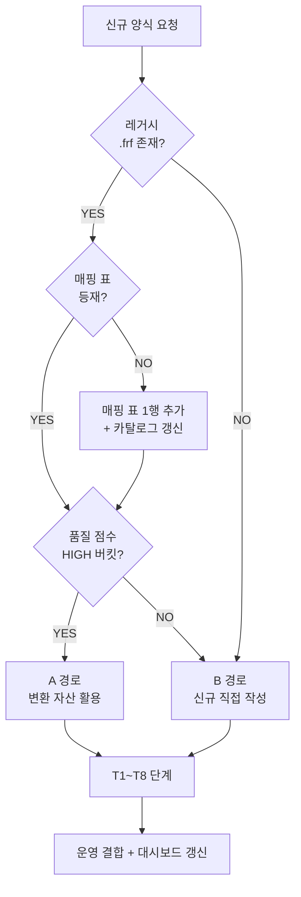

# 인쇄 양식 추가 SOP — A) 변환 자산 활용 + B) 신규 직접 작성

**ID**: PRINT-FORM-ADD-SOP
**일자**: 2026-04-21
**연관 결정**: DEC-037 / DEC-038 / DEC-039 / DEC-046 / DEC-048 / DEC-050(예정)
**연관 문서**: [`docs/phase3-print-gate.md`](./phase3-print-gate.md), [`docs/print-html-status.md`](./print-html-status.md), [`migration/coverage/frf-html-form-catalog.md`](../migration/coverage/frf-html-form-catalog.md), [`migration/coverage/frf-to-screen-usage-map.md`](../migration/coverage/frf-to-screen-usage-map.md)
**관련 모듈**: [`backend/app/services/print_template_registry.py`](../도서물류관리프로그램/backend/app/services/print_template_registry.py), [`backend/app/services/print_ir_compiler.py`](../도서물류관리프로그램/backend/app/services/print_ir_compiler.py), [`backend/app/services/print_service.py`](../도서물류관리프로그램/backend/app/services/print_service.py)

---

## 0. 두 경로 (선택 분기)



| 경로 | 조건 | 결과 |
|---|---|---|
| **A** 변환 자산 활용 | 레거시 `.frf` 존재 + 카탈로그 등재 + 품질 HIGH | IR 결합 (registry 1행 추가) |
| **B** 신규 직접 작성 | `.frf` 부재 또는 품질 LOW/MID + 시각 회귀 거부 | manual HTML Jinja2 빌더 신규 |

---

## 1. 경로 A — 변환 자산 활용 (Phase 3 게이트 통과 후)

### A1. 자산 확인

[`migration/coverage/frf-html-form-catalog.md`](../migration/coverage/frf-html-form-catalog.md) §3 의 HIGH 버킷에서 대상 form_id 확인. 또는:

```bash
python3 -c "
import json
q=json.load(open('debug/output/frf_converted_all/_quality_report.json'))
target='Report_4_51'
for f in q['all_files']:
    if target in f['rel'] and f['binding_fill']>=0.7 and f['coord_recovery']>=0.95:
        print(f['rel'], f['binding_fill'], f['coord_recovery'])
"
```

### A2. 게이트 확인 ([`phase3-print-gate.md`](./phase3-print-gate.md))

- [ ] G1 SME 합의 (`c7_phase3_sme_review.md` §3 표에 form_id 행 ✓)
- [ ] G2 ROI = B4 채택 (`c7_b1_vs_b4_roi.md` §3)
- [ ] G3 R&D 가용성 ≥ 1 form/sprint (`c7_phase3_capacity.md` §2)

3 조건 미달 시 **A 경로 진행 금지** — 카탈로그만 보존, manual 유지.

### A3. 화이트리스트 PR

1. **IR 파일 복사** (수동, 자동 sync 금지 — DEC-039):

   ```bash
   cp debug/output/frf_converted_all/legacy_delphi_source/legacy_source/Report/Report_4_51.ir.json \
      도서물류관리프로그램/backend/app/services/print_templates/auto/Report_4_51.ir.json
   ```

2. **레지스트리 1행 추가** ([`print_template_registry.py`](../도서물류관리프로그램/backend/app/services/print_template_registry.py) `_WHITELIST`):

   ```python
   "billing_v0": {
       "ir": "Report_4_51.ir.json",
       "schema_version": "0.1.0",
       "approved_pr": "#NNN",            # 본 PR 번호
       "quality": {"binding_fill": 0.78, "coord_recovery": 0.99},
   },
   ```

3. **호출자 분기** — 호출 서비스 (예: [`settlement_print_service.py`](../도서물류관리프로그램/backend/app/services/settlement_print_service.py)) 의 `render_*_html()` 시작에 [`label_service`](../도서물류관리프로그램/backend/app/services/label_service.py) 와 동일 패턴으로 1 분기 추가:

   ```python
   from app.services import print_template_registry
   ...
   ctx = {str(k).lower(): v for k, v in row.items()}
   html = print_template_registry.try_render_with_ir(
       "billing_v0", ctx, document_title="청구서",
   )
   if html is not None:
       return html
   ```

   `try_render_with_ir` 는 환경변수 게이트 (`PRINT_TEMPLATE_MODE=auto`) + 화이트리스트 + 컴파일 에러 fallback 을 모두 처리. 운영 5xx 누설 0.

### A4. 품질 점수 게이트

```bash
python3 debug/frf_quality_report.py \
  --input 도서물류관리프로그램/backend/app/services/print_templates/auto/Report_4_51.ir.json \
  --threshold-binding 0.7 --threshold-coord 0.95
```

- 통과 → A5 진행.
- 실패 → A 경로 거부, B 경로 또는 카탈로그 보존.

### A5. 시각 회귀 (수동 PDF vs IR PDF)

```bash
# 1) manual PDF 생성 (PRINT_TEMPLATE_MODE=manual)
PRINT_TEMPLATE_MODE=manual python3 -m debug.print_form_a5_dump --form billing_v0 --out manual.pdf

# 2) IR PDF 생성 (PRINT_TEMPLATE_MODE=auto)
PRINT_TEMPLATE_MODE=auto python3 -m debug.print_form_a5_dump --form billing_v0 --out auto.pdf

# 3) pdftoppm + ImageMagick compare (시각 diff ≤ 5%)
```

> PR 본문에 **두 PDF 의 첫 페이지 스크린샷** 첨부 필수.

### A6. 5축 회귀

[`test/test_regression_phase2.py`](../test/test_regression_phase2.py) 의 group 에 신규 form 추가:

```python
"billing_v0": {
    "url": "/api/v1/settlement/billing/{key}/print.pdf",
    "key_fixture": "billing_seed_001",
    "expect_pdf": True,
    "expect_html_contains": ["frf-obj", "Memo"],   # IR 결합 표식
},
```

5축 (`reads / writes / dual / api / contract`) 모두 PASS 후 머지.

### A7. 머지 후 동기화

- [`dashboard/data/frf-html-porting.json`](../dashboard/data/frf-html-porting.json) `screens[]` 의 해당 카드 `stages.T8.status = done`.
- [`legacy-analysis/decisions.md`](../legacy-analysis/decisions.md) DEC-050 의 **변경 이력** 1행 추가.

---

## 2. 경로 B — 신규 직접 작성 (.frf 부재 또는 품질 미달)

### B1. 폼 스펙 작성

[`analysis/print_specs/`](../analysis/print_specs/) 에 신규 markdown 1건 (필드 / 레이아웃 / 페이지 / 데이터 소스):

```markdown
# <form_id> — <도메인>

## Fields
| 필드 | 타입 | source | 비고 |
| ... |

## Layout (mm)
- 페이지: A4 portrait, margin 8mm
- 헤더 영역, 표 영역, 푸터 영역 ...

## SQL
- 신규 SQL 0 (DEC-040 정합) — 기존 detail SQL 재사용
```

### B2. Jinja2 / 수동 HTML 빌더

```python
# 도서물류관리프로그램/backend/app/services/print_templates/manual/<form_id>.html.j2
<!doctype html>
<html lang='ko'>
<head>
  <meta charset='utf-8'>
  <title>{{ title }}</title>
  <style>@page { size: A4; margin: 8mm; } ...</style>
</head>
<body data-legacy-id="<Legacy.Form.Id>">...</body>
</html>
```

서비스에 `render_<form_id>_html(detail) -> str` 신규.

### B3. 레지스트리 등록 (manual 모드)

[`print_template_registry.py`](../도서물류관리프로그램/backend/app/services/print_template_registry.py) `_WHITELIST` 에 manual 행 추가 (감사 추적):

```python
"<form_id>": {
    "ir": None,                          # manual 경로
    "schema_version": None,
    "approved_pr": "#NNN",
    "quality": None,
    "manual_template": "manual/<form_id>.html.j2",
},
```

> ⚠️ `try_render_with_ir` 는 `ir == None` 시 자동으로 None 반환 → manual 빌더로 폴백. 동일 인터페이스.

### B4. Contract / TestPack 갱신

- [`migration/contracts/<flow>.yaml`](../migration/contracts/) `print:` 섹션 1 행 추가.
- [`migration/test-cases/<flow>.json`](../migration/test-cases/) `print` 케이스 ≥ 1 추가.

### B5. 5축 회귀

A6 와 동일 ([`test/test_regression_phase2.py`](../test/test_regression_phase2.py) 그룹 추가).

---

## 3. 공통 — 대시보드 카드 등록

```bash
# dashboard/data/frf-html-porting.json screens[] 1행 추가:
{
  "id": "Frf_<form_id>",
  "menuGroup": "...",
  "title": "<form_id> — <도메인>",
  "mappingType": "ir_in_use" | "manual_in_use",
  "priority": "P0" | "P1" | "P2" | "P3",
  "scenario": { ... },
  "stages": { "T1": "done", ..., "T8": "in_progress" }
}
```

대시보드 [`renderFrfHtmlPorting`](../dashboard/js/app.js) 가 자동 노출.

---

## 4. 회귀 가드 체크리스트 (PR 머지 전 필수)

- [ ] DEC-039 정합 — 자동 sync 코드 추가 0
- [ ] DEC-046 단일 원천 — `_WHITELIST` 행 수 = `print_templates/auto/*.ir.json` 파일 수 = 매핑 표 `ir_in_use` 행 수
- [ ] 품질 점수 게이트 (A 경로) — `binding_fill ≥ 0.7` + `coord_recovery ≥ 0.95`
- [ ] 시각 회귀 PDF 스크린샷 첨부 (A 경로)
- [ ] 5축 회귀 PASS (A/B 공통)
- [ ] 폴백 동작 검증 — `PRINT_TEMPLATE_MODE=manual` 환경에서 manual HTML 정본 보존

---

## 5. 변경 이력

| 일자 | 변경 |
|---|---|
| 2026-04-21 | 1차 작성. A 경로 7 단계 + B 경로 5 단계 + 공통 대시보드 + 회귀 가드 체크리스트. |
