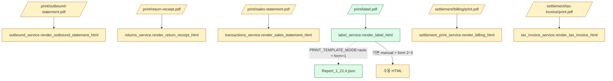

# 운영 인쇄 라우트 — 수동 HTML vs IR 결합 현황

**ID**: PRINT-HTML-STATUS
**일자**: 2026-04-21
**연관 결정**: DEC-037 (WeasyPrint 단일 엔진), DEC-038 (라벨 1종 → Phase 2-α 5종 확장), DEC-039 (운영 .frf 자동 변환 0), DEC-046 (단일 원천), DEC-048 (T-B4 종결, Phase 3 게이트), DEC-050(예정) (per-form 화이트리스트 옵트인)
**연관 문서**: [`migration/coverage/frf-html-form-catalog.md`](../migration/coverage/frf-html-form-catalog.md), [`migration/coverage/frf-to-screen-usage-map.md`](../migration/coverage/frf-to-screen-usage-map.md)

---

## 0. 사실 동결

운영 인쇄 라우트는 모두 **WeasyPrint + 수동 HTML 빌더** 에 의존한다. 1744쌍 변환 자산 중 운영에서 실제 호출되는 건 **`Report_1_21.ir.json` 1건** ([`backend/app/services/print_templates/auto/Report_1_21.ir.json`](../도서물류관리프로그램/backend/app/services/print_templates/auto/Report_1_21.ir.json)) 뿐이며, 이 또한 `PRINT_TEMPLATE_MODE=auto` 환경변수가 켜진 경우만 활성화되는 R&D 분기. 기본 운영 모드는 `manual`.

---

## 1. 운영 인쇄 엔드포인트 매핑 표

`legacy_id` = 디스패처 코드 + .frf 정본. 출처: [`migration/coverage/frf-to-screen-usage-map.md`](../migration/coverage/frf-to-screen-usage-map.md) §1.

| # | 엔드포인트 | 라우터 파일:행 | 빌더 (서비스) | 모드 | 정본 .frf | IR 파일 (있다면) |
|---|---|---|---|---|---|---|
| 1 | `GET /api/v1/print/outbound-statement/{order_key}.pdf` | [`print.py:85`](../도서물류관리프로그램/backend/app/routers/print.py) | `outbound_service.render_outbound_statement_html` | **manual** | `Report_2_41/2_42/2_46.frf` (Tong40 `'24'`) | — |
| 2 | `GET /api/v1/print/return-receipt/{return_key}.pdf` | [`print.py:118`](../도서물류관리프로그램/backend/app/routers/print.py) | `returns_service.render_return_receipt_html` | **manual** | `Report_3_*` 반품 변형 | — |
| 3 | `GET /api/v1/print/sales-statement/{order_key}.pdf` | [`print.py:167`](../도서물류관리프로그램/backend/app/routers/print.py) | `transactions_service.render_sales_statement_html` | **manual** | `Report_2_11/2_13/2_19.frf` (Tong40 `'21'`/`'22'`) | — |
| 4 | `GET /api/v1/print/label/{shipment_key}.pdf` | [`print.py:190`](../도서물류관리프로그램/backend/app/routers/print.py) | `label_service.render_label_html` | **manual + (form=1) IR opt-in** | `Report_1_21~1_25.frf` | `Report_1_21.ir.json` only |
| 5 | `GET /api/v1/settlement/billing/{billing_key}/print.pdf` | [`settlement.py:575`](../도서물류관리프로그램/backend/app/routers/settlement.py) | `settlement_print_service.render_billing_html` | **manual** | `Report_4_51.frf` (137 복제) | — (P0 후보) |
| 6 | `GET /api/v1/settlement/tax-invoice/{billing_key}/print.pdf` | [`settlement.py:803`](../도서물류관리프로그램/backend/app/routers/settlement.py) | `tax_invoice_service.render_tax_invoice_html` | **manual** | `Report_2_11/2_13/2_19.frf` | — (P0 후보) |

**현행 결합 통계**:
- 운영 라우트 6개, 수동 HTML 빌더 6개, IR 결합 라우트 1개 (`/print/label`, form=1, opt-in).
- IR 파일 운영 영역 (`print_templates/auto/`): **1 파일** (`Report_1_21.ir.json`).
- 카탈로그 1744 vs 운영 결합 1 = **결합률 0.06%** (의도적, DEC-039 정책).

---

## 2. 결론 (게이트 정합)

1. **운영 = 수동 HTML 정본**. 변환 자산은 카탈로그/R&D 참조용이며, 운영 결합은 **per-form 화이트리스트 PR** ([`backend/app/services/print_template_registry.py`](../도서물류관리프로그램/backend/app/services/print_template_registry.py), 예정) 단위로만 발생한다.
2. **자동 sync 금지** — `debug/output/frf_converted_all/` ↔ `backend/app/services/print_templates/auto/` 자동 복사 스크립트는 작성하지 않는다 (DEC-039 영속).
3. **Phase 3 게이트** — [`docs/phase3-print-gate.md`](./phase3-print-gate.md) 의 SME / ROI / R&D 가용성 3-조건 모두 PASS 시에만 §1 의 `manual` 행을 `ir_in_use` 로 1건씩 승격한다.
4. **단일 원천** — 본 표의 행 수 = `print.py` + `settlement.py` 의 `.pdf` 엔드포인트 수와 1:1 정합 (DEC-046).

---

## 3. 변경 이력

| 일자 | 변경 |
|---|---|
| 2026-04-21 | 1차 작성. 운영 라우트 6개 동결 + IR 결합 1건(`Report_1_21`) 동결. P0 후보 2건(Sobo46/49) 명시. |
