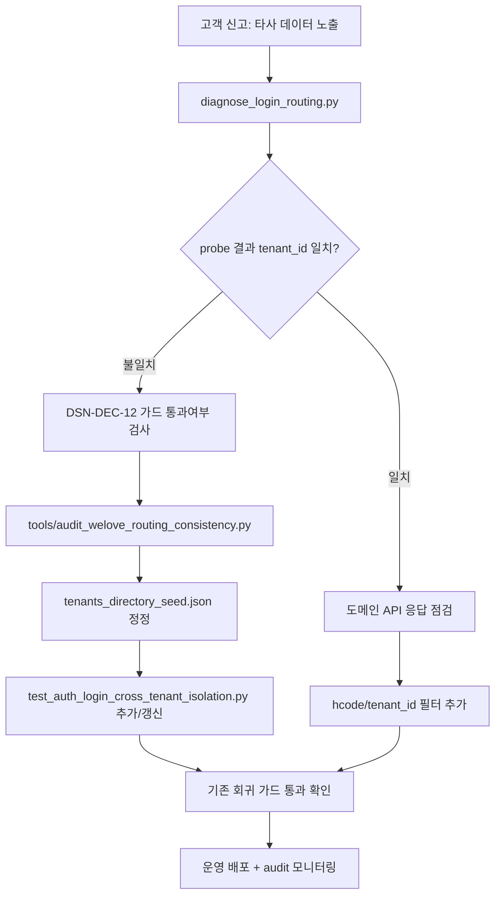

# 타사 데이터 노출 점검 런북 (DSN-DEC-08/09 + DSN-DEC-12)

| 항목 | 내용 |
| ---- | ---- |
| 작성일 | 2026-05-21 |
| 단일 원천 | 본 문서 + [docs/welove-login-tenant-audit-samples.md](welove-login-tenant-audit-samples.md) |
| 진입 도구 | [debug/diagnose_login_routing.py](../debug/diagnose_login_routing.py), [tools/classify_login_audit_logs.py](../tools/classify_login_audit_logs.py) |
| 회귀 가드(테스트) | [test/test_auth_login_cross_tenant_isolation.py](../test/test_auth_login_cross_tenant_isolation.py) |
| 비밀 정책 | 자격증명 0건. 비밀번호는 stdout/JSON 출력에 인쇄되지 않는다. |

---

## 0. 사용 시점

- 사용자가 "**다른 회사 데이터가 보인다**" 라고 신고한 경우.
- 신규 가입자가 가입 직후 다른 테넌트의 화면이 노출된 경우.
- 야간 인덱스 재빌드 후 `audit.auth` 의 `directory_sweep=true` 비율이 평소보다 높을 때.

> 본 런북은 **읽기 전용 진단 + 분류** 까지만 다룬다. 코드 수정은 [docs/decision-login-db-routing.md](decision-login-db-routing.md) §DSN-DEC-12 참조.

---

## 1. 1차 진단 — 계정 단건

```bash
# 1) 인덱스 / 후보 / 정책 / 환경 한 번에 덤프
PYTHONPATH=도서물류관리프로그램/backend \
  python3 debug/diagnose_login_routing.py <login_id> --write-json /tmp/diag.json

# 2) 비밀번호가 있고 read-only 환경이면 후보별 검증까지
PYTHONPATH=도서물류관리프로그램/backend \
  python3 debug/diagnose_login_routing.py <login_id> \
    --password '...' --probe --write-json /tmp/diag.json
```

`/tmp/diag.json` 에서 봐야 할 핵심 필드:

| 필드 | 정상 | 위험 신호 |
|------|------|----------|
| `index_lookup.lookup.status` | `single` 또는 `ambiguous` | `miss` 인데 `directory_sweep` 통해 매치된 경우 |
| `candidates[].candidate_via` | `tenant_id`, `account_family`, `index_single` | 1순위가 `directory_sweep` / `logical_db_peer` 면 의심 |
| `policy_simulation.has_real_db_candidate` | true | false 면 폴백 단독 — 정상 사용자라면 인덱스 누락 |
| `probe_results[].result=="password_match"` 의 `tenant_id` | 매트릭스 기대 tenant_id 와 동일 | 다르면 **타사 노출 사고** |
| `probe_results` 에서 `password_match` 가 2건 이상 | 0~1건 | 2건 이상 = 비번 재사용 + ambiguous → DSN-DEC-12 가드 필수 |

---

## 2. 운영 감사 로그 분석 (다건)

`audit.auth` 로거 출력은 한 줄에 `auth.login {...JSON...}` 형태다. 일정 기간 분량을 분류해 사고 패턴을 빠르게 카테고라이즈하려면 [tools/classify_login_audit_logs.py](../tools/classify_login_audit_logs.py) 를 사용한다.

```bash
# 표준입력 또는 파일 경로
python3 tools/classify_login_audit_logs.py /var/log/audit-auth.log
python3 tools/classify_login_audit_logs.py < /var/log/audit-auth.log
```

출력 카테고리(우선순위 순) — 본 분류는 [docs/welove-login-tenant-audit-samples.md](welove-login-tenant-audit-samples.md) §1 의 라우팅 카테고리와 1:1 매핑된다.

| 코드 | 트리거 조건 | 의미 / 후속 조치 |
|------|--------------|---------------------|
| `A_SEED_MISMATCH` | 성공 row 의 (`server_id`, `resolved_db`) 가 매트릭스/시드 어디에도 없음 | 시드 누락 — `tools/audit_welove_routing_consistency.py` 로 정정 |
| `B_INDEX_STALE` | `lazy_refreshed=true` 후 성공이 반복 (`lazy_refresh_reason=rebuilt` ≥ 5건/일) | 인덱스 신선도 저하. 야간 재빌드 추가 검토 |
| `C_AMBIGUOUS_NARROWING` | `ambiguous_narrowed=true` + `candidate_attempts ≥ 2` | 정상(default 동작). 단 `candidate_attempts ≥ 4` 면 후보 폭주 — `BLS_LOGIN_MAX_CANDIDATES` 점검 |
| `D_DIRECTORY_SWEEP_HIT` | 성공 row 의 `directory_sweep=true` | 신규 가입자 또는 인덱스 누락. 인덱스 재빌드 후 사라져야 정상 |
| `E_OWNERSHIP_VIOLATION` | **신규 — DSN-DEC-12** — `ownership_violation=true` | **타사 노출 차단됨** (가드가 일한 흔적). 동일 사용자가 반복적으로 발생하면 시드 정정 |
| `F_TOKEN_BUILD_FAILED` | `reason=token_build_failed` | 인증 통과 후 토큰 빌드 실패 — 코드 회귀, 즉시 PR 분석 |
| `G_INVALID_CREDENTIALS` | `reason=invalid_credentials` 또는 `invalid_credentials_after_probe` | 정상 401. 동일 IP 반복은 brute force 의심 |
| `H_AMBIGUOUS_STRICT` | `ambiguous_strict=true` | strict 모드. 사용자 안내 또는 default 로 복원 |

---

## 3. 사고 → 시드/코드 → 회귀 가드 워크플로



---

## 4. PR 체크리스트 (운영자용 복붙)

- [ ] `diagnose_login_routing.py` 결과의 `single_route.tenant_id` 가 매트릭스 기대값과 일치
- [ ] `tools/audit_welove_routing_consistency.py` 가 0 충돌 또는 운영 화이트리스트 처리
- [ ] 새 케이스가 `test_auth_login_cross_tenant_isolation.py` 에 회귀 가드로 추가됨
- [ ] `audit.auth` 로 `ownership_violation=true` 가 0 인지 24h 모니터링
- [ ] [docs/welove-login-tenant-audit-samples.md](welove-login-tenant-audit-samples.md) 에 케이스 추가/갱신
