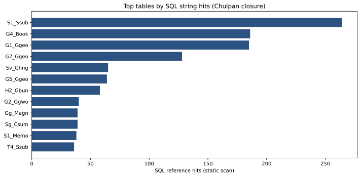
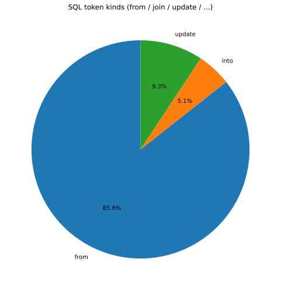
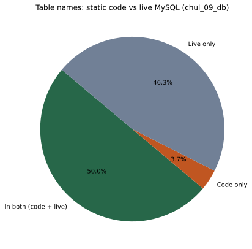
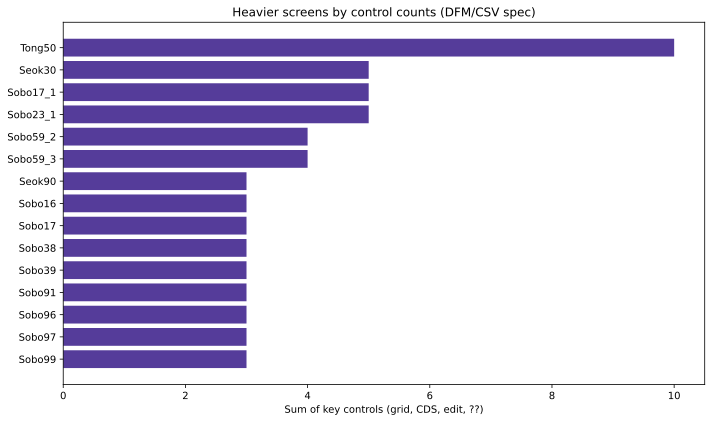
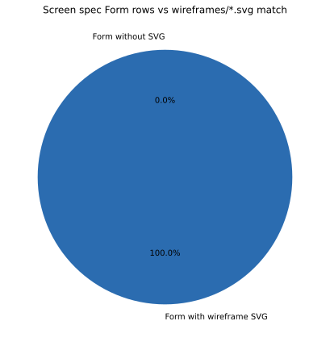
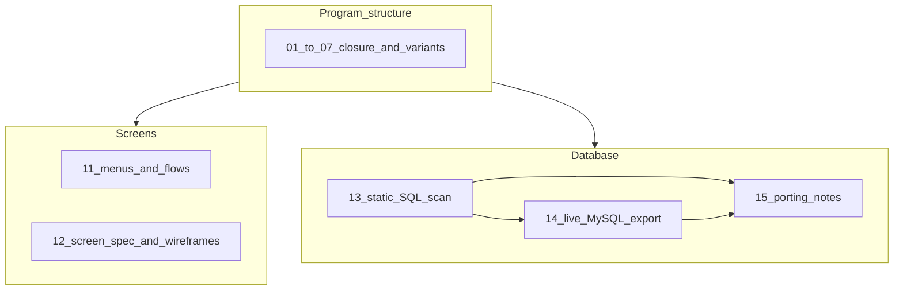
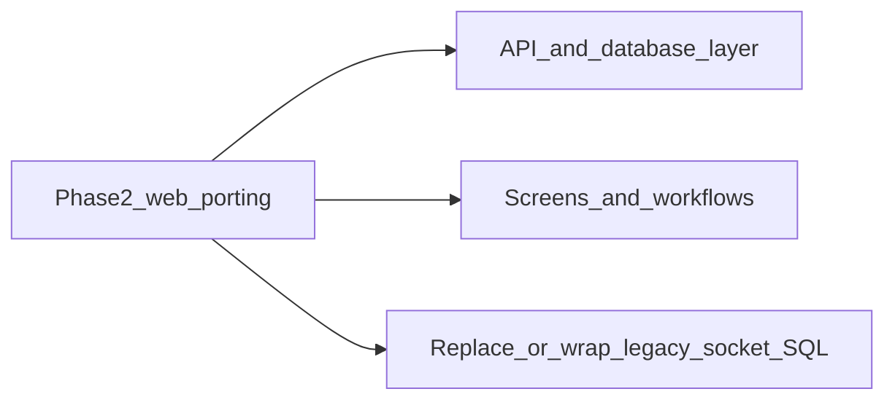

# 1단계 분석 요약 (비전문가용)

**대상 독자**: 경영, 기획, 도메인 담당 등이 소스 코드를 읽지 않고 **규모·리스크·다음 결정**만 파악하고자 할 때.  
**상세 기술 문서**: 같은 폴더의 `01`～`16` 번대 파일 및 CSV/SQL을 링크로 안내합니다. **실서버 주소·비밀번호는 이 문서에 적지 않습니다.**

---

## 한 페이지 요약

- **무엇을 분석했나**: 도서 물류용 **데스크톱 프로그램(Delphi)** 한 제품 계열의 **화면 구조**, **메뉴·업무 흐름**, **데이터베이스에 붙는 SQL 문자열(코드 기준)**, 그리고 가능한 경우 **실제 MySQL 스키마**와의 대조입니다.
- **왜 중요한가**: 같은 기능을 **현대 웹**으로 옮기려면 "화면이 몇 개인지, 데이터가 어디에 어떻게 붙는지, 예전 방식(소켓으로 SQL 보내기 등)"을 먼저 알아야 **일정과 비용**을 맞출 수 있습니다.
- **본 분석의 전제**: 루트 [`Chulpan.dpr`](../../Chulpan.dpr) 기준 **빌드 클로저(함께 묶인 유닛 묶음)** 안만 정밀하게 봤습니다. 저장소 안의 다른 폴더(`book_*` 변형 등)는 **별도 제품**으로 같은 방식으로 확장할 수 있습니다.

---

## 규모 (숫자로 보는 범위)

| 항목 | 대략적인 크기 | 비고 |
|------|----------------|------|
| 함께 분석된 프로그램 유닛 | **129** | [01-build-closure.md](01-build-closure.md) |
| 화면(폼) 수 | **126** | [12-screen-specification.csv](12-screen-specification.csv) 중 `Form` |
| 코드에서 잡힌 DB 테이블 이름(종류) | **44** | 정적 스캔; [13-db-surface.md](13-db-surface.md) |
| 실제 DB(`chul_09_db`) 테이블 수 | **79** | [14-mysql-tables-summary.md](14-mysql-tables-summary.md) 등 |
| 코드와 DB 이름이 **둘 다**에 나오는 테이블 | **41** | [14-db-code-vs-live.md](14-db-code-vs-live.md) |
| 코드에만 있고 현재 DB 스냅샷에는 없는 이름 | **3** | 아래 차트·리스크 참고 |
| DB에만 있고 코드 스캔에는 안 잡힌 이름 | **38** | 배치·타 시스템·스캔 한계 가능 |

---

## 그래프 (차트)

아래 이미지는 저장소의 [`figures/`](figures/) 폴더에 있는 **SVG**입니다 (확대해도 깨짐이 적음).

---

## 다이어그램 (산출물 관계)

업무 메뉴별 흐름도(텍스트 다이어그램)는 [11-screen-business-flows-graphs.md](11-screen-business-flows-graphs.md)을 참고하십시오.

---

## 리스크와 결정이 필요한 일

- **다른 회사/버전**: 저장소에는 비슷한 프로그램이 여러 갈래가 있습니다. 이번 숫자는 **현재 루트 제품 클로저**에 가장 가깝습니다.
- **DB 이름이 코드와 DB에서 안 맞는 경우**: 3개 테이블 이름은 코드에는 있는데 `chul_09_db`에는 없습니다. 실제 운영에서 쓰이는지, 다른 DB에만 있는지 **확인이 필요**합니다 ([13-db-surface.md](13-db-surface.md) 참고).
- **DB에만 있는 테이블 38개**: 다른 프로그램, 별도 배치, 또는 우리가 문자열로 못 잡은 SQL일 수 있습니다. **삭제하면 안 됩니다**; 운영 확인 후 판단합니다.
- **인쇄·리포트·FTP**: 웹으로 옮길 때 **대체 수단**(PDF 다운로드, 클라우드 스토리지 등)을 정해야 합니다 ([10-report-deps.md](10-report-deps.md), [09-settings-external.md](09-settings-external.md)).
- **소켓으로 SQL 보내기**: 예전 방식 그대로 될지, 서버가 DB에 직접 붙을지 **아키텍처 결정**이 필요합니다 ([16-socket-runsql-surface.md](16-socket-runsql-surface.md)).

---

## 다음 단계 제안

1. **포팅 범위 확정**: 위러브(`chul_09`)만 웹화할지, 다른 스키마/변형까지 포함할지.  
2. **준비도 체크**: [00-porting-readiness-checklist.md](00-porting-readiness-checklist.md).  
3. **와이어프레임 예외**: [00-wireframe-coverage-gap.md](00-wireframe-coverage-gap.md) — 현재 폼과 SVG는 대부분 일치하나, CSV에 없는 SVG 파일이 있을 수 있습니다.  
4. **기술 팀 인수**: `15-db-porting-and-optimization.md`와 `14-mysql-schema.sql`을 기준으로 API·스키마 설계를 시작합니다.

---

## 상세 문서 목록 (필요 시)

| 문서 | 내용 |
|------|------|
| [README.md](README.md) | 전체 인덱스·재생성 명령 |
| [00-porting-readiness-checklist.md](00-porting-readiness-checklist.md) | 포팅 정보 충분성 체크 |
| [01-build-closure.md](01-build-closure.md) ~ [10-report-deps.md](10-report-deps.md) | 구조·화면·설정·리포트 |
| [11-screen-business-flows.md](11-screen-business-flows.md) | 메뉴·업무 흐름 |
| [12-screen-specification.md](12-screen-specification.md) | 화면 상세 |
| [13-db-surface.md](13-db-surface.md) ~ [15-db-porting-and-optimization.md](15-db-porting-and-optimization.md) | DB·라이브 비교 |
| [16-socket-runsql-surface.md](16-socket-runsql-surface.md) | 소켓/SQL 전송 개요 |
