# 비즈니스 플로우 다이어그램 (Mermaid)

메인/팝업 메뉴에서 `Menu*Click`으로 열리는 화면을 **Subu00(MDI)**에서 연결한 그래프입니다. 툴바나 `nForm` 단추 경로는 포함되지 않습니다.

관련: [11-screen-business-flows.md](11-screen-business-flows.md) (표 버전).

## 기초관리

```mermaid
flowchart TB
  root00["Subu00 MDI"]
  subgraph sg_0 ["기초관리"]
    n_0_0["Subu19 - E&xit - TSobo19 (F19)"]
    n_0_1["Subu15 - 거래처관리-개별 - TSobo15 (F13)"]
    n_0_2["Subu11 - 거래처관리-통합 - TSobo11 (F13)"]
    n_0_3["Subu14 - 도서관리 - TSobo14 (F14)"]
    n_0_4["Subu12 - 입고처관리 - TSobo12 (F12)"]
    n_0_5["Subu18 - 종당관리(도서) - TSobo18 (F15)"]
    n_0_6["Subu13 - 지역분류(시내+지방) - TSobo13 (F17)"]
    n_0_7["Subu13_1 - 출고증정렬 - TSobo13_1 (F17)"]
    n_0_8["Subu17 - 출판사관리 - TSobo17 (F11)"]
    n_0_9["Subu48 - 출판사관리(설정) - TSobo48 (F11)"]
    n_0_10["Subu17_1 - 출판사관리-택배 - TSobo17_1 (F11)"]
    n_0_11["Subu16 - 특별관리 - TSobo16 (F16)"]
    n_0_12["Subu10 - 환경설정 - TSobo10 (F18)"]
  end
  root00 -->|F19| n_0_0
  root00 -->|F13| n_0_1
  root00 -->|F13| n_0_2
  root00 -->|F14| n_0_3
  root00 -->|F12| n_0_4
  root00 -->|F15| n_0_5
  root00 -->|F17| n_0_6
  root00 -->|F17| n_0_7
  root00 -->|F11| n_0_8
  root00 -->|F11| n_0_9
  root00 -->|F11| n_0_10
  root00 -->|F16| n_0_11
  root00 -->|F18| n_0_12
```

## 내역서관리

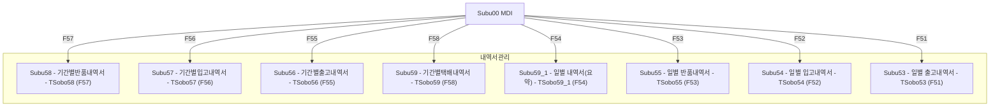

## 등록

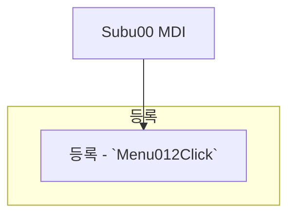

## 반품관리

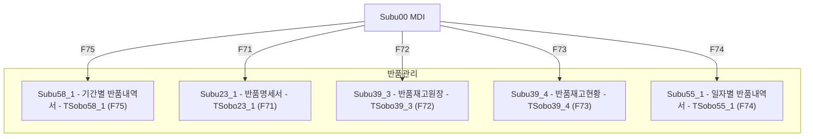

## 발송비/입금관리

```mermaid
flowchart TB
  root00["Subu00 MDI"]
  subgraph sg_4 ["발송비/입금관리"]
    n_4_0["Seok03 - 메세지(팝업창) - TSeok30 (F49)"]
    n_4_1["Subu24_9 - 명세서 발송건수 - TSobo24_9 (F24)"]
    n_4_2["Subu36 - 반품수거내역 - TSobo36 (F42)"]
    n_4_3["Subu37 - 반품수거현황 - TSobo37 (F42)"]
    n_4_4["Subu43 - 발송비내역 - TSobo43 (F41)"]
    n_4_5["Subu44 - 발송비현황 - TSobo44 (F41)"]
    n_4_6["Subu49 - 세금계산서 - TSobo49 (F45)"]
    n_4_7["Subu38_1 - 운임관리-택배 - TSobo38_1 (F29)"]
    n_4_8["Subu41 - 입금내역 - TSobo41 (F46)"]
    n_4_9["Subu42 - 입금현황(1) - TSobo42 (F46)"]
    n_4_10["Subu42_1 - 입금현황(2) - TSobo42_1 (F46)"]
    n_4_11["Subu47 - 청구금액(년월) - TSobo47 (F47)"]
    n_4_12["Subu45 - 청구서관리 - TSobo45 (F43)"]
    n_4_13["Subu45_1 - 청구서관리-택배 - TSobo45_1 (F43)"]
    n_4_14["Subu46 - 청구서출력 - TSobo46 (F44)"]
    n_4_15["Subu39 - 출고내역서 - TSobo39 (F48)"]
  end
  root00 -->|F49| n_4_0
  root00 -->|F24| n_4_1
  root00 -->|F42| n_4_2
  root00 -->|F42| n_4_3
  root00 -->|F41| n_4_4
  root00 -->|F41| n_4_5
  root00 -->|F45| n_4_6
  root00 -->|F29| n_4_7
  root00 -->|F46| n_4_8
  root00 -->|F46| n_4_9
  root00 -->|F46| n_4_10
  root00 -->|F47| n_4_11
  root00 -->|F43| n_4_12
  root00 -->|F43| n_4_13
  root00 -->|F44| n_4_14
  root00 -->|F48| n_4_15
```

## 삭제

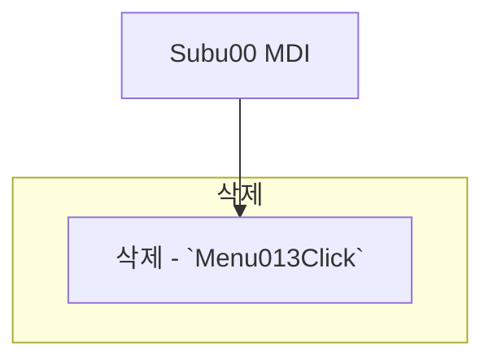

## 재고관리

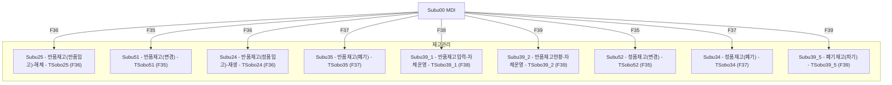

## 재고원장

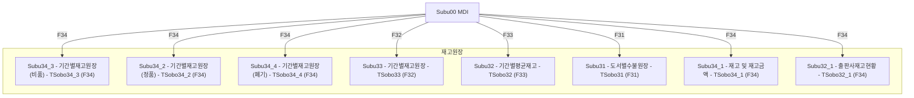

## 추가

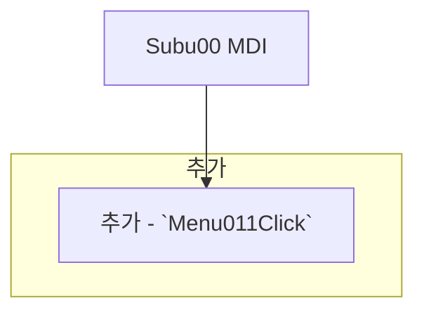

## 출고관리

```mermaid
flowchart TB
  root00["Subu00 MDI"]
  subgraph sg_9 ["출고관리"]
    n_9_0["Subu21 - 거래명세서 - TSobo21 (F24)"]
    n_9_1["Subu23 - 반품명세서 - TSobo23 (F26)"]
    n_9_2["Subu22_1 - 가입고요청서 - TSobo22_1 (F27)"]
    n_9_3["Subu22_2 - 가입고현황 - TSobo22_2 (F27)"]
    n_9_4["Subu29 - 신간발행 - TSobo29 (F28)"]
    n_9_5["Subu22 - 입고명세서 - TSobo22 (F25)"]
    n_9_6["Subu38 - 전송자료받기(FTP) - TSobo38 (F29)"]
    n_9_7["Subu59_2 - 출고검증관리 - TSobo59_2 (F23)"]
    n_9_8["Subu59_3 - 출고검증관리(개별) - TSobo59_3 (F23)"]
    n_9_9["Subu27 - 출고접수관리 - TSobo27 (F21)"]
    n_9_10["Subu26 - 출고접수현황 - TSobo26 (F22)"]
    n_9_11["Subu28 - 출고택배관리 - TSobo28 (F22)"]
  end
  root00 -->|F24| n_9_0
  root00 -->|F26| n_9_1
  root00 -->|F27| n_9_2
  root00 -->|F27| n_9_3
  root00 -->|F28| n_9_4
  root00 -->|F25| n_9_5
  root00 -->|F29| n_9_6
  root00 -->|F23| n_9_7
  root00 -->|F23| n_9_8
  root00 -->|F21| n_9_9
  root00 -->|F22| n_9_10
  root00 -->|F22| n_9_11
```

## 택배관리

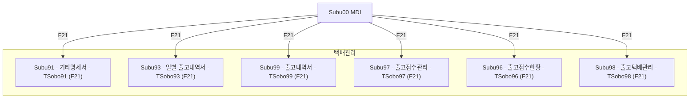

## 통계관리

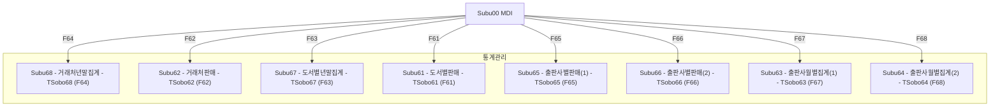

