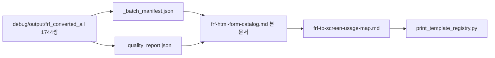

# .frf → HTML/IR 변환 자산 카탈로그 (1744쌍)

**ID**: FRF-HTML-FORM-CATALOG
**일자**: 2026-04-21
**연관 결정**: DEC-037 (WeasyPrint 단일 엔진), DEC-038 (라벨 1종), DEC-039 (운영 .frf 자동 변환 0), DEC-046 (단일 원천), DEC-048 (T-B4 변환 작업 종결 + Phase 3 게이트), DEC-050(예정) (per-form 화이트리스트 옵트인)
**연관 매니페스트**: [`debug/output/frf_converted_all/_batch_manifest.json`](../../debug/output/frf_converted_all/_batch_manifest.json) v0.6.3 / [`_quality_report.json`](../../debug/output/frf_converted_all/_quality_report.json) v0.3.0
**연관 컴파일러**: [`도서물류관리프로그램/backend/app/services/print_ir_compiler.py`](../../도서물류관리프로그램/backend/app/services/print_ir_compiler.py) (R3, IR→HTML, `ctx.*` Jinja2)
**파생 문서**: [`migration/coverage/frf-to-screen-usage-map.md`](./frf-to-screen-usage-map.md), [`docs/print-html-status.md`](../../docs/print-html-status.md), [`dashboard/data/frf-html-porting.json`](../../dashboard/data/frf-html-porting.json)

---

## 0. 카탈로그 목적 (DEC-046 단일 원천)

[`debug/frf_batch_convert_all.py`](../../debug/frf_batch_convert_all.py) + [`debug/frf_quality_report.py`](../../debug/frf_quality_report.py) 가 생성한 **1744쌍** (`*.template.html` + `*.ir.json`) 의 **인덱스·그룹·품질 점수·legacy_id** 4-축 단일 원천을 동결한다. 본 카탈로그는 **운영 결합 화이트리스트** ([`backend/app/services/print_template_registry.py`](../../도서물류관리프로그램/backend/app/services/print_template_registry.py), 예정) 의 **모집단** 이며, 운영 결합은 **per-form 화이트리스트 PR** 단위로만 발생한다 (DEC-039 정합).



---

## 1. 전체 통계 (manifest + quality 머지)

| 지표 | 값 | 출처 |
|---|---:|---|
| 총 .frf 입력 | 1744 | `manifest.total_input` |
| 변환 성공 (`ok`) | 1744 | `manifest.ok` |
| 변환 실패 (`fail`) | 0 | `manifest.fail`, `quality.fail_files=[]` |
| 디코더 버전 | 0.6.3 | `manifest.decoder_version` |
| 컴파일러 버전 | 0.6.5 | `manifest.compiler_version` |
| 객체 총합 | 133 546 | `quality.summary.objects_total` |
| 텍스트 객체 | 133 272 (99.8%) | `text_objects_total` |
| 좌표 복원 평균 | **0.9887** | `coord_recovery_overall` |
| 바인딩 충진 평균 | **0.5696** | `binding_fill_overall` |
| 폰트 복원 평균 | 0.9638 | `font_recovery_overall` |
| 표현식 포함 비율 | 0.992 | `files_with_expressions_ratio` |
| `page_size_ok` 비율 | 1.0 | `page_size_ok_ratio` |
| 좌표 이상치 비율 | 0.0001 (8건) | `coord_outliers_ratio` |
| 디코더 경고 총합 | 1408 | `decoder_warnings_total` |

---

## 2. 자산 그룹 분포 (출처 루트별)

| 그룹 | 파일 수 | 분류 | 비고 |
|---|---:|---|---|
| `WeLove_FTP/도서유통-New/` | **967** | 고객 운영본 (최신) | 정본 후보 — 변경 빈도 높음 |
| `WeLove_FTP/도서유통-출판/` | 524 | 출판사 도메인 변형 | 정본 일부 + 고객 분기 |
| `legacy_delphi_source/legacy_source/Report/` | **98** | 표준 정본 (저장소) | DEC-039 「참조 정본」 |
| `WeLove_FTP/book_21/` | 77 | 고객 복제본 (book_21) | SME 정본 지정 시 승격 |
| `WeLove_FTP/book_99/` | 76 | 고객 복제본 (book_99) | SME 정본 지정 시 승격 |
| `WeLove_FTP/도서유통-총판/` | 2 | 총판 미니 | — |
| **합계** | **1744** | | |

**고유 `Report_X_Y` ID 종류**: 전체 156종, **legacy 정본 78종** (1 ID = 1 정본 + 0~N 고객 복제). 즉 운영 결합 1차 후보의 상한은 **legacy 정본 78종** 으로 동결.

---

## 3. 품질 버킷 (binding_fill × coord_recovery)

운영 결합 게이트 (SOP §A): `binding_fill ≥ 0.7` AND `coord_recovery ≥ 0.95`.

| 버킷 | 정의 | 파일 수 | 비율 |
|---|---|---:|---:|
| **HIGH** | binding≥0.7 + coord≥0.95 → SOP-A 직행 가능 | **996** | 57.1% |
| **MID** | binding 0.4~0.7 + coord≥0.95 → SOP-A 단, 시각 회귀 비교 의무 | 436 | 25.0% |
| **LOW** | binding<0.4 → SOP-B (manual) 권장 | 248 | 14.2% |
| 기타 | coord<0.95 (좌표 이상치 8건) | ~64 | <4% |

**`buckets_by_coord_recovery`** (quality.summary): `ok=1744` — 좌표 회복은 전체 OK, 결합 게이트의 변동 변수는 **binding_fill** 단일.

---

## 4. Top 20 Report ID 빈도 (1744 파일 기준)

| Report_X_Y | 복제 수 | 도메인 (추정 — §5 usage-map 에서 확정) |
|---|---:|---|
| `Report_4_51` | **137** | 청구서 (Sobo46) — 운영 결합 P0 |
| `Report_2_13` | 123 | 거래명세서 변형 (Tong04 PrinTing00) |
| `Report_3_91` | 107 | 통계/현황 |
| `Report_2_11` | 67 | 세금계산서 (Sobo49) — 운영 결합 P0 |
| `Report_3_81` | 55 | 통계/현황 변형 |
| `Report_3_92` | 50 | 통계 변형 |
| `Report_4_96` | 26 | 정산 변형 (Tong04) |
| `Report_2_19` | 20 | 세금/명세 변형 |
| `Report_3_11` | 20 | 내역서 |
| `Report_4_94` | 20 | 정산 변형 |
| `Report_2_16` | 19 | 명세 변형 |
| `Report_3_12` | 18 | 내역서 변형 |
| `Report_3_41` | 18 | 통계 |
| `Report_3_42` | 18 | 통계 |
| `Report_2_12` | 17 | 명세 변형 |
| `Report_2_41` | 17 | 영수 |
| `Report_6_91` | 17 | 라벨/특수 |
| `Report_4_11` | 16 | 정산 |
| `Report_4_21` | 16 | 정산 변형 |
| `Report_6_51` | 16 | 라벨 변형 |

**라벨 5종 (DEC-038)**: `Report_1_21` ~ `Report_1_25` — 본 표 외 별도 추적 ([`label_service.py`](../../도서물류관리프로그램/backend/app/services/label_service.py) 매핑). 현재 1종만 운영 `auto`.

---

## 5. legacy 정본 78종 vs 운영 결합 현황

| 상태 | 정본 ID 수 | 비고 |
|---|---:|---|
| 운영 결합 (`ir_in_use`) | **1** | `Report_1_21` (라벨 1종, [`print_templates/auto/Report_1_21.ir.json`](../../도서물류관리프로그램/backend/app/services/print_templates/auto/Report_1_21.ir.json)) |
| 운영 사용 (`manual_in_use`) | **5** (중복 ID 포함) | `Report_4_51`(Sobo46), `Report_2_11`/`2_13`/`2_19`(Sobo49), 출고/반품 (수동 HTML 빌더) |
| 카탈로그만 (`catalogued`) | **72** | 운영 미결합 — DEC-039 정책상 SOP/PR 없이는 결합 0 |

**1744쌍 중 운영 코드에서 직접 참조되는 변환 자산 수**: **1건** (`Report_1_21.ir.json`). 나머지 1743쌍은 **DEC-048 트랙 종결 산출물** 로 카탈로그·R&D 참조용.

---

## 6. 검색·조회 헬퍼 (재현 가능 쿼리)

```bash
# 전체 1744 매니페스트 1줄씩 (rel + ir + html 경로)
python3 -c 'import json; m=json.load(open("debug/output/frf_converted_all/_batch_manifest.json")); [print(e["rel"], "|", e["ir"], "|", e["html"]) for e in m["entries"]]'

# 품질 점수 high 버킷 만
python3 -c 'import json; q=json.load(open("debug/output/frf_converted_all/_quality_report.json")); [print(f["rel"], f["binding_fill"], f["coord_recovery"]) for f in q["all_files"] if f["binding_fill"]>=0.7 and f["coord_recovery"]>=0.95]'

# legacy 정본만 (98 파일)
python3 -c 'import json; m=json.load(open("debug/output/frf_converted_all/_batch_manifest.json")); [print(e["rel"]) for e in m["entries"] if e["rel"].startswith("legacy_delphi_source/")]'
```

---

## 7. 변경 이력

| 일자 | 변경 |
|---|---|
| 2026-04-21 | 1차 작성. manifest v0.6.3 + quality v0.3.0 머지 → 그룹 6분류 + 품질 3 버킷 + Top 20 ID + legacy 78 정본 vs 운영 결합 1건 동결. |
